# CloudInfraAutomation — Architecture

**Status:** v2.17, approved; implementation in progress. No code is written until this design is approved.
**Date:** 2026-10-03
**Scope:** A web feature where a user selects their **Portfolio → Product/Platform** (the project is the repo they are creating) and the AWS services they need. The platform then generates a CloudFormation template and a GitHub Actions pipeline, creates a new **infrastructure repository**, and deploys the stack through a series of **environments, each in its own AWS account**. The environments and their account numbers are **configurable in the application** (default set: Sandbox, DEV, TEST, QA/STAGE, PROD). What each project can touch in AWS is controlled by **tags**: a project can never change another project's resources. Developers deploy their own code (Python, Java, Go, Rust, …) to ECS, Lambda, EKS and Step Functions from separate **application repositories** that read a published infrastructure contract (§9). Every solution is **DR-capable**: it can run in one region, as DR (primary active, secondary standby) or as an HA pair (both active), with **any region pair chosen in the UI** (default us-east-1 / us-east-2) (§10).

**Changes in v2:** added the org registry and tagging strategy (§4); permissions based on tags (§4.5–4.8); multi-account, five-environment model (§5); promotion pipeline (§8). Payload, provisioning, security and scaling sections are updated to match.
**Changes in v2.17:** implementation started. The control plane runs on ECS Fargate with Aurora PostgreSQL (§2.2a), and the same containers run locally on Docker Desktop.
**Changes in v2.16:** cost centers are admin-configurable for the whole organization (§4.2.1): an org default, then per portfolio, per product and optional project overrides, with inheritance, validation, audit and automatic re-tagging.
**Changes in v2.15:** Appendix A (§19): a complete set of approval and workflow diagrams (landscape, release in default mode, release decision flow, override, sharing routing, access request, infrastructure change request, configuration change, DR failover, recertification, application release) plus an approval summary table.
**Changes in v2.14:** all sharing is granted through a sharing approval workflow (§4.11.6). Covers share offers, access requests, agreements, renewal and revocation, with risk-based routing, optional auto-approval within an approved tag offer, recertification and audit.
**Changes in v2.13:** sharing by tags (§4.11.1). Providers set `org:share-scope` (product / portfolio / organization) and `org:share-access` on a resource, and any consumer in any account whose tags match (same environment, inside the organization) can connect self-service. Agreements remain for everything tags cannot express.
**Changes in v2.12:** cross-account access (§4.11). Infrastructure can use assets in other AWS accounts (S3, SQS, SNS, KMS, DynamoDB, secrets, events, private APIs) through approved sharing agreements. Both sides are generated with tag conditions, inside the organization by default, with expiry, revocation and audit.
**Changes in v2.11:** any region pair is allowed. Users pick the primary and secondary regions in the UI (pre-filled with us-east-1 / us-east-2). Admins manage enabled regions in the UI. Adds per-pair availability and replication checks, us-east-1 placement for CloudFront certificates/WAF, and region changes after creation (§10.9).
**Changes in v2.10:** runtime isolation by tags (§4.10). Every component can only talk to resources with the same project and environment tag values, enforced by four layers generated into the template: the runtime role's policy, the permissions boundary, a same-tag resource policy on the target, and an SCP.
**Changes in v2.9:** multi-region resilience (§10): every template is DR-capable. Projects choose single region, DR (deployed to us-east-1 and us-east-2, only us-east-1 active) or HA pair (both active). Adds per-service replication rules, a global stack, a two-region pipeline, failover/failback, DR drills and a multi-region control plane. Sections 10–17 renumbered to 11–18.
**Changes in v2.8:** the catalog now covers every project-scoped AWS service, including all major databases, in every combination (§6.8). It is generated from AWS's own schemas and authorization data, with curated secure blocks for common services, generic connection kinds, database defaults (network, Secrets Manager credentials, RDS Proxy, snapshots), layered stacks, and pairwise + real-deploy testing.
**Changes in v2.7:** runtime infrastructure is AWS services only; email notifications use Amazon SES (no SMTP option).
**Changes in v2.6:** technology policy added: AWS + GitHub + open source only (§1). Commercial products removed or replaced (CMDB/ITSM, chat tools, paid GitHub security features). Approvals now work on any GitHub plan via platform-executed releases (§8.3.1); GitHub Enterprise features are optional.
**Changes in v2.5:** infrastructure and solution code are now explicitly independent (§9.9): contract-first development, placeholder artifacts, expand → migrate → contract changes, optional bindings, local/ephemeral testing, and a responsibilities table. Product teams no longer have to sign off on infrastructure changes.
**Changes in v2.4:** added developer consumption (§9): infrastructure contract published per environment, application repos linked to compute slots, golden-path build/deploy workflows per language and compute type (Lambda, ECS, EKS, Step Functions), and least-privilege application deploy roles. Sections 9–16 renumbered to 10–17.
**Changes in v2.3:** STAGE and PROD require GitHub reviewer approval before deployment, using a plan → approve → apply-reviewed-change-set flow that cannot be turned off (§8.3). Added a layered quality-gate strategy for STAGE and PROD (§8.4). Added the release console: promotion and approval workflow in the platform UI, with approvals submitted to GitHub as the reviewer (§8.5).
**Changes in v2.2:** the hierarchy is now three levels, Portfolio → Product/Platform → Project. The team level and the `org:team` tag are removed.
**Changes in v2.1:** environment names, their order and their AWS account numbers can now be configured by platform admins in the application (§5.5). Nothing about environments is hardcoded.

---

## Contents

1. [Goals, non-goals and design principles](#1-goals-non-goals-and-design-principles)
2. [System architecture](#2-system-architecture)
3. [Request payload and data model](#3-request-payload-and-data-model)
4. [Org registry, tagging strategy and tag-based permissions](#4-org-registry-tagging-strategy-and-tag-based-permissions)
5. [Multi-account environment strategy](#5-multi-account-environment-strategy)
6. [CloudFormation generation engine](#6-cloudformation-generation-engine)
7. [GitHub repository provisioning](#7-github-repository-provisioning)
8. [Deployment pipeline (GitHub Actions + OIDC, configurable environments)](#8-deployment-pipeline-github-actions--oidc-configurable-environments)
9. [Developer consumption: application repositories](#9-developer-consumption-application-repositories)
10. [Multi-region resilience: DR and HA](#10-multi-region-resilience-dr-and-ha)
11. [Security model](#11-security-model)
12. [Scalability and multi-tenancy](#12-scalability-and-multi-tenancy)
13. [Error handling, idempotency and rollback](#13-error-handling-idempotency-and-rollback)
14. [Observability](#14-observability)
15. [Where an LLM fits (and where it must not)](#15-where-an-llm-fits-and-where-it-must-not)
16. [Proposed repository layout](#16-proposed-repository-layout)
17. [Decisions needed from you](#17-decisions-needed-from-you)
18. [Implementation phases](#18-implementation-phases)
19. [Appendix A: Approval and workflow diagrams](#19-appendix-a-approval-and-workflow-diagrams)
20. [Landing zone workflow: AWS Organizations OU structure with Control Tower controls](#20-landing-zone-workflow-aws-organizations-ou-structure-with-control-tower-controls)

---

## 1. Goals, non-goals and design principles

### Goals
- A user picks their Portfolio → Product/Platform from dropdowns, names the project, selects services (for example, a Python Lambda triggered by an S3 bucket), and gets a working repository deployed in one click.
- **Tags decide what a project may touch.** Every resource is tagged with its portfolio, product, project and environment. The IAM roles a project uses can only create resources with *their own* tags and can only change resources that already carry *their own* tags.
- **Configurable environments, one account each:** environments (default: Sandbox, DEV, TEST, QA/STAGE, PROD) and their unique AWS account numbers are managed in the application by platform admins. A project is promoted through them in the configured order by a gated pipeline, using the same built artifact each time.
- Generated infrastructure is **least-privilege by construction**: no `*` actions or `*` resources in any IAM role the app template creates.
- Each push safely updates the existing stack, nothing is replaced unless intended, and failures are cleaned up or clearly reported.
- Supports many portfolios, products and projects at once without hitting GitHub or AWS API limits.

### Non-goals (v1)
- Free-form CloudFormation authoring. Users compose from a catalog that covers **every project-scoped AWS resource type** (curated Tier 1 + schema-driven Tier 2, §6.8); account- and organization-wide resources are excluded.
- Creating new AWS accounts from the project wizard. The landing zone (AWS Organizations OUs, Control Tower controls, policies) is managed by a **separate admin-only workflow** (§20); projects only *use* its accounts.
- Editing the Portfolio/Product lists in this UI. They come from the org registry (§4.2), which is the master; maintained in the platform admin screen or imported via CSV/REST.

### Design principles
| Principle | What it means here |
|---|---|
| **Tags are the permission boundary, names are the backstop** | Permissions are written once, using tag conditions, and reused by every project. **At runtime, components can only talk to resources with the same project and environment tag values**, enforced on both the caller's role and the target's resource policy (§4.10). Resource names are still prefixed by project, as a second line of defense for AWS actions that don't support tag conditions. |
| **The platform owns the tags, not the repo** | The tag values a project may use are fixed on its IAM roles by the platform. A user who edits the repo to claim another product's tags is denied by AWS. |
| **Account per environment** | PROD is separated from everything else by an account boundary, not just by tags. |
| **Build once, deploy many** | The same artifact (zip + template) moves DEV → TEST → STAGE → PROD. Only parameters change per environment. |
| **Deterministic over generative** | Templates and IAM come from a versioned, tested catalog of building blocks, never from free-form LLM output. |
| **Short-lived credentials everywhere** | OIDC for GitHub Actions → AWS, GitHub App installation tokens, STS AssumeRole between accounts. No long-lived keys by default. |
| **Infrastructure and solution code are independent** | Every solution has two parts: infrastructure (platform-owned) and solution code (product-owned). They live in separate repos with separate pipelines, versions, release schedules and approvals, joined only by a versioned contract. Neither team waits for the other (§9.9). |
| **Async and safe to retry** | Long-running provisioning is orchestrated as a series of steps, each safe to repeat (keyed by the request ID), with undo steps for anything that fails partway. |

### Technology policy: AWS + GitHub + open source only

The platform is built **in-house**. Its only commercial dependencies are the two systems it exists to automate: **AWS** (the target cloud, including its native services) and **GitHub** (source control and Actions). Every other component is either written by us or is **open-source software**. No other commercial product, SaaS or paid add-on is required.

**AWS services only for runtime infrastructure:** everything the platform runs on, and everything it creates, is an AWS service: compute, storage, database, workflow, email (Amazon SES), secrets, monitoring. No non-AWS infrastructure (mail servers, self-hosted databases, external SaaS) is created or required.

**Rules:**
- No feature may *require* a paid GitHub tier. Features that only exist on GitHub Enterprise are **optional add-ons**, and every one of them has a built-in equivalent (§8.3.1).
- Integrations with commercial tools (chat, ITSM, CMDB, portals) are **never required**. The platform exposes **generic, signed outgoing webhooks and a REST API**, so an organization can connect any tool it likes without the platform depending on it.
- Open-source licenses allowed by default: Apache-2.0, MIT, BSD, MPL-2.0; LGPL as unmodified libraries. AGPL and "source-available" licenses (BSL, SSPL, Elastic, the Semgrep Rules License, etc.) are excluded unless approved (D26).

**Open-source components chosen:**

| Purpose | Choice | License |
|---|---|---|
| Backend API / models | FastAPI, pydantic | MIT |
| GitHub client / AWS SDK / secret encryption | PyGithub, boto3, PyNaCl | LGPL-3.0 (library), Apache-2.0, Apache-2.0 |
| Web UI | React, TypeScript | MIT, Apache-2.0 |
| CloudFormation lint / policy | cfn-lint, cfn-guard | MIT-0, Apache-2.0 |
| IaC security scan | Checkov | Apache-2.0 |
| Gate policy engine (G4/G5 rules as code) | Open Policy Agent (OPA) / Conftest | Apache-2.0 |
| SAST per language | bandit (Python), SpotBugs + Find Security Bugs (Java), gosec (Go), cargo-audit + clippy (Rust), eslint-plugin-security (Node.js) | Apache-2.0 / LGPL-2.1 / Apache-2.0 / Apache-2.0+MIT / Apache-2.0 |
| Dependency / vulnerability scanning | OSV-Scanner, Trivy | Apache-2.0 |
| SBOM | Syft | Apache-2.0 |
| Secret scanning (PR check + pre-commit hook) | gitleaks | MIT |
| Artifact signing and provenance | cosign (Sigstore) **with keys in AWS KMS** (no dependency on public Sigstore services); SLSA/in-toto provenance format | Apache-2.0 |
| Kubernetes GitOps / admission policy | Argo CD, Kyverno | Apache-2.0 |
| Local AWS emulation | moto (server mode), AWS SAM CLI; LocalStack **Community** edition optional | Apache-2.0 |
| Telemetry | OpenTelemetry (export to CloudWatch/X-Ray) | Apache-2.0 |
| Developer portal (optional) | Backstage | Apache-2.0 |
| Dependency update PRs | Dependabot (built into GitHub, free on all plans); Renovate as an alternative if license approved | — / AGPL-3.0 |

**Removed or replaced compared with earlier drafts:**

| Earlier mention | Replaced by |
|---|---|
| ServiceNow / external CMDB as source of truth | **Platform registry is the master**, with CSV/REST import (§4.2) |
| ITSM change tickets | **Built-in change record** in the release console (§8.5); external ITSM optional via outgoing webhook |
| Slack / Microsoft Teams notifications | **In-app inbox** + **email via Amazon SES** + optional generic **signed webhooks** |
| CodeQL (needs paid GitHub Advanced Security for private repos) | Language SAST tools above |
| GitHub secret scanning push protection (paid for private repos) | gitleaks in PR checks and pre-commit hooks |
| GitHub artifact attestations (paid for private repos) | cosign + AWS KMS signatures, verified by the gate |
| GitHub environment required reviewers / custom deployment protection rules (Enterprise for private repos) | **Built-in approval with platform-executed release** (§8.3.1); GitHub features used additionally only if available |

---

## 2. System architecture

### 2.0 Architecture overview

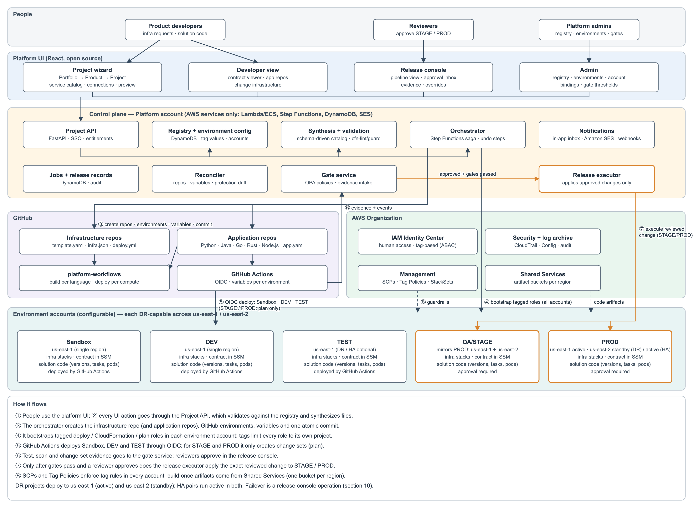

The numbered flows are explained under the diagram. A Word version of this whole document, with all diagrams, is in [CloudInfraAutomation-Architecture.docx](CloudInfraAutomation-Architecture.docx).

### 2.1 Component diagram

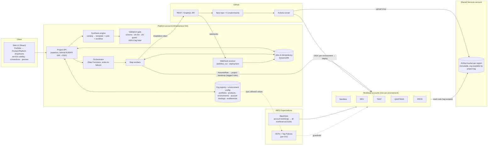

### 2.2 End-to-end sequence

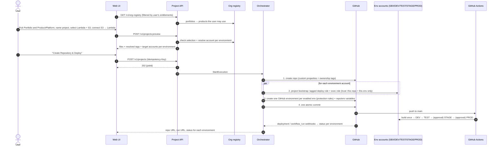

### 2.2a Implementation decision: control plane on ECS + Aurora PostgreSQL

**Decided at implementation start:** the platform's own control plane runs on **ECS Fargate** (api, worker and ui services) with **Aurora PostgreSQL Serverless v2** as its database, deployed by `infra/platform/platform.yaml`. This replaces DynamoDB and Step Functions for the control plane:
- the job queue and saga state live in PostgreSQL (`FOR UPDATE SKIP LOCKED`);
- the worker service runs provisioning steps with undo-on-failure;
- registry, cost centers, jobs and audit are relational tables, migrated with Alembic.

The same containers run locally with Docker Desktop (PostgreSQL 16) for development and testing. Generated customer infrastructure is unaffected: it still uses any AWS service via CloudFormation.

### 2.3 Component responsibilities

| Component | Responsibility | Scaling |
|---|---|---|
| **Web UI** | Cascading ownership dropdowns, service catalog, connection editor, preview (files, tags, target accounts), job status per environment. | Static on CDN |
| **Project API** | Authentication, entitlement checks, validation, preview, job creation, idempotency. Keeps no state between requests. | Horizontal containers |
| **Org registry** | Source of the Portfolio → Product/Platform tree, projects, cost centers, entitlements, allowed tag values. | DynamoDB + cache; master data, CSV/REST import |
| **Environment config** | Admin-managed list of environments (name, order, tier, protection and guardrail profiles) and **account bindings** (environment + portfolio/product + region → AWS account ID). Validates and onboards accounts before they can be used (§5.5). | DynamoDB, versioned, audited |
| **Synthesis engine** | Payload → template, starter code, workflow, per-environment parameter files. Pure function with no I/O. | Runs in-process |
| **Validation gate** | Schema, connection rules, cfn-lint, cfn-guard (rules differ per environment), IAM least-privilege + tag linter. | Runs in-process |
| **Orchestrator** | Provisioning steps across GitHub and up to five accounts, with retries and undo steps. | Worker ECS service + PostgreSQL job queue (§2.2a) |
| **Org guardrails** | SCPs and Tag Policies attached to OUs, enforcing the tag rules no matter which tool makes the call. | AWS Organizations |
| **StackSets** | Deploy the *account bootstrap* (OIDC provider, shared tag-based policies, provisioner role) to every workload account automatically, including new ones. | Service-managed StackSets |
| **Artifact bucket** | One per region in Shared Services. Workload accounts can read only their project's prefix. | S3 |

### 2.4 API surface (contract only)

| Method & path | Purpose |
|---|---|
| `GET /v1/org-registry` | Portfolio → Product/Platform tree, **filtered to what the caller is entitled to**. Drives the dropdowns. |
| `GET /v1/catalog` | Services that can be selected, their settings and valid connections. |
| `GET /v1/environments` | Active environments in promotion order (read-only for normal users). |
| `GET/POST/PUT /v1/admin/environments` | **Admin:** create, rename (display name), reorder, set profiles, deactivate environments. |
| `GET/POST/PUT/DELETE /v1/admin/account-bindings` | **Admin:** map an AWS account ID to an environment for a portfolio/product/region. |
| `POST /v1/admin/account-bindings/{id}:validate` | **Admin:** run the onboarding checks (§5.5.3) and report the result. |
| `POST /v1/projects:preview` | Validate + synthesize, no side effects. Returns files, resolved tags and target accounts per environment. |
| `POST /v1/projects` | Start provisioning (`Idempotency-Key` required) → 202 `{jobId}`. |
| `GET /v1/jobs/{jobId}` / `…/events` | Job + per-environment status (JSON / SSE). |
| `GET /v1/projects/{id}/releases` | Release console: pipeline view and history per environment (§8.5). |
| `GET /v1/approvals?mine=true` | Reviewer's approval inbox. |
| `POST /v1/approvals/{id}:approve` / `:reject` | Approve/reject in the UI; the platform submits it to GitHub as the reviewer. |
| `POST /v1/projects/{id}/environments/{env}:promote` | Start promotion when the environment is in `on-request` mode. |
| `POST /v1/overrides` / `POST /v1/overrides/{id}:decide` | Request / decide a high-risk change override. |
| `GET /v1/shareable-resources` | Catalog of resources other projects have marked shareable (§4.11). |
| `POST /v1/sharing-requests` | Create a sharing request: share offer, access request, agreement, renewal or revocation (§4.11.6). |
| `GET /v1/sharing-requests?mine=true` / `POST /v1/sharing-requests/{id}:approve` / `:reject` | Sharing approval inbox and decisions. |
| `POST /v1/github/webhooks` | GitHub App webhooks. |

---

## 3. Request payload and data model

### 3.1 Design choices
- **Ownership by ID, not by name:** the UI sends registry IDs (`pf-…`, `pr-…`). The server checks them against the registry *and* the user's entitlements. **The UI is never trusted for ownership.**
- **No account IDs in the payload.** The server works out the target account for each environment from the admin-configured account bindings (§5.5). Users cannot point a deploy at an account they don't own.
- **Graph-shaped:** `resources` (nodes) and `connections` (edges). Permissions and event wiring come from the edges, so the user never writes IAM.
- **Stable IDs supplied by the user** become logical IDs and part of physical names; stable IDs are what make updates safe.

### 3.2 Example — Python Lambda + S3, owned by Payments → Invoicing → AP Automation

```json
{
  "schemaVersion": "2.0",
  "requestId": "6f1c2a9e-4b7d-4a52-9d55-0d1f2b3c4e5f",
  "catalogVersion": "2026.10.0",
  "project": {
    "name": "invoice-ingest",
    "description": "Process invoices dropped into S3",
    "github": { "owner": "acme-platform", "visibility": "private" }
  },
  "ownership": {
    "portfolioId": "pf-payments",
    "productId": "pr-invoicing",
    "dataClassification": "confidential"
  },
  "environments": {
    "enabled": ["sandbox", "dev", "test", "stage", "prod"],
    "region": "us-east-1"
  },
  "resilience": {
    "mode": "dr",
    "primaryRegion": "us-east-1",
    "secondaryRegion": "us-east-2",
    "drStrategy": "pilot-light",
    "targets": { "rtoMinutes": 60, "rpoMinutes": 5 }
  },
  "resources": [
    { "id": "uploads", "type": "s3.bucket",
      "config": { "versioning": true, "expireNoncurrentDays": 30 } },
    { "id": "processor", "type": "lambda.python",
      "config": { "runtime": "python3.13", "architecture": "arm64", "starterCode": "s3-event-logger" } }
  ],
  "connections": [
    { "kind": "s3.notify", "source": "uploads", "target": "processor",
      "config": { "events": ["s3:ObjectCreated:*"], "prefix": "incoming/" } }
  ],
  "environmentOverrides": {
    "prod":    { "processor": { "memoryMb": 512, "reservedConcurrency": 50 } },
    "sandbox": { "*": { "retainOnDelete": false } }
  },
  "deploy": { "auth": "oidc" }
}
```

What the server adds before synthesis (shown in the preview, read-only):

```json
{
  "resolvedTags": {
    "org:portfolio": "pf-payments",
    "org:product": "pr-invoicing",
    "org:project": "invoice-ingest",
    "org:cost-center": "CC-4410",
    "org:data-classification": "confidential",
    "org:managed-by": "cloudinfra"
  },
  "targets": {
    "sandbox": { "accountId": "111111111111", "region": "us-east-1" },
    "dev":     { "accountId": "222222222222", "region": "us-east-1" },
    "test":    { "accountId": "333333333333", "region": "us-east-1" },
    "stage":   { "accountId": "444444444444", "region": "us-east-1" },
    "prod":    { "accountId": "555555555555", "region": "us-east-1" }
  }
}
```

`org:environment` is added per account at deploy time (§4.3).

### 3.3 Schema rules (enforced by the validation gate)

| Field | Rule | Reason |
|---|---|---|
| `ownership.*Id` | Must exist in the registry; product must belong to the portfolio; user must be entitled to the product | Stops users from claiming someone else's product. |
| `ownership.dataClassification` | ≤ the product's classification ceiling; `restricted` data not allowed in `sandbox` | Classification gates are enforced in SCPs too (§4.7). |
| `environments.enabled` | Subset of the **active configured** environments that have an onboarded account binding for this product; must include every environment the configuration marks as a required gate before a later one (e.g. `prod` requires `stage`); order comes from the configuration, not the payload | Promotion integrity. |
| `project.name` | `^[a-z][a-z0-9]*(-[a-z0-9]+)*$`, 3–30 chars, no `--`, **unique within the GitHub org and across the registry** | `org:project` must identify exactly one project. `--` is reserved as the name separator. |
| `resources[].id` | `^[a-z][a-z0-9-]{0,19}$`, unique | Logical ID + physical name. |
| `len(project.name) + len(id)` for S3 | ≤ 31 | Bucket name `{project}--{id}-{account}-{region}` must stay ≤ 63 chars. |
| `resilience` | `mode` ∈ single/dr/ha, allowed by the environment's policy; `primaryRegion` / `secondaryRegion`: **any two different regions** from the platform's region list, chosen in the UI (pre-filled with us-east-1 / us-east-2); every selected service must be available in both regions; in HA every data store must support active/active (§10.3, §10.9) | DR-capable from the start; impossible combinations are rejected early. |
| `environmentOverrides` | Only settings the catalog marks as overridable, within per-environment ranges (e.g. prod log retention ≥ 90 days) | Environments differ in size, not in shape. |
| Connections | Source/target must exist; the pair of types must be allowed; no overlapping S3 notifications; no write access to a bucket that also triggers the same function on an overlapping prefix | Correctness + stops S3 ↔ Lambda infinite loops. |

**Catalog:**
- **Resource types:** any project-scoped AWS resource type. Tier 1 curated (including all major database engines) and Tier 2 schema-driven; see §6.8.
- **Connection kinds:** generic kinds (`iam.access`, `network.access`, `event.source`, `event.notify`, `event.rule`, `api.route`, `workflow.task`, `secret.binding`, `cdn.origin`) that work across services (§6.8.4). The example payload's `s3.notify` is the S3-specific form of `event.notify`.

### 3.4 Persistent model (DynamoDB, single table)

| Entity | PK | SK | Key attributes |
|---|---|---|---|
| Organization settings | `CFG#ORG` | `META` | **default cost center**, cost center format rule, version |
| Portfolio | `REG#PORTFOLIO` | `PF#{id}` | displayName, status, owner group, **costCenter** (optional; inherits the org default) |
| Product/Platform | `REG#PF#{portfolioId}` | `PR#{id}` | displayName, kind (`product`\|`platform`), costCenter (optional; inherits the portfolio's), classification ceiling, allowed envs, entitled IdP groups, GitHub access team (repo maintain role), GitHub reviewer teams per env |
| Environment | `CFG#ENV` | `ENV#{envId}` | displayName, order, tier, OU, required-gate flag, protection profile, guardrail profile, status, version |
| Account binding | `CFG#BIND#{envId}` | `{scope}#{scopeId}#{region}` | accountId, status (`pending`/`onboarded`/`failed`/`retired`), last validation result, version |
| Account index (uniqueness) | `CFG#ACCT#{accountId}` | `META` | envId. Written in the same transaction as the binding, so **one account ID can belong to only one environment** |
| Project | `PROJECT#{name}` | `META` | ownership IDs, repo ID, enabled envs, bootstrap stack IDs per env, catalog version |
| Job | `JOB#{jobId}` | `META` / `STEP#{n}#{name}#{env}` | state, per-step / per-env status, errors, undo state |
| Idempotency | `IDEMP#{requestId}` | `META` | jobId, payloadHash |

Job states: `ACCEPTED → REPO_CREATED → AWS_BOOTSTRAPPED(per env) → ACTIONS_CONFIGURED → COMMITTED → PROMOTING → SUCCEEDED | DEPLOY_FAILED(env) | FAILED_ROLLED_BACK | FAILED_NEEDS_ATTENTION`.

---

## 4. Org registry, tagging strategy and tag-based permissions

### 4.1 Hierarchy and how each level is used

Three levels: **Portfolio → Product/Platform → Project**. Who may act for a product (repo access, approvers, human AWS access) comes from IdP/GitHub groups attached to the product in the registry; it is not a level in the hierarchy and not a tag.

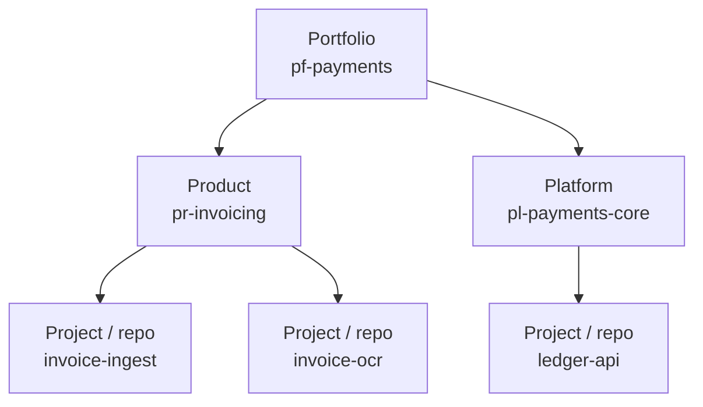

| Level | Used for | Used in IAM permissions? |
|---|---|---|
| **Portfolio** | Cost roll-up, portfolio-level guardrails, account routing (§5.2) | Guardrail SCPs only (e.g. "this account only accepts portfolio X") |
| **Product / Platform** | Cost, entitlements (who may create projects), optional sharing between projects in the same product | Yes, for opt-in sharing within a product (§4.6) |
| **Project** | **The main isolation boundary.** One repo = one project = one set of roles per environment | **Yes, always** |
| **Environment** | Which account / stage | Yes: must equal the account's environment |

**Default isolation:** a project can create, change and delete only resources tagged with its own `org:project`. Sharing within the same product is opt-in and read-only by default. Sharing across products is never automatic.

### 4.2 Org registry → UI dropdowns
- **Source of truth:** the **platform registry is the master**, maintained in the platform admin screen. Bulk changes can be imported via CSV or the REST API (so any existing inventory can feed it), but no external product is required. The UI never hardcodes the lists.
- **Cascading dropdowns:**
  - **Portfolio:** only portfolios where the user has at least one entitled product.
  - **Product/Platform:** filtered by the chosen portfolio *and* the user's IdP groups. Shows a badge for kind (Product or Platform).
  - **Project:** a new name typed by the user (validated for format and uniqueness, §3.3), not a dropdown.
  - **Resilience:** single region / DR / HA pair; then **Primary region** and **Secondary region** dropdowns listing every region the platform has enabled, pre-filled with us-east-1 / us-east-2 (§10.9).
- **Read-only fields shown after selection:** cost center (resolved, with where it comes from, §4.2.1), classification ceiling, and target account per environment (from the account bindings). The user sees exactly where the project will deploy.
- **Server-side re-check** on preview and on create (registry + entitlement). This guards against a stale UI and against crafted requests.
- **IDs are immutable; display names can change.** Tag values are IDs (`pr-invoicing`), so renaming "Invoicing" to "AP Invoicing" changes nothing in AWS.
- **Lifecycle:** retiring a product blocks new projects, flags existing ones and does not delete anything.

#### 4.2.1 Cost centers (admin-configurable for the whole organization)

Platform admins maintain cost centers in the admin screen (**Admin → Cost centers**). Nothing is hardcoded and nothing comes from an external finance system unless imported.

| Level | Set by | Rule |
|---|---|---|
| **Organization default** | Platform admin | Required. Used when nothing more specific is set |
| **Portfolio** | Platform admin | Optional. Overrides the org default for everything in the portfolio |
| **Product / Platform** | Platform admin | Optional. Overrides the portfolio value for that product |
| **Project override** | Requested in the project; approved by a platform admin (finance) | Optional, for exceptions (e.g. a project funded by another budget) |

- **Resolution:** the effective cost center is project override → product → portfolio → org default. The UI always shows the resolved value and **where it comes from** (e.g. "CC-4400 · inherited from Payments").
- **Validation:** a format rule set in organization settings (default `^CC-[0-9]{4}$`). Values can also be bulk-imported by CSV/REST, with the same validation.
- **Propagation:** changing a cost center opens **tag-update PRs** on every affected infrastructure repo. Normal deploys update the stack tags, and CloudFormation re-tags the resources. Nothing is re-tagged by hand. The admin screen shows how many projects a change affects before saving.
- **Governance:** every change is versioned and audited (who, when, old → new). Tag Policies (§4.7) get the list of valid cost centers automatically. `org:cost-center` is activated as a cost allocation tag, so Cost Explorer and the CUR report spend per cost center.
- **Permissions:** cost centers are billing metadata, not a security boundary. They are never used in IAM conditions (§4.5), so changing one never affects access.


### 4.3 Tag schema

The key prefix `org:` is a placeholder; choose your company prefix (D3). All values are registry IDs or validated slugs.

| Key | Example | Set by | Required | Used for |
|---|---|---|---|---|
| `org:portfolio` | `pf-payments` | Platform (from registry) | Yes | Cost, guardrails |
| `org:product` | `pr-invoicing` | Platform | Yes | Cost, sharing within a product |
| `org:project` | `invoice-ingest` | Platform | Yes | **Primary permission key** |
| `org:environment` | `dev` | Platform (per account) | Yes | Must match the account's environment |
| `org:cost-center` | `CC-4410` | Platform (resolved from the cost center hierarchy, §4.2.1) | Yes | Billing (activated as a cost allocation tag) |
| `org:data-classification` | `confidential` | User (≤ product ceiling) | Yes | SCP gates (e.g. not in sandbox) |
| `org:managed-by` | `cloudinfra` | Platform | Yes | Marks resources only the platform pipeline may change |
| `org:share-scope` | `none` / `product` / `portfolio` / `organization` | Provider (UI, via infra PR) | No (default `none`) | **Sharing by tags**: who outside the project may use the resource, across accounts (§4.11.1) |
| `org:share-access` | `read` / `readwrite` / `invoke` / `publish` / `consume` | Provider (UI, via infra PR) | No (default `read`) | What shared consumers may do (§4.11.1) |
| `org:share-approval` | `required` (default) / `auto` | Provider (UI, approved offer) | No | Whether each consumer access request needs the provider's approval or is auto-approved within the tag rule (§4.11.6) |
| `org:resilience` | `dr` | Platform (project setting) | Yes | Reporting, cost, DR drill scheduling (§10) |
| `org:region-role` | `primary` / `secondary` | Platform (per region) | Yes | Operations and failover tooling (§10) |
| `org:expires-on` | `2026-11-01` | Platform (sandbox only) | Sandbox only | Automatic cleanup in sandbox |

**Where the tags are recorded:**

| Location | Tags | Purpose |
|---|---|---|
| IAM roles the platform creates per project per env (deploy role, CFN execution role) | All `org:*` keys | **These role tags are the source of truth.** Inside IAM policies they are read as `aws:PrincipalTag/...`. |
| CloudFormation stack tags | Same values, passed by the pipeline | Propagated by CloudFormation to every resource that supports tags. AWS only accepts them if they **match the role's own tags** (§4.5). |
| GitHub repo custom properties | portfolio, product, project | Discovery, rulesets, audit. Informational, not a security control. |
| `infra.json` in the repo | Ownership IDs | Regeneration. **Not trusted** for permissions. |

### 4.4 Why a repo cannot forge tags

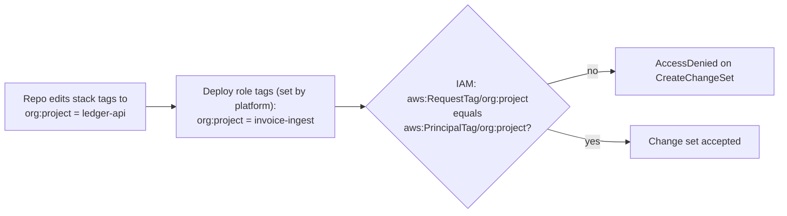

The role's tags can be changed only by the platform's provisioner role, and an SCP blocks changes to role tags by anyone else (§4.7). So a project can only ever act as itself.

### 4.5 Tag-based permissions (ABAC) design

**One shared policy per role type per account, instead of one policy per project.** The policies use `${aws:PrincipalTag/org:project}`, so the same policy behaves differently for each project's role. They are deployed once per account by StackSets. Project bootstrap only creates **tagged roles** that attach them. This is the main scalability gain: adding project number 500 adds no new policy documents.

| Role (per project, per env account) | Trusted by | Attached shared policy | Tag rules |
|---|---|---|---|
| `GitHubDeployRole` | GitHub OIDC, `sub = repo:{owner}/{repo}:environment:{env}` | `cloudinfra-deploy-abac` | CloudFormation create/update/change-set actions only when `aws:RequestTag/org:*` = `${aws:PrincipalTag/org:*}` for all required keys; describe/execute/delete only when `aws:ResourceTag/org:project` = own project. `iam:PassRole` only on roles where `aws:ResourceTag/org:project` = own project, passed to CloudFormation. Upload only to `artifact-bucket/${aws:PrincipalTag/org:project}/*`. |
| `CfnExecutionRole` | `cloudformation.amazonaws.com` (with `aws:SourceAccount`) | `cloudinfra-exec-abac` | **Create:** allowed only if request tags = own tags (and `aws:TagKeys` only from the allowed list). **Change/delete:** only if `aws:ResourceTag/org:project` = own project. **IAM:** `CreateRole`/`PutRolePolicy` only with the shared boundary attached and own tags. `PassRole` only on own-project roles, to Lambda. |
| App roles (e.g. the Lambda execution role, created by the stack) | `lambda.amazonaws.com` | Exact-ARN inline policy (from binders) **+ shared boundary** `cloudinfra-app-boundary` | The boundary allows data access only to resources tagged with the same `org:project` (or same `org:product` with `org:share-scope=product`, read-only). The inline policy narrows it to exact ARNs. |

**Illustrative pattern** (a design sketch, not final policy). The core rule of `cloudinfra-exec-abac` for Lambda:

```json
[
  {
    "Sid": "CreateOnlyWithOwnTags",
    "Effect": "Allow",
    "Action": ["lambda:CreateFunction", "lambda:TagResource"],
    "Resource": "arn:aws:lambda:*:${aws:PrincipalAccount}:function:${aws:PrincipalTag/org:project}--*",
    "Condition": {
      "StringEquals": {
        "aws:RequestTag/org:project":     "${aws:PrincipalTag/org:project}",
        "aws:RequestTag/org:product":     "${aws:PrincipalTag/org:product}",
        "aws:RequestTag/org:environment": "${aws:PrincipalTag/org:environment}"
      },
      "ForAllValues:StringEquals": { "aws:TagKeys": ["org:portfolio","org:product","org:project","org:environment","org:cost-center","org:data-classification","org:managed-by","org:share-scope","org:resilience","org:region-role"] }
    }
  },
  {
    "Sid": "ManageOnlyOwnProject",
    "Effect": "Allow",
    "Action": ["lambda:UpdateFunctionCode","lambda:UpdateFunctionConfiguration","lambda:DeleteFunction","lambda:AddPermission","lambda:RemovePermission","lambda:GetFunction"],
    "Resource": "arn:aws:lambda:*:${aws:PrincipalAccount}:function:${aws:PrincipalTag/org:project}--*",
    "Condition": { "StringEquals": { "aws:ResourceTag/org:project": "${aws:PrincipalTag/org:project}" } }
  }
]
```

Each rule checks **both** the tag condition and a name pattern built from the principal's own tag. Each one alone would be enough; together they are defense in depth.

### 4.6 Tags + names: covering what tag conditions can't

AWS support for `aws:ResourceTag` / `aws:RequestTag` **varies by service and by action**. The platform keeps a **support matrix** per catalog service, checked against the AWS Service Authorization Reference and tested in CI against a real sandbox account:

| Situation | Control used |
|---|---|
| Action supports `aws:RequestTag` (create) and `aws:ResourceTag` (change) | Tag condition **and** name pattern |
| Action lacks tag-condition support (some describe/list calls, some bucket-configuration actions) | Name pattern `${aws:PrincipalTag/org:project}--*` (still built from the role's tag, so still tag-driven) |
| Action supports no resource scoping at all (e.g. some `Describe*` calls) | Allowed read-only, at account+region scope, only in platform-owned roles, **never** in generated app roles |

**Sharing with other projects** is done by share tags or by agreement (§4.11). For example, an `iam.access` connection to a resource in *another* project of the *same* product is allowed when:
1. The target resource carries `org:share-scope=product` (or wider).
2. The access is within its `org:share-access` level (read by default).
3. The boundary condition `aws:ResourceTag/org:product = ${aws:PrincipalTag/org:product}` holds.

Access across products is not offered by the platform; it goes through a separate exception process.

### 4.7 Organization guardrails (SCPs + Tag Policies)

SCPs apply to every principal in the account, including humans and other tools. So the tag rules hold even outside this platform.

| Guardrail | Attached to | Rule |
|---|---|---|
| **Protect ownership tags** | All workload OUs | Deny `TagResource`/`UntagResource` (and service-specific equivalents) that add, change or remove `org:*` keys on a resource, unless the caller's `org:project` matches the resource's, or the caller is the platform provisioner / break-glass role. |
| **Protect platform roles** | All workload OUs | Deny changes (policy, trust, tags, boundary) to roles tagged `org:managed-by=cloudinfra`, except by the provisioner role. Deny `iam:DeleteRolePermissionsBoundary` everywhere. |
| **Require tags on create** | All workload OUs | For callers tagged `org:managed-by=cloudinfra`: deny create actions on catalog services if `aws:RequestTag/org:project` or `org:environment` is missing. Scoped to platform principals so other tooling isn't broken. |
| **Environment lock** | Each environment OU | Deny create if `aws:RequestTag/org:environment` ≠ that OU's environment (e.g. only `prod` in the Prod OU). |
| **Classification gate** | Sandbox OU | Deny create if `aws:RequestTag/org:data-classification` is `confidential` or `restricted`. |
| **Region allow-list** | All workload OUs | Only regions enabled in the platform's region list (§10.9). **Generated from that list**, so enabling a region in the admin screen updates the SCP (after approval). |
| **Tag Policies** | Root | Allowed keys + **allowed values** for `org:portfolio`/`org:product`, **generated from the registry and synced automatically**; enforce letter case; enforce on resource types that support it. |

Note: Tag Policies standardize values and report non-compliance; they enforce only for supported resource types. **SCP + IAM conditions are the actual enforcement**; Tag Policies are the consistency and reporting layer.

### 4.8 Human access uses the same tags
In IAM Identity Center, **attributes for access control** map an IdP attribute (product) to a session tag. Permission sets in shared environment accounts then use the same `aws:ResourceTag/org:product = ${aws:PrincipalTag/org:product}` pattern. Engineers can view and debug their product's resources in DEV/TEST and get read-only access in PROD, with no per-product policies.

### 4.9 Compliance and drift
- AWS Config rules (`required-tags` + a custom rule) flag `org:*` tag values that don't match the registry, per account, collected in the audit account.
- Resource Explorer / Tag Editor views per product.
- Cost Explorer + CUR grouped by `org:portfolio` / `org:product` / `org:cost-center` (activated as cost allocation tags in the management account).

---

### 4.10 Runtime isolation: components talk only to resources with the same tags

**Rule:** every component the platform creates (Lambda, ECS task, EKS pod, Step Functions state machine, Glue job, …) can read, write or invoke **only resources carrying the same `org:project` and `org:environment` tag values**. A Lambda in `invoice-ingest` / `dev` can use the `invoice-ingest` / `dev` S3 bucket because both are part of the same solution, and **nothing else**, even if someone pastes another bucket's ARN into the code or the template.

This is generated into the CloudFormation template at creation time. Nobody writes it by hand, and it applies to every resource type in the catalog (§6.8).

#### 4.10.1 How it is enforced (four layers)

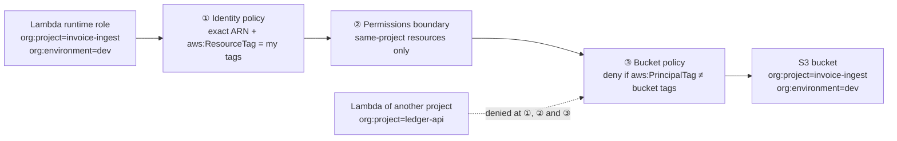

| Layer | Where | What it checks | Covers |
|---|---|---|---|
| **1. Identity policy of the runtime role** | Generated per component by the connection binders (§6.8.4) | Exact resource ARNs from the connections **plus** `aws:ResourceTag/org:project = ${aws:PrincipalTag/org:project}` and `aws:ResourceTag/org:environment = ${aws:PrincipalTag/org:environment}` on every action where AWS supports resource-tag conditions | Caller side |
| **2. Shared permissions boundary** (`cloudinfra-app-boundary`, §4.5) | Attached to every runtime role (required by the CFN execution role) | Same tag conditions for supported actions; for actions without tag support, only names built from the principal's tag (`${aws:PrincipalTag/org:project}--*`) | Caller side, even if layer 1 had a bug |
| **3. Resource policy on the target** | Generated on **every resource type that supports a resource policy**: S3 buckets, SQS queues, SNS topics, KMS keys, Secrets Manager secrets, DynamoDB tables, ECR repositories, EventBridge buses, OpenSearch domains, API Gateway (private), Lambda (invocation), and so on | **Deny** any principal whose `aws:PrincipalTag/org:project` or `aws:PrincipalTag/org:environment` is not exactly this resource's value. Works for **all actions** on the resource, including those that don't support resource-tag conditions (e.g. S3 object operations). | Target side, independent of the caller's policies |
| **4. Organization guardrail (SCP)** | Workload OUs (§4.7) | For principals tagged `org:managed-by=cloudinfra`: deny supported actions when `aws:ResourceTag/org:project ≠ ${aws:PrincipalTag/org:project}` | Whole account, including roles created outside the platform pattern |

Because the **runtime roles carry the same stack tags** as the resources (propagated by CloudFormation, and required on `iam:CreateRole` by the CFN execution role, §4.5), "same tags and values" is something AWS checks on every request. It does not depend on naming conventions.

#### 4.10.2 Example: the generated S3 bucket policy (illustrative)

```json
{
  "Version": "2012-10-17",
  "Statement": [
    {
      "Sid": "DenyOtherProjects",
      "Effect": "Deny",
      "Principal": "*",
      "Action": "s3:*",
      "Resource": ["arn:aws:s3:::invoice-ingest--uploads-222222222222-us-east-1",
                   "arn:aws:s3:::invoice-ingest--uploads-222222222222-us-east-1/*"],
      "Condition": {
        "StringNotEquals": { "aws:PrincipalTag/org:project": "invoice-ingest" },
        "BoolIfExists":    { "aws:PrincipalIsAWSService": "false" },
        "ArnNotLike":      { "aws:PrincipalArn": ["arn:aws:iam::222222222222:role/aws-service-role/*",
                                                  "arn:aws:iam::222222222222:role/cloudinfra/break-glass-*"] }
      }
    },
    {
      "Sid": "DenyOtherEnvironments",
      "Effect": "Deny",
      "Principal": "*",
      "Action": "s3:*",
      "Resource": ["arn:aws:s3:::invoice-ingest--uploads-222222222222-us-east-1",
                   "arn:aws:s3:::invoice-ingest--uploads-222222222222-us-east-1/*"],
      "Condition": {
        "StringNotEquals": { "aws:PrincipalTag/org:environment": "dev" },
        "BoolIfExists":    { "aws:PrincipalIsAWSService": "false" },
        "ArnNotLike":      { "aws:PrincipalArn": ["arn:aws:iam::222222222222:role/aws-service-role/*",
                                                  "arn:aws:iam::222222222222:role/cloudinfra/break-glass-*"] }
      }
    },
    { "Sid": "DenyInsecureTransport", "Effect": "Deny", "Principal": "*", "Action": "s3:*",
      "Resource": ["arn:aws:s3:::invoice-ingest--uploads-222222222222-us-east-1",
                   "arn:aws:s3:::invoice-ingest--uploads-222222222222-us-east-1/*"],
      "Condition": { "Bool": { "aws:SecureTransport": "false" } } }
  ]
}
```

Design notes:
- **Project and environment are separate Deny statements.** Several keys inside one `StringNotEquals` are combined with AND, which would deny only when *both* differ. Separate statements deny when *either* differs.
- **A principal with no tag is denied:** a negated condition on a missing key evaluates to true.
- **Exceptions are explicit and minimal:**
  - AWS service-linked roles, e.g. AWS Config reading the bucket configuration;
  - the audited break-glass role.

  The CloudFormation execution role and the S3 replication role (§10) carry the project tags, so they pass without exceptions.
- **AWS service principals** (e.g. S3 invoking Lambda, CloudFront reading S3) are not IAM roles and have no tags. They are allowed only through statements pinned to the **specific same-project source** with `aws:SourceArn` + `aws:SourceAccount` (the §6.3 pattern). The binder generates these only for connections drawn in the UI, so the source is always a resource with the same tags.

#### 4.10.3 What this covers, and the honest edges

| Situation | Behavior |
|---|---|
| Lambda → S3 / DynamoDB / SQS / SNS / Secrets / KMS of the same project + environment | Allowed (exact actions from the connection) |
| Lambda → same resource type of **another project** (ARN pasted in code) | **Denied** by layers 1, 2 and 3 |
| DEV component → STAGE resource of the same project | **Denied** (environment tag differs; also a different account) |
| Sharing with other projects / accounts | **By tags** (§4.11.1): the resource policy allows principals whose `org:product` / `org:portfolio` tags match the resource's `org:share-scope`, same environment, inside the organization, limited to `org:share-access` actions. **By agreement** (§4.11.2) for anything else |
| Humans (Identity Center) | Data access follows the environment policy: e.g. read for the product's engineers in DEV/TEST via an explicit, read-only exception on `org:product`; no human data access in PROD except break-glass |
| Network paths (DB, cache, OpenSearch in a VPC) | Security groups only allow ingress from the security groups of same-project components (`network.access`, §6.8.4). Databases also use IAM auth / per-project secrets, which are themselves tag-protected |
| Service without resource policies **and** without tag-condition support | Layer 1 uses exact ARNs, layer 2 uses the principal-tag-derived name pattern, and the catalog marks the service "name-scoped"; such services need platform review before enablement (§6.8.2) |

#### 4.10.4 Verification

- **Synthesis-time linter:**
  - every resource in a project carries identical `org:project` / `org:environment` values;
  - every runtime role has the boundary and tag conditions;
  - every resource that supports a resource policy has the project/environment deny statements.

  A template missing any of these is rejected.
- **CI cross-project tests (P1):** two projects are deployed in the platform test account. Tests assert that project A's Lambda **cannot** read, write or invoke project B's bucket, queue, table, secret or function, even with the exact ARN, and **can** use its own.
- **IAM Access Analyzer** (external and internal access findings) runs in every account. Any access path to a project resource from a principal outside that project raises a finding to the platform.

### 4.11 Sharing across projects and accounts: by tags or by agreement

Infrastructure created by the platform often needs assets owned by **other projects**, in the same or in **other AWS accounts**: a central data-lake bucket, a shared SQS queue, another product's KMS-encrypted dataset. Sharing is supported in two ways, and both **keep the tag-based isolation of §4.10**:

| Way | How it is decided | Approval per consumer | Use for |
|---|---|---|---|
| **1. Sharing by tags** (default) | The provider puts **share tags** on its resource. They define which consumers *can* be granted access (matching tags, any account of the organization). | **Yes, through the sharing approval workflow (§4.11.6).** The offer (share tags) is approved once; each consumer's access request is approved by the provider, or auto-approved if the provider chose `org:share-approval=auto` | Common, predictable sharing: within a product, within a portfolio, organization-wide reference data |
| **2. Sharing by agreement** | An explicit record naming one provider resource and one consumer | **Yes, through the same workflow** (provider owner, plus security / platform admin where required) | Anything the tag rules cannot express: one specific consumer, write access across products, outside the organization, exceptions |

In both cases the platform **generates** the permissions on both sides. Nobody hand-edits a policy.

#### 4.11.1 Sharing by tags

**Share tags on the provider resource** (set in the platform UI, deployed through the provider's normal infrastructure PR, gates and approvals):

| Tag | Values | Meaning |
|---|---|---|
| `org:share-scope` | `none` (default) \| `product` \| `portfolio` \| `organization` | **Who** may use the resource: principals whose `org:product` (or `org:portfolio`) equals the resource's value, or any platform principal in the organization |
| `org:share-access` | `read` (default) \| `readwrite` \| `invoke` \| `publish` \| `consume` | **What** they may do; mapped to exact actions per service (§6.8.1) |
| `org:environment` (existing) | — | Sharing by tags is **always same-environment**: the consumer's `org:environment` must equal the resource's. Never configurable by tag. |

**The rule AWS evaluates** for a consumer principal *P* and a provider resource *R*:

> allow the `org:share-access` actions **if** P's `org:environment` = R's `org:environment` **and** P is in the organization (`aws:PrincipalOrgID`) **and** (`org:share-scope = product` and P's `org:product` = R's `org:product`) **or** (`org:share-scope = portfolio` and P's `org:portfolio` = R's `org:portfolio`) **or** (`org:share-scope = organization`)

The rule needs no consumer ARNs or account IDs. It works **across accounts**, because AWS evaluates the caller's principal tags (`aws:PrincipalTag/...`) in the resource account's policy. A new project or account in the same product gets access automatically, and a project that moves to another product loses it automatically.

**What the platform generates:**

| Side | Generated from the tags |
|---|---|
| **Provider resource policy** (S3, SQS, SNS, KMS, Secrets Manager, DynamoDB, EventBridge, Lambda, ECR, Kinesis, OpenSearch, …) | An Allow for the share rule above, with the resource's **own tag values written in** at synthesis time (e.g. `aws:PrincipalTag/org:product = "pr-invoicing"`). The §4.10 deny statements are widened only to the same scope. For `read` sharing, an extra deny blocks every write action for anyone but the owning project. |
| **Provider KMS key** (if the data is encrypted) | Key policy grant for the same share rule, limited with `kms:ViaService` to the service in use |
| **Cross-account role** (pattern B, for services without resource policies) | Trust policy: any principal in the organization **with matching `org:product` / `org:portfolio` and `org:environment` tags**, instead of named consumer roles |
| **Consumer side** | When a consumer draws a connection to a shared resource (picked from the **shareable-resource catalog**, which is built from share tags), the platform checks the tags match, then raises an **access request** in the sharing approval workflow (§4.11.6). Only after approval does it generate the exact-ARN statements and the contract binding (auto-approved, with a notification to the provider, if the resource is tagged `org:share-approval=auto`). Because only the platform creates runtime roles and their policies, **no consumer can use a shared resource without an approved request**, even when the tags would match. The consumer's boundary allows cross-project access only to resources whose `aws:ResourceTag/org:share-scope` and product/portfolio match the consumer's tags (where the service supports resource-tag conditions), and only inside the organization. |

**Example: generated statements for a bucket tagged `org:product=pr-invoicing`, `org:share-scope=product`, `org:share-access=read`, `org:environment=prod` (illustrative):**

```json
[
  { "Sid": "ShareByTagRead", "Effect": "Allow", "Principal": "*",
    "Action": ["s3:GetObject", "s3:ListBucket"],
    "Resource": ["arn:aws:s3:::invoice-ingest--uploads-555555555555-us-east-1",
                 "arn:aws:s3:::invoice-ingest--uploads-555555555555-us-east-1/*"],
    "Condition": { "StringEquals": { "aws:PrincipalOrgID": "o-exampleorg",
                                     "aws:PrincipalTag/org:product": "pr-invoicing",
                                     "aws:PrincipalTag/org:environment": "prod" } } },
  { "Sid": "DenyOutsideShareScope", "Effect": "Deny", "Principal": "*", "Action": "s3:*",
    "Resource": ["arn:aws:s3:::invoice-ingest--uploads-555555555555-us-east-1",
                 "arn:aws:s3:::invoice-ingest--uploads-555555555555-us-east-1/*"],
    "Condition": { "StringNotEquals": { "aws:PrincipalTag/org:product": "pr-invoicing" },
                   "BoolIfExists": { "aws:PrincipalIsAWSService": "false" } } },
  { "Sid": "DenyWritesExceptOwner", "Effect": "Deny", "Principal": "*",
    "Action": ["s3:PutObject", "s3:DeleteObject", "s3:PutObjectAcl"],
    "Resource": "arn:aws:s3:::invoice-ingest--uploads-555555555555-us-east-1/*",
    "Condition": { "StringNotEquals": { "aws:PrincipalTag/org:project": "invoice-ingest" },
                   "BoolIfExists": { "aws:PrincipalIsAWSService": "false" } } }
]
```

The environment deny statement from §4.10.2 stays unchanged, and the service-linked-role and break-glass exceptions apply as before.

**Guardrails on share tags:**
- Share tags are `org:*` tags, so **only the platform pipeline can set or change them** (SCP §4.7). Changing a share tag is an infrastructure change with the normal gates and approvals.
- **Classification limits** (defaults, configurable, D37):
  - `public`/`internal` data: any scope.
  - `confidential`: up to `product`.
  - `restricted`: `none`, so agreements only.
- **Every change to share tags is a share-offer request** in the approval workflow (§4.11.6). It needs a security reviewer when widening scope beyond `product` or granting anything other than `read`.
- **Tag Policies** enforce the allowed values. The **shareable-resource catalog** in the UI lists every resource with a share scope, its owner, access level and classification.
- **IAM Access Analyzer:** archive rules are generated from the share tags, so expected access (e.g. "principals in o-exampleorg with product pr-invoicing, read") is archived automatically, and anything else alerts.
- **Revoking** = setting `org:share-scope=none`. The next deploy regenerates the policies and access stops for everyone at once. The consumers' connections are flagged in their projects.

#### 4.11.2 Sharing by agreement (explicit, for everything tags don't cover)

A sharing agreement is a record in the platform registry, created and approved in the UI:

| Field | Example |
|---|---|
| Provider | Project `datalake-core` / environment `prod` / account `666666666666` / resource `arn:aws:s3:::datalake-core--curated-666666666666-us-east-1` (or "non-platform resource" + ARN) |
| Consumer | Project `invoice-ingest` / environment `prod` / account `555555555555` / component (slot) `processor` |
| Access | `read` \| `write` \| `readwrite` \| `invoke` \| `publish` \| `consume` (mapped to exact actions per service from the Service Authorization Reference, §6.8.1) |
| Scope | Optional prefix / key condition (e.g. `s3:prefix = invoices/`) |
| Data classification | Must be ≤ the consumer project's classification ceiling |
| Expiry / review date | Required, e.g. 12 months; recertified quarterly |
| Approvals | Consumer owner (request) + **provider owner** + security reviewer for PROD or `confidential`+ data |

**Rules enforced on every agreement:**
- **Same environment tier only:** DEV↔DEV, PROD↔PROD. PROD resources are never shared with non-PROD. Any other combination needs a security exception.
- **Inside the AWS Organization by default** (`aws:PrincipalOrgID` / `aws:ResourceOrgID`). Accounts outside the organization (partners, vendors) are off by default and need an explicit exception, with an ExternalId for role assumption.
- **Least privilege:** exact actions for the access level, exact resource ARNs, optional prefix.
- **Both sides consent:** nothing is generated until the provider owner approves.

#### 4.11.3 How access is granted (per service)

| Pattern | When | Provider side (generated) | Consumer side (generated) |
|---|---|---|---|
| **A. Resource policy grant** (preferred) | Services with resource-based policies: S3, SQS, SNS, KMS, Secrets Manager, EventBridge buses, Lambda (invoke), DynamoDB (resource policies), ECR, OpenSearch, Kinesis (resource policies) | Allow statement for the consumer: `aws:PrincipalAccount = consumer account` **and** `aws:PrincipalTag/org:project = consumer project` **and** `aws:PrincipalTag/org:environment = env` **and** `aws:PrincipalOrgID = our org`. The §4.10 deny statements gain the approved consumer as their only additional exception. | Runtime role statement for the exact ARN + actions, with `aws:ResourceAccount = provider account` and, where supported, `aws:ResourceTag/org:project = provider project` |
| **B. Cross-account role** | Services without resource policies, or when the provider wants one auditable entry point | A role `xacct/{provider-project}/{consumer-project}` tagged with the provider's tags **plus** `org:share-consumer = {consumer project}`. Trust: the consumer component's role ARN, with `aws:PrincipalTag/org:project` and `org:environment` conditions and `aws:PrincipalOrgID`. Permissions: only the agreed actions on the agreed resources | `sts:AssumeRole` on **that one role ARN** only. The boundary allows `sts:AssumeRole` only when `aws:ResourceTag/org:share-consumer = ${aws:PrincipalTag/org:project}` |
| **C. AWS RAM share** | Resources shared by AWS RAM (e.g. subnets, Transit Gateway attachments, Glue Data Catalog, Route 53 Resolver rules) | RAM resource share to the consumer account, tagged with the agreement ID | Consumer stack references the shared resource ARN from the contract |
| **D. Encrypted data** | Any of the above where the data is KMS-encrypted | Key policy grant (pattern A) for the consumer role, with `kms:ViaService` limited to the service in use (e.g. `s3.us-east-1.amazonaws.com`) | `kms:Decrypt` / `kms:GenerateDataKey` on that key ARN only |
| **E. Private network path** | Cross-account network access (databases, internal APIs) | **PrivateLink endpoint service** (preferred) with allowed principals = consumer account; owned by the provider project or the network team | Interface endpoint + security group in the consumer project (`network.access`) |
| **F. Events** | EventBridge / SNS → SQS across accounts | Bus policy / topic policy allowing the consumer's rule or subscription (pattern A) | Rule target or subscription, plus the queue policy on the consumer's own queue |

**Non-platform resources** (in accounts the platform does not manage): the platform generates the consumer side. It gives the provider owner a **ready-to-apply policy snippet**. A readiness check (a harmless read such as `HeadBucket` / `GetQueueAttributes` from the consumer role) confirms the grant before the agreement is marked active.

#### 4.11.4 How sharing fits the four isolation layers (§4.10)

| Layer | Change for an approved agreement |
|---|---|
| 1. Consumer runtime role | Gets statements for the provider's exact ARNs and actions (pattern A) or for `sts:AssumeRole` on one role (pattern B). **Generated only from an active agreement**; the linter rejects any other cross-account statement. |
| 2. Permissions boundary | Allows cross-account access only to resources **inside the organization** (`aws:ResourceOrgID`), and role assumption only to roles tagged `org:share-consumer = ${aws:PrincipalTag/org:project}`. Everything else stays same-project only. |
| 3. Provider resource policy | **By tags:** one Allow for the share rule, with the deny statements widened to the share scope only. **By agreement:** the deny statements list only the owning project plus approved consumers (account + project + environment), and a precise Allow is added per agreement. |
| 4. SCP data perimeter | Platform principals cannot access resources outside the organization, and resource policies cannot grant to principals outside the organization, unless an exception is registered (§4.7). |

A consumer can therefore reach exactly the agreed resource, with exactly the agreed actions, from exactly the agreed component and environment. No other project in either account gains anything.

#### 4.11.5 Agreement workflow in the UI

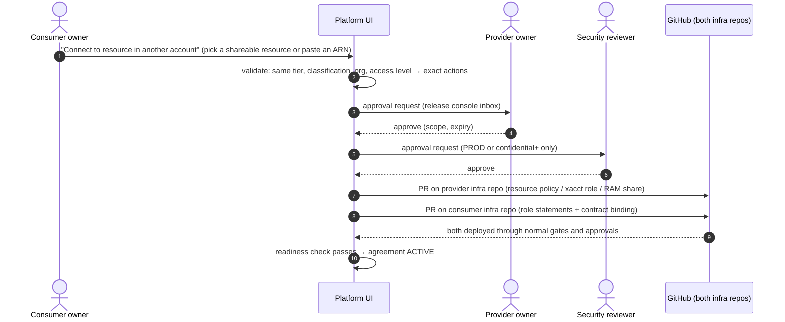

- **Shareable resources:** the catalog shows resources with share tags (self-service connect, §4.11.1) and resources marked as available by agreement (request and approve).
- **Contract:** the consumer's contract (§9.4) gets an `external` section with the provider ARN, region, KMS key ARN and access level. Application code reads it like any other binding.
- **Revocation and expiry:** revoking (by either owner or security) or expiry opens PRs that remove both sides. Expiry warnings go out 30 and 7 days before.
- **DR/HA (§10):** agreements cover both regions of each side. Resource policies are generated in every region where the provider resource or replica exists, and the contract lists per-region ARNs.
- **Audit:** every agreement, approval, change and revocation is in the release records. **IAM Access Analyzer** findings that match an active agreement are archived automatically; any other cross-account access raises an alert.

#### 4.11.6 Sharing approval workflow

**All sharing is granted through one approval workflow in the platform UI.** Tags (and agreements) define what *can* be shared. The workflow decides what *is* shared, by whom, and records why.

**Request types:**

| Request | Raised by | Effect when approved |
|---|---|---|
| **Share offer** | Provider owner | Sets or changes `org:share-scope` / `org:share-access` / `org:share-approval` on a resource. Opens the provider infra PR |
| **Access request** | Consumer owner (by drawing a connection to a shared resource) | Grants one consumer component access within the tag rule. Opens the consumer infra PR (and the provider PR where a per-consumer grant is needed, e.g. a KMS grant) |
| **Agreement request** | Consumer owner | Creates a sharing agreement (§4.11.2). Opens both PRs |
| **Renewal** | Platform (before expiry / at recertification) | Extends the access or agreement; if not approved in time, access is removed |
| **Revocation** | Provider, consumer, security | Removes access on both sides. Emergency revocation needs only security and takes effect at once |

**Approval routing** (defaults; configurable by platform admins, D38):

| Situation | Approvers |
|---|---|
| Share offer, scope `product`, access `read`, data ≤ `internal` | Provider product owner |
| Share offer, scope `portfolio`/`organization`, **or** any access beyond `read`, **or** data `confidential` | Provider product owner **+ security reviewer** |
| Access request within an approved offer, resource tagged `org:share-approval=auto` | **Auto-approved** (provider notified; request still recorded) |
| Access request within an approved offer, `org:share-approval=required` (default) | Provider product owner |
| Access request or agreement for **PROD** with `confidential` data | Provider product owner **+ security reviewer** |
| Agreement **outside the AWS Organization**, or a cross-environment exception | Provider product owner + security reviewer **+ platform admin** |
| Renewal | Same approvers as the original request |
| Emergency revocation | Security reviewer (single approver) |

**Workflow rules:**
- **Separation of duties:** the requester cannot approve their own request; two-approver steps need two different people. Approvers come from the registry groups of the provider product (owners) and from the security group.
- **Evidence on one page:**
  - what is shared and with whom (project, product, account, environment);
  - access level → exact actions;
  - data classification;
  - the **generated policy diff** for both sides;
  - the Access Analyzer preview of the resulting access.
- **Timeouts and escalation:** reminders after 2 business days; escalation to the product's secondary owner after 5; pending requests expire after 30 days.
- **Approval leads to deployment, never manual edits:** an approved request opens the infra PRs, which go through the normal gates. For STAGE/PROD they also need the usual release approval (§8.3). The release reviewer sees the sharing approval as evidence, so the decision is not asked twice: release approval checks the change, sharing approval checks the access.
- **Recertification:** every active access and agreement is re-approved periodically (default quarterly, by the provider owner). Anything not recertified is removed automatically.
- **Audit:** every request, decision, comment, generated policy and deployment is in the release records. Exportable per resource ("who can access this and who approved it") and per consumer ("what does this project use and who approved it").

**Engine:** AWS Step Functions (human approval steps with task tokens), state in DynamoDB, notifications through the in-app inbox and Amazon SES. These are the same AWS services as the rest of the control plane (§1).

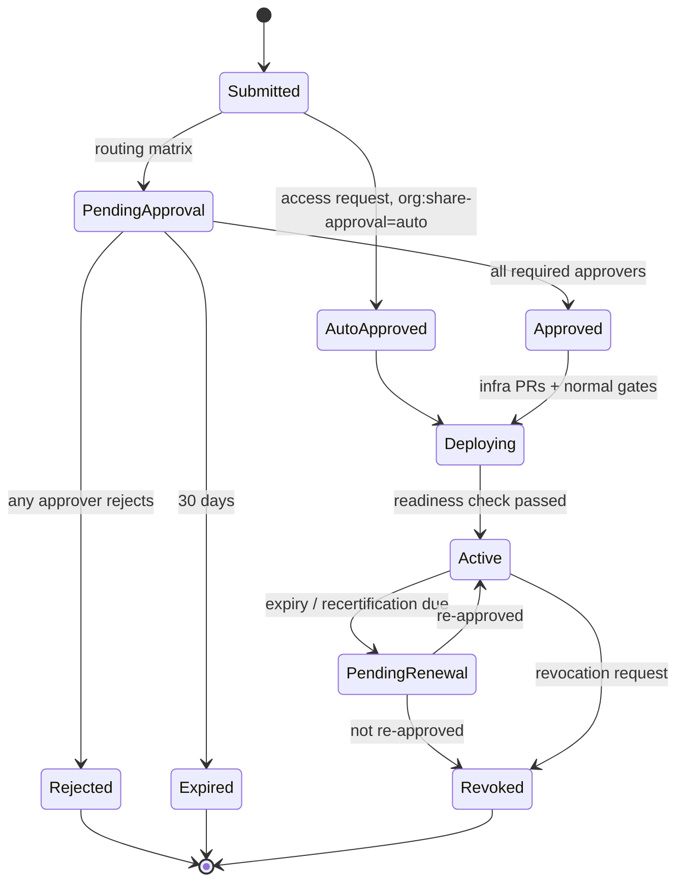

---

## 5. Multi-account environment strategy

### 5.1 Organization structure

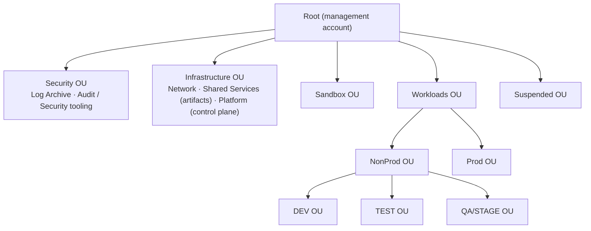

The full landing-zone OU structure (questionnaire-driven; Sandbox, DEV, TEST, STAGE, PROD always separate isolated OUs; one Security OU), its Control Tower controls and the isolated hub-and-spoke network are designed in §20. This diagram shows only the environment OUs. Separate OUs per environment let each environment have its own SCPs (environment lock, classification, sandbox budget/cleanup, prod deletion protection).

### 5.2 Account granularity: options

| Option | Accounts | Isolation between products | Main risk | When |
|---|---|---|---|---|
| **A. One account per environment** | 5 | Tags/ABAC only | Large blast radius; **shared service quotas** (e.g. Lambda's default 1,000 concurrent executions per account per region shared by everyone) | Small orgs |
| **B. One account per portfolio per environment** (recommended) | 5 × portfolios | Account boundary between portfolios; ABAC between products/projects inside | Moderate number of accounts | Default |
| **C. One account per product per environment** | 5 × products | Account boundary per product | Account sprawl | Regulated or very large products |

**Recommendation: B, with C available per product.** Account bindings (§5.5) decide per portfolio or product, so a product can move to dedicated accounts later without changing the generator, pipeline or policies. Only its binding changes. **Tag-based isolation is required in all three options**, because more than one project always shares an account.

### 5.3 Environment profiles

These are the **default profiles** for the five seeded environments. All of them can be changed per environment in the application (§5.5).

| | Sandbox | DEV | TEST | QA/STAGE | PROD |
|---|---|---|---|---|---|
| Purpose | Experiments, feature branches | Integration on `main` | Automated test suites | Production-like, UAT | Live |
| Deploy trigger | Manual dispatch from **any branch** | Auto on push to `main` | Auto after DEV succeeds | After TEST + **approval** | After STAGE + **approval** |
| GitHub env protection | None | Branch: `main` | Branch: `main` | `main`, **required reviewer approval** (QA; release console, GitHub identities), no self-approval | `main`/release tags, **required reviewer approval** (product owner + change mgmt; release console, GitHub identities), no self-approval, optional wait timer |
| Data classification allowed | ≤ internal | ≤ confidential (synthetic data) | ≤ confidential | as product ceiling | as product ceiling |
| `retainOnDelete` default | false | false | false | true | true (+ stack policy blocks replace/delete) |
| Log retention | 7 d | 14 d | 14 d | 90 d | ≥ 365 d |
| Cleanup | `org:expires-on` TTL (e.g. 14 days) + nightly cleanup job | — | — | — | Deletion denied by SCP except break-glass |
| Budget | Per-project budget alarm + hard SCP limits on expensive services | Budget alarm | Budget alarm | Budget alarm | Alarms + anomaly detection |
| Alarms | — | basic | basic | full | full + paging |

### 5.4 Bootstrap at scale

| Layer | What | Deployed by | When |
|---|---|---|---|
| **Account bootstrap** | GitHub OIDC provider; shared policies `cloudinfra-deploy-abac`, `cloudinfra-exec-abac`, `cloudinfra-app-boundary`; `CloudInfraProvisioner` role (trusted only by the Platform account, with `aws:PrincipalOrgID`); in gated accounts, the `PlatformReleaseExecutor` role (§8.3.1: execute reviewed change sets / release reviewed artifacts only; session tag `org:project` required) | **Service-managed StackSet** targeting the workload OUs, auto-deploying to new accounts | Once; updates roll out across the org |
| **Shared Services** | Artifact bucket per **enabled** region (created when an admin enables a region, §10.9); its bucket policy lets org accounts' execution roles read `${aws:PrincipalTag/org:project}/*` only (`aws:PrincipalOrgID` + principal-tag condition) | Platform IaC | Once per region |
| **Project bootstrap** | Per enabled environment: `GitHubDeployRole` + `CfnExecutionRole`, **tagged with the project's tags** and attaching the shared policies. Small, because the policies already exist. | Orchestrator via `CloudInfraProvisioner` in each target account (in parallel, throttled per account) | Once per project per environment |

Lambda requires the code bucket to be in the **same region** as the function; it can be in another account. Hence one artifact bucket per region in Shared Services.

### 5.5 Configurable environments and account numbers

Environments and their AWS account numbers are **data in the application, not code**. The five environments above are the default seed. Admins can rename, reorder, add (e.g. `perf`) or retire environments, and bind account numbers to them, without a code change or redeploy.

#### 5.5.1 Environment definition (admin screen)

| Field | Example | Notes |
|---|---|---|
| `envId` | `stage` | Immutable slug (`^[a-z][a-z0-9]{1,15}$`). Used as the GitHub environment name, the `org:environment` tag value and the OIDC `sub` suffix, so it **cannot be renamed** once a project uses it. |
| `displayName` | `QA/STAGE` | Free text, can change at any time. |
| `order` | `4` | Promotion order. Must be unique among active environments. |
| `tier` | `sandbox` \| `nonprod` \| `prod` | Selects default guardrails and which OU an account must be in. |
| `requiredGate` | `true` | If true, any later environment requires this one to be enabled (e.g. no prod without stage). |
| `deployTrigger` | `manual-any-branch` \| `auto-on-main` \| `after-previous` \| `after-previous-with-approval` | Becomes the job wiring in the generated `deploy.yml`. |
| `requiresApproval` | `true` | GitHub required-reviewer approval before deployment. **Locked to `true` for STAGE and all `prod`-tier environments** (§8.3). |
| `protectionProfile` | branch rules, reviewer source, prevent self-review, wait timer | Applied to the GitHub environment (§7.2). |
| `guardrailProfile` | classification ceiling, retention minimums, retain defaults, TTL, stack policy | Feeds validation, cfn-guard rules and `config/{env}.json` defaults (§5.3 table = the default profiles). |
| `status` | `active` \| `retired` | Retired environments are hidden for new projects; existing projects keep working until migrated. |

#### 5.5.2 Account bindings

An account binding says *"for this environment, this portfolio (or product), in this region, deploy to this AWS account"*.

| Field | Example | Rule |
|---|---|---|
| `envId` | `prod` | Must be an active environment |
| `scope` | `portfolio` / `product` | A product binding overrides its portfolio's binding (matches option B with C per product, §5.2) |
| `scopeId` | `pf-payments` | Must exist in the org registry |
| `region` | `us-east-1` | Must be in the region allow-list |
| `accountId` | `555555555555` | 12 digits. **Unique across environments:** an account can belong to only one environment (enforced by a transactional uniqueness record). It may serve several portfolios only if the admin explicitly allows sharing (option A). |
| `status` | `pending` → `onboarded` / `failed` → `retired` | Only `onboarded` bindings can be selected for deploys |

Resolution at preview time is: product binding → portfolio binding → error "no account configured for {env}". The preview shows the resolved account for every environment before the user clicks Create.

#### 5.5.3 Onboarding checks (run when a binding is saved or re-validated)

| Check | How |
|---|---|
| Account belongs to the organization and is active | `organizations:DescribeAccount` from the Platform account (delegated admin) |
| Account is in the OU that matches the environment's tier | `organizations:ListParents` |
| Account bootstrap is in place | StackSet instance status `CURRENT` for that account + region |
| Platform can reach it | Assume `CloudInfraProvisioner` and call `sts:GetCallerIdentity`; returned account must equal `accountId` |
| GitHub OIDC provider and shared tag-based policies exist | Read-only IAM checks through the provisioner role |
| Account not bound to a different environment | Uniqueness record |

A binding that fails any check stays `failed`, with the reason shown in the admin screen.

#### 5.5.4 Who can change it, and how changes propagate

- **Permissions:** only `platform-admin` can edit environments and bindings. Changes to `prod`-tier environments need a **second admin's approval** (four-eyes) before they take effect. Every change is versioned and audited (who, when, before/after).
- **New projects** always use the current configuration.
- **Existing projects are never silently re-pointed.** When an environment is added or a binding changes, the platform lists the affected projects and, per project:
  1. Bootstraps the new account (§5.4).
  2. Updates the repo's GitHub variables (§5.5.5).
  3. Opens a "sync pipeline" PR if the environment list or order changed.

  Moving an existing stack to a different account is a **migration** (deploy in the new account, move data, retire the old stack). It is done on purpose and per project, never automatically.
- A **reconciler** compares each repo's GitHub variables with the application configuration nightly. It reports drift and, if configured, repairs it.

#### 5.5.5 GitHub variables (all pipeline configuration lives here)

Every value the pipeline needs is a **GitHub Actions variable** (`vars.*`), written by the platform. The workflow files contain no account numbers, ARNs, names or tags; they only reference variables. There are **no GitHub secrets** in OIDC mode, because no credentials are stored. A role ARN is an identifier, not a credential, so it is a variable too.

| Variable | Level | Example | Source in the application |
|---|---|---|---|
| `PROJECT_NAME` | Repository | `invoice-ingest` | Project |
| `ORG_PORTFOLIO` | Repository | `pf-payments` | Ownership (registry ID) |
| `ORG_PRODUCT` | Repository | `pr-invoicing` | Ownership |
| `ORG_COST_CENTER` | Repository | `CC-4410` | Registry (product) |
| `ORG_DATA_CLASSIFICATION` | Repository | `confidential` | Ownership |
| `ENVIRONMENT_ORDER` | Repository | `sandbox,dev,test,stage,prod` | Environment config (informational; the generated `deploy.yml` holds the actual job chain) |
| `ENVIRONMENT_NAME` | **Environment** | `prod` | `envId` |
| `AWS_ACCOUNT_ID` | **Environment** | `555555555555` | Resolved account binding |
| `AWS_REGION` | **Environment** | `us-east-1` | Binding region (multi-region projects use `AWS_PRIMARY_REGION` / `AWS_SECONDARY_REGION` instead, §10.5) |
| `AWS_ROLE_ARN` | **Environment** | `arn:aws:iam::555555555555:role/cloudinfra/invoice-ingest-deploy` | Project bootstrap output |
| `CFN_EXEC_ROLE_ARN` | **Environment** | `arn:aws:iam::555555555555:role/cloudinfra/invoice-ingest-cfn-exec` | Project bootstrap output |
| `ARTIFACT_BUCKET` | **Environment** | `cloudinfra-artifacts-999999999999-us-east-1` | Shared Services bucket for the binding's region |

- **Plan environments** (`stage-plan`, `prod-plan`) have their own copy of these environment variables, where `AWS_ROLE_ARN` points to the **plan role** (§8.3). The workflow uses the same variable name everywhere; GitHub supplies the right value per environment.
- **Environment-level variables** are visible only to jobs that run in that GitHub environment. So the DEV job never sees the PROD account number or role.
- GitHub's precedence is environment → repository → organization. The platform writes each variable at exactly one level, so precedence never decides a value by accident.
- **Who can edit them:** the product's GitHub access team (from the registry) gets the `maintain` role on the repo, not `admin`, so it cannot change variables or environment protection. Only the platform (GitHub App) and org admins can. This is a convenience control, not the security boundary.
- **The security boundary is still AWS.** If someone did change `AWS_ACCOUNT_ID` or a tag variable:
  - OIDC trust in each account only accepts this repo + this environment.
  - IAM only accepts stack tags equal to the deploy role's own tags (§4.4).
  - The pipeline also checks that `aws sts get-caller-identity` returns `vars.AWS_ACCOUNT_ID` and that `vars.ENVIRONMENT_NAME` equals the job's GitHub environment, and stops if not.

  A tampered variable can make a deploy fail; it cannot make it touch another project's or another environment's resources.
- **Long-lived credentials mode (§8.7)** is the only exception: access keys are credentials and are stored as GitHub **environment secrets**, never as variables.

---

## 6. CloudFormation generation engine

### 6.1 Approach: building blocks + connection binders

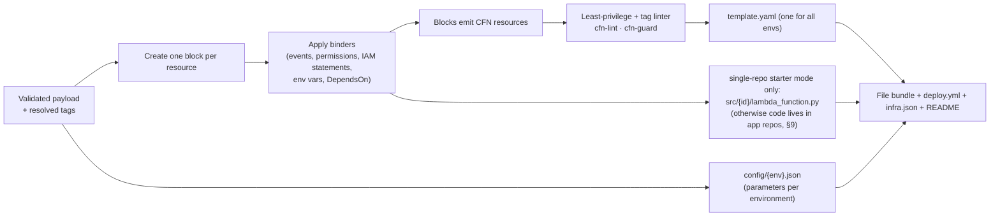

- **One template for all environments.** Differences between environments are only parameter values in `config/{env}.json` (memory, retention, concurrency, retain flags), checked against per-environment ranges.
- **Tags are not hardcoded per resource in the template.** They are applied as **stack tags** by the pipeline and propagated by CloudFormation. The template itself stays environment-neutral and ownership-neutral. (A resource type that doesn't receive propagated tags gets explicit `Tags` from parameters; the linter checks every taggable resource ends up tagged.)
- Output is **deterministic** (stable logical IDs, sorted keys, no timestamps), so regenerating gives an empty changeset.

### 6.2 Naming

| Item | Pattern | Example |
|---|---|---|
| Stack | `{project}` (one per environment account) | `invoice-ingest` |
| Logical IDs | `PascalCase(id)` + type suffix | `UploadsBucket`, `ProcessorFunction`, `ProcessorRole` |
| S3 bucket | `{project}--{id}-${AWS::AccountId}-${AWS::Region}` | `invoice-ingest--uploads-222222222222-us-east-1` |
| Lambda / DynamoDB | `{project}--{id}` | `invoice-ingest--processor` |
| Log group | `/aws/lambda/{project}--{id}` | — |
| IAM roles | CloudFormation-generated name, Path `/app/{project}/`, tagged | — |
| Boundary | Shared `cloudinfra-app-boundary` per account | — |

The account ID in bucket names keeps them unique across environments.

### 6.3 S3 → Lambda wiring (and the circular dependency trap)

The obvious template has a dependency loop:
- The bucket's notification needs the function ARN.
- The `Lambda::Permission` needs the bucket ARN.
- The bucket must wait for the permission, because S3 checks that it may invoke the function when the notification is saved.

**Fix:**
1. The bucket name is predictable (built with `Fn::Sub`).
2. `Lambda::Permission.SourceArn` and the function role's `s3:GetObject` resource use a **constructed ARN string**, not `Ref`/`GetAtt`.
3. The bucket gets `DependsOn` on the permission.
4. The permission sets `SourceAccount: ${AWS::AccountId}`, so another account that owns a bucket with that name cannot invoke the function.

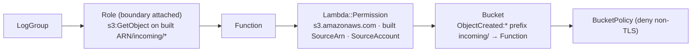

### 6.4 Defaults built into each block
- **S3:**
  - Public access blocked; ACLs off; encryption (SSE-S3, or SSE-KMS for `confidential`+).
  - Bucket policy: deny other projects and other environments by principal tag (§4.10.2), and deny non-TLS requests.
  - Versioning + lifecycle.
  - `DeletionPolicy: RetainExceptOnCreate` / `UpdateReplacePolicy: Retain` when retained (stage/prod by default).
- **Lambda:**
  - One execution role per function, with the shared boundary attached; exact-ARN inline policy (logs to its own log group + binder statements).
  - An explicit log group with retention per environment; JSON logging.
  - `arm64`.
  - Code: in the recommended split model (§9) the function is created with a platform bootstrap package and the **application repo** deploys the real code. In single-repo starter mode only, code comes from the regional artifact bucket at `{project}/{tree-hash}/{id}.zip`.
  - DLQ / on-failure destination recommended for S3 triggers.
- **DynamoDB:** on-demand billing, point-in-time recovery, encryption, deletion protection in stage/prod.

### 6.5 Template parameters

| Parameter | Source |
|---|---|
| `ProjectName` | GitHub environment variable |
| `EnvironmentName` | GitHub environment variable (must equal the deploy role's `org:environment` tag) |
| `CodeS3Bucket`, `CodeS3Prefix` | Bootstrap package location (split model, §9) or `{project}/{tree-hash-of-src}` (single-repo starter mode) |
| Per-resource settings (memory, retention, concurrency, retain) | `config/{env}.json` |

### 6.6 Validation gate
1. Schema + graph + registry/entitlement checks (§3.3).
2. **Least-privilege linter:**
   - No `Allow` with `*` / `service:*` actions or `*` resources in generated roles.
   - No `iam:*` or `iam:PassRole` in app roles. No `sts:AssumeRole`, except on the single cross-account role named in an **active sharing agreement** (§4.11). No cross-account resource statements unless generated from an active agreement.
   - Every generated role has the boundary.
3. **Tag linter:** every taggable resource will carry the required `org:*` keys (via propagation or explicit tags) with **identical** project/environment values. Every runtime role has the boundary and tag conditions, and every resource that supports a resource policy has the same-tag deny statements (§4.10).
4. cfn-lint; **cfn-guard rules per environment** (e.g. prod: retain + alarms + retention ≥ 365 days).
5. Golden-file tests for every catalog combination.

### 6.7 Idempotency of the template
- Stable logical IDs and predictable physical names.
- Retain policies on stateful resources; stack policy in prod.
- Code keys based on content (tree hash). A docs-only push gives an empty changeset (`--no-fail-on-empty-changeset`).
- No timestamps or request IDs in the template; deploys go through changesets.

---

### 6.8 Full AWS service coverage: every service and every combination, including databases

**Goal:** users can build any combination of AWS services that CloudFormation supports, including all database engines, with the same security, tagging, environment and approval guarantees as the Lambda + S3 example.

**Why the hand-written approach must change:** AWS has well over a thousand CloudFormation resource types and adds more every month. Hand-writing a block and binder for each one, and testing every combination by hand, does not scale. The engine therefore **generates** most of the catalog from AWS's own machine-readable specifications and adds **curated, opinionated blocks** on top for the services people use most.

#### 6.8.1 Two inputs published by AWS

| Source | What it gives the platform | How it is used |
|---|---|---|
| **CloudFormation resource provider schemas** (JSON Schema for every resource type; `aws cloudformation describe-type` / published schema bundle per region) | Every property, its type, required/read-only/create-only fields, which properties force **replacement**, available `GetAtt` attributes, tagging support | Generates the UI form, payload validation, the replacement-risk classifier (§8.4.2) and correct `Ref`/`GetAtt` wiring for any resource type |
| **AWS Service Authorization Reference** (machine-readable JSON per service: actions, resource ARN formats, condition keys, access levels) | For every action: read/write/list/tagging level, ARN pattern, whether `aws:ResourceTag` / `aws:RequestTag` are supported | Generates least-privilege `iam.access` statements for **any** service, the tag-condition support matrix (§4.6) and the per-service parts of the shared tag-based policies (§4.5) |

A nightly **catalog sync job** downloads both, diffs them against the current catalog version, and opens a PR on the platform repo with new and changed types. A platform engineer reviews it, the golden tests run, and it ships as a new `catalogVersion`. Nothing reaches users without review.

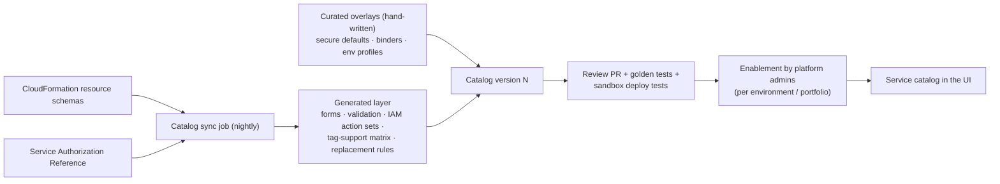

#### 6.8.2 Catalog tiers

| Tier | What | Defaults and wiring | Who can use it |
|---|---|---|---|
| **Tier 1: Curated** | The most-used services (list below) | Hand-written secure defaults per environment profile, binders for connections, tested combinations, reference patterns | All users |
| **Tier 2: Schema-driven** | **Any other project-scoped CloudFormation resource type** | Generated form + validation; mandatory guardrails applied to every type (naming, tags, encryption where the schema has it, deletion policies for stateful types); generic `iam.access` binder from the Service Authorization Reference | Enabled per service by platform admins after a short review (ABAC support, guard rules, cost); can be limited to sandbox/dev first |
| **Excluded** | Account-wide or organization-wide types (Organizations, Control Tower, IAM Identity Center, account settings, IAM users/groups, VPC creation where the landing zone owns the network, billing) and anything that can't be scoped to one project | — | Not offered; managed by the landing zone / platform team |

Promoting a Tier 2 service to Tier 1 is a normal catalog change: add a curated overlay and binders.

**Tier 1 at launch (proposal, D27):**

| Category | Services |
|---|---|
| Compute | Lambda, ECS (Fargate), EKS workloads (shared clusters), App Runner, Batch |
| Integration | Step Functions, EventBridge (buses, rules, Scheduler, Pipes), SQS, SNS, Kinesis Data Streams, Amazon Data Firehose, Amazon MQ, MSK |
| API & edge | API Gateway (REST, HTTP, WebSocket), Application/Network Load Balancer (listener rules on shared or project ALB), CloudFront, AWS WAF (web ACL association) |
| Storage | S3, EFS |
| **Databases** | **Aurora PostgreSQL / MySQL (incl. Serverless v2), RDS PostgreSQL / MySQL / MariaDB, DynamoDB, DocumentDB, Neptune, ElastiCache (Valkey / Redis OSS / Memcached), MemoryDB, Keyspaces, Timestream, Redshift Serverless, OpenSearch Service (incl. Serverless)** |
| Analytics | Glue (jobs, crawlers, Data Catalog), Athena workgroups, Lake Formation permissions (project-scoped) |
| Security & config | KMS keys (project keys), Secrets Manager, SSM parameters, AppConfig, Cognito user pools |
| Observability | CloudWatch alarms, dashboards, log groups, X-Ray groups |
| Machine learning | SageMaker endpoints/models (project-scoped), Amazon Bedrock access (model invocation permissions) |

**Commercial database engines:** RDS for Oracle and RDS for SQL Server include third-party vendor licenses. Because of the open-source/no-commercial-products policy (§1), they are **excluded by default** and can be enabled only by an explicit decision (D28).

#### 6.8.3 Databases: what the platform adds

Databases need more than a resource: network placement, credentials, backups and engine-specific settings. The curated database blocks provide these automatically.

| Concern | Built-in behavior |
|---|---|
| **Network** | Placed in the landing zone's private database subnets (published to SSM by the network team, D23). A **security group per database**. Ingress is opened only by a connection (`network.access`, below) from a specific compute slot's security group, on the engine port. **Never public.** |
| **Credentials** | **No passwords in templates or repos.** RDS/Aurora/DocumentDB/Redshift use **AWS-managed master credentials in Secrets Manager** (`ManageMasterUserPassword`) with rotation. App runtime roles get `secretsmanager:GetSecretValue` on that one secret only. **IAM database authentication** (`rds-db:connect` for a specific DB user) is offered where the engine supports it. |
| **Connections from Lambda** | **RDS Proxy** added automatically when a Lambda slot connects to RDS/Aurora (connection pooling + IAM auth) |
| **Encryption** | At rest with the project KMS key (stage/prod) or AWS-managed key (sandbox/dev); TLS required (parameter group `require_secure_transport` / `rds.force_ssl`) |
| **Resilience per environment profile** | Sandbox/dev: single-AZ, small instance or serverless minimum, 1-day backups. Stage/prod: Multi-AZ / Aurora replicas, longer backup retention, Performance Insights, enhanced monitoring |
| **Data protection** | `DeletionProtection` on stage/prod; `DeletionPolicy: Snapshot` (or `RetainExceptOnCreate` where snapshots don't apply) and `UpdateReplacePolicy: Snapshot`. Any change that would **replace** a database is classified **high risk** and blocked without an override (§8.4.2). |
| **Parameter groups** | Generated per database from the engine family, with secure defaults; overridable settings limited to an allow-list |
| **Contract exposes** | Endpoint(s) (writer/reader), port, engine/version, database name, secret ARN, proxy endpoint, IAM auth user, security group ID |
| **Schema migrations** | Owned by the **application repo** (solution code), using open-source tools such as Flyway, Liquibase or Alembic. Run by the golden-path pipeline as a one-off ECS task or Lambda **inside the VPC**, before the new code version is released. Same approvals as the app deploy (§9.9 independence preserved). |

#### 6.8.4 Connection kinds that cover any combination

Combinations are built from a **small set of generic connection kinds** that work across services, not from a binder per pair of services:

| Connection kind | Examples | What the binder generates |
|---|---|---|
| `iam.access` (read / write / readwrite / admin-data) | Lambda → DynamoDB, ECS → S3, Step Functions → Lambda, Glue → S3 | Least-privilege statements from the Service Authorization Reference for the target's ARN; tag conditions where supported |
| `network.access` | ECS → Aurora (5432), Lambda → ElastiCache (6379), EKS workload → OpenSearch (443) | Security group ingress rule (source SG → target SG, engine port only); VPC config on the source if missing |
| `event.source` (poll-based) | SQS / Kinesis / DynamoDB Streams / MSK / Amazon MQ → Lambda | Event source mapping + the poller permissions on the source |
| `event.notify` (push-based) | S3 → Lambda/SQS/SNS/EventBridge, SNS → SQS/Lambda | Notification config + resource policy on the target with `SourceArn`/`SourceAccount` (the §6.3 pattern, generalized) |
| `event.rule` | EventBridge rule/schedule/pipe → any supported target | Rule/schedule/pipe + target role or resource policy |
| `api.route` | API Gateway / ALB → Lambda / ECS / Step Functions | Integration, route, permission/target group |
| `workflow.task` | Step Functions → Lambda / ECS / DynamoDB / SQS / SNS / Glue / Batch / Bedrock … | Task state substitution values + state machine role statements for that integration |
| `secret.binding` | Any compute → database secret / Secrets Manager secret / SSM parameter | `GetSecretValue`/`GetParameter` on that one ARN + KMS decrypt on its key; value name injected as env var |
| `cdn.origin` | CloudFront → S3 / ALB / API Gateway | Origin + origin access control and the matching bucket/resource policy |
| `xacct.access` | Any component → a resource in **another AWS account** (S3, SQS, SNS, KMS, DynamoDB, secrets, events, private APIs) | Created only from an approved **sharing agreement** (§4.11): provider resource policy / cross-account role / RAM share / PrivateLink, plus consumer role statements and contract binding |

Each connection kind declares **which source and target types it accepts**, using capabilities from the generated layer (e.g. "can be a Lambda event source", "has a security group", "has an ARN"). So a new service is usable in combinations as soon as its schema and authorization data are in the catalog. The **compatibility matrix** shown in the UI is computed, not hand-maintained.

#### 6.8.5 Scaling templates: layered stacks

Large combinations can exceed CloudFormation limits (500 resources per stack, 1 MB template) and mix very different change rates. The engine splits a project into **layer stacks** automatically when needed:

| Stack | Contains | Change rate | Protection |
|---|---|---|---|
| `{project}-data` | Databases, buckets, tables, streams, KMS keys, secrets | Rare | Strongest: stack policy denies replace/delete; retain/snapshot policies |
| `{project}-integration` | Queues, topics, event buses, rules, APIs | Medium | Standard |
| `{project}-compute` | Lambda shells, ECS services, EKS namespace resources, state machine roles | Frequent | Standard |
| `{project}-edge` | CloudFront, WAF associations, DNS records | Rare | Standard |

- Layers reference each other through **SSM parameters**, not CloudFormation exports (same reason as §9.4).
- They deploy in dependency order in the same pipeline run, each through its own change set, and STAGE/PROD reviewers approve **all layer change sets together** as one release.
- Small projects stay a single stack.

#### 6.8.6 How "all combinations" are validated and tested

Exhaustive testing of every combination is impossible, so correctness rests on **construction rules** plus **systematic sampling**:

1. **By construction:** every resource is validated against its AWS schema; every connection against the computed compatibility matrix; every IAM statement is generated from the authorization data and passes the least-privilege linter; every template passes cfn-lint and cfn-guard. A combination that passes these is valid by design.
2. **Golden tests:** every Tier 1 block and every connection kind has reference templates in CI.
3. **Pairwise combination tests:** CI generates **pairwise (all-pairs) combinations** of Tier 1 types × connection kinds × environment profiles. This covers every interaction between any two choices with a manageable number of cases. Each case is synthesized and linted on every change.
4. **Real deploy tests:** a nightly job deploys a rotating sample of combinations (including every database engine at least weekly) into a dedicated **platform test account**, runs connectivity checks (e.g. Lambda → RDS Proxy → Aurora with IAM auth), then deletes them.
5. **Reference patterns:** popular combinations are offered as one-click **patterns** in the UI, each fully deploy-tested. Examples:
   - REST API + Lambda + Aurora Serverless;
   - containerized service on ECS + ALB + RDS PostgreSQL + ElastiCache;
   - event pipeline (S3 → EventBridge → Step Functions → Lambda → DynamoDB);
   - streaming (Kinesis → Lambda → OpenSearch);
   - data lake (S3 + Glue + Athena + Lake Formation).

#### 6.8.7 Governance for a large catalog

- **Enablement:** admins enable services per environment tier and per portfolio (e.g. Neptune allowed in sandbox only until reviewed). Disabled services are hidden in the UI and also denied by SCP, so the rule holds outside the platform too.
- **Cost visibility:** the preview shows an indicative monthly cost per environment for each resource. It is computed in-house from the **AWS Price List API** (AWS service, no third-party tool).
- **Quotas:** the preview warns when a combination would approach an account quota (e.g. VPC security groups, Lambda concurrency), using the Service Quotas API.
- **Deprecations:** when AWS deprecates a resource type, property or engine version, the catalog sync flags the affected projects and the platform opens upgrade PRs on their infrastructure repos.

---

## 7. GitHub repository provisioning

### 7.1 Identity: GitHub App (recommended)
1-hour installation tokens, per-installation rate limits, and an audit trail as a bot. Permissions:

| Permission | Level | Used for |
|---|---|---|
| Administration | write | Create/delete repos, custom properties |
| Contents | write | Commit |
| **Workflows** | write | Required to commit anything under `.github/workflows/` |
| Secrets | write | Only for long-lived credentials mode (§8.7); not needed with OIDC |
| Variables | write | Actions variables |
| Environments | write | Create one GitHub environment per configured environment |
| Actions | read | Run status |
| Deployments | write | Run status; **submit reviewer approvals from the release console** (as the reviewer, via user-to-server token, §8.5) |
| Members | read | Resolve reviewer teams |

Webhooks: `workflow_run`, `deployment`, `deployment_status`, `deployment_review`, `deployment_protection_rule`. GitHub Apps can create repos in **organizations**; personal-account repos are out of scope for v1.

### 7.2 Provisioning steps (each step is safe to retry)

| # | Step | How | Retry / idempotency approach | Undo (before the commit) |
|---|---|---|---|---|
| 1 | Create repo | `POST /orgs/{org}/repos` (`auto_init: true`). Set **custom properties** `portfolio`, `product`, `project`; grant the product's GitHub access team (from the registry) the `maintain` role. | Name exists → check the ownership marker (custom property `provision-request`); resume if ours, otherwise fail with a name conflict | Delete the repo (only if this job created it) |
| 2 | Bootstrap AWS **per enabled environment** (in parallel) | AssumeRole `CloudInfraProvisioner` in each target account → create/update `cloudinfra-bootstrap-{project}` (tagged roles, OIDC trust for `repo:{owner}/{repo}:environment:{env}`) | CloudFormation `ClientRequestToken`; create-or-update | Delete the bootstrap stack in each account where it was created |
| 3 | GitHub environments | `PUT /repos/{o}/{r}/environments/{env}` for each enabled environment, with protection rules from that environment's protection profile (§5.5) (branch policies; for STAGE and PROD: required reviewers from the registry, prevent self-review, plus a separate `{env}-plan` environment without reviewers, §8.3) | `PUT` can safely be repeated | Removed when the repo is deleted |
| 4 | GitHub variables | Repository variables (project + ownership tags) and **environment variables per enabled environment** (`ENVIRONMENT_NAME`, `AWS_ACCOUNT_ID`, `AWS_REGION`, `AWS_ROLE_ARN`, `CFN_EXEC_ROLE_ARN`, `ARTIFACT_BUCKET`). Full list in §5.5.5. No secrets in OIDC mode. | Create-or-update (`POST`, then `PATCH` on 409) | Removed when the repo is deleted |
| 5 | **Atomic commit** | Git Data API: create tree (all files) → create commit → fast-forward `refs/heads/main` (`force: false`) | Skip if `main` already has the job's commit trailer | **None.** The repo is kept from here on |
| 6 | Track promotion | `deployment_status` / `workflow_run` webhooks per environment; reconciler as a backup | Matched by `head_sha` + environment | — |

**Why variables are set before the commit:** pushing `deploy.yml` starts the workflow at once.

**Why the Git Data API:** one commit appears all at once. The per-file contents endpoint would create N commits and N workflow runs.

**Why environment-scoped values:** each environment's job sees only its own account's role. A DEV job cannot even read the PROD role ARN.

### 7.3 Rate limits and API etiquette
- Honor `x-ratelimit-remaining` / `reset` and `retry-after`. Otherwise use exponential backoff with full jitter (1 s base, 60 s cap, 6 attempts).
- Content-creating calls are serialized per installation, at least 1 s apart (token bucket, §12.3).
- Webhooks instead of polling; conditional requests (`304`s are not counted against the limit).
- A project with 5 environments needs roughly 25–30 write calls. At 1 write/s per installation, that is about 30 s of GitHub time per project, which is why provisioning is async and queued.

---

## 8. Deployment pipeline (GitHub Actions + OIDC, configurable environments)

### 8.1 Trust model per environment

```mermaid
flowchart LR
  subgraph GHJ["GitHub job: environment = dev"]
    J["deploy-dev"] -->|"JWT sub = repo:acme-platform/invoice-ingest:environment:dev"| X[" "]
  end
  X -->|"AssumeRoleWithWebIdentity"| STS["STS in DEV account"]
  STS -->|"trust: aud + sub exact match"| DR["GitHubDeployRole (DEV)<br/>tags: org:project=invoice-ingest,<br/>org:environment=dev, …"]
  DR -->|"CreateChangeSet with stack tags<br/>(must equal role tags)"| CFN["CloudFormation"]
  CFN -->|"assumes"| ER["CfnExecutionRole (DEV)<br/>same tags · cloudinfra-exec-abac"]
  ER -->|"create/update only own-tagged resources"| APP["invoice-ingest stack"]
```

- A token for `environment:dev` matches **only** the DEV account's role trust. Separate accounts + exact `sub` matching mean no environment can reach another environment's account.
- Hardening: customize the OIDC `sub` to include `repository_id`, so a deleted-and-recreated repo with the same name doesn't inherit trust.

### 8.2 Promotion flow

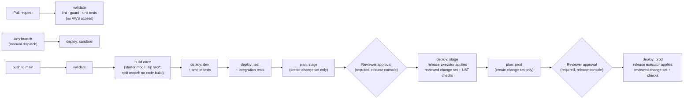

- **Build once:** one zip per function per commit, uploaded to the regional artifact bucket at a key based on content. Every environment deploys that exact key. No rebuilds between environments.
- **Change set before approval:** for STAGE and PROD, a plan job creates the change set and writes its summary (replacements and deletions highlighted) to the job summary. Reviewers approve with the exact change in front of them, and only that change set is executed (§8.3).
- **Sandbox** deploys can come from any branch via manual dispatch. Stacks get `org:expires-on` and are removed by the sandbox cleanup job.

### 8.3 Approval gates: STAGE and PROD require GitHub reviewer approval before deployment

**Rule:** nothing is deployed to STAGE or PROD until a GitHub reviewer approves. The approval happens **before** the deploy job starts. Until then the job has no OIDC token and no AWS access, so nothing in the account can change.

**How it works: plan, approve, then apply the reviewed change set.** The diagram and table below show the flow with GitHub environment reviewers (**Mode B**). In the default **Mode A** (§8.3.1) the steps are the same, except that approval happens in the release console and the **platform release executor**, not a GitHub job, executes the change set.

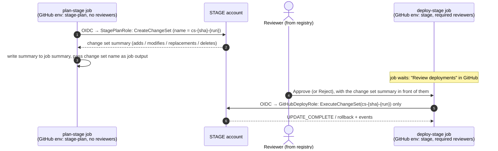

| Item | Design |
|---|---|
| GitHub environments | Two per gated stage: `stage-plan` / `stage` and `prod-plan` / `prod`. Only `stage` and `prod` have **required reviewers**. The plan environments have a branch rule (`main`) but no reviewers. |
| Plan role (`{project}-plan`, per gated account) | Trusted only for `sub = repo:{owner}/{repo}:environment:{env}-plan`. Can create, describe and delete change sets on its own stack (same tag rules as §4.5) and read the artifact. **Cannot execute change sets** or touch resources. |
| Deploy role in gated accounts | **Mode A:** there is no GitHub-assumable deploy role in STAGE/PROD; only the platform release executor can execute. **Mode B:** for STAGE and PROD it may **only execute an existing change set** (plus describe). It cannot create a new change set, so what runs is exactly what was reviewed. If the stack changed after the plan, execution fails and the pipeline re-plans; reviewers then approve the new plan. |
| Reviewers | Set on each environment from the registry: the product's reviewer GitHub team(s) per environment (default: QA reviewers for STAGE; product owner group + change management for PROD). Up to 6 users/teams per environment; one approval releases the job. |
| Prevent self-review | Enabled on `stage` and `prod`: the person who triggered the run cannot approve it. |
| Branch rule | `stage` and `prod` deploy only from `main` (PROD optionally also from release tags). |
| Wait timer | Optional on `prod` (e.g. 15 min after approval), for a final cancel window. |
| Timeouts | A pending approval expires after 30 days (GitHub limit). The job is marked "Awaiting approval" in the platform UI until then; no AWS change happens. Rejection stops the promotion and leaves the environment untouched. |
| Audit | GitHub records who approved/rejected, when, and the comment. The platform stores it with the job (via `deployment_status` / `deployment_review` webhooks) next to the change set ID and the CloudTrail `ExecuteChangeSet` event. |

**The gate cannot be turned off**
- In the environment configuration (§5.5.1), `requiresApproval` is **locked to `true` for STAGE and for every `prod`-tier environment**. Admins can change *who* reviews, but cannot remove the gate. Any new environment of tier `prod` gets the gate automatically.
- Approval is checked by the platform before the release executor runs (Mode A), so no repo setting can bypass it. In Mode B, the product's GitHub team also has only the `maintain` role, so it cannot edit environment protection rules.
- The reconciler checks every repo's `stage` and `prod` environments nightly. Missing reviewers, disabled prevent-self-review or a changed branch rule is **restored automatically and alerted**.
- AWS backs it up: in gated accounts, only the release executor (Mode A) or an execute-only deploy role (Mode B) can apply changes, and only to existing, reviewed change sets. Even a workflow edited to skip the plan job cannot deploy new changes to STAGE or PROD.

#### 8.3.1 Approval enforcement modes (no paid GitHub features required)

GitHub's environment required reviewers and custom deployment protection rules need **GitHub Enterprise Cloud** for private and internal repos. So the design does **not depend on them**. The default mode gives the same guarantee on any GitHub plan.

| | **Mode A: platform-executed release (default, any GitHub plan)** | **Mode B: add GitHub environment protection (optional, Enterprise)** |
|---|---|---|
| Plan | GitHub job creates the change set with the plan role (as above) | Same |
| Approval | Reviewers approve in the **release console** (§8.5). They sign in with their **GitHub identity** (OAuth); the platform checks live, via the GitHub API, that they are in the product's reviewer GitHub team for that environment and not the person who triggered the run. | Mode A approval **plus** GitHub required reviewers on the `stage`/`prod` environments (submitted from the console as the reviewer) |
| Who executes | The platform's **release executor** executes the exact reviewed change set (or, for application deploys, releases the exact reviewed artifact, §9.7). GitHub Actions **holds no execute permission** in STAGE/PROD accounts. | Same, or the GitHub deploy job executes it after GitHub approval |
| AWS-side guarantee | Only the executor role can execute change sets/releases in gated accounts. It is assumable only from the Platform account (`aws:PrincipalOrgID` + ExternalId), and **only with a session tag `org:project`**, so even the executor is limited by tags to one project per session. | Same |
| Record of approval | Release record (who, when, comment, evidence); also written back to GitHub as a **deployment status and commit status** on the SHA, so the approval is visible in GitHub | GitHub audit log as well |

**Mode A sequence (STAGE shown; PROD is identical):**
1. `plan-stage` job (GitHub): creates change set `cs-{sha}-{run}`, posts the summary and evidence to the platform.
2. Gate service: evaluates G4 (§8.4). If it fails, stop.
3. Release console: reviewer approves.
4. Release executor: assumes `PlatformReleaseExecutor` in the STAGE account with session tag `org:project=invoice-ingest`, executes `cs-{sha}-{run}`, and waits for completion.
5. Status flows back to the GitHub run (the waiting `release-stage` job polls the platform API, or a `repository_dispatch` updates it) and to the release console.

Why this is at least as strong as GitHub reviewers alone:
- The only identity that can change STAGE/PROD is the platform executor, and it acts only on approved, gate-passed change sets.
- An edited workflow, a leaked GitHub token or a compromised runner cannot deploy to STAGE/PROD in either mode.
- The gate rules live in the platform, not in repo YAML.


### 8.4 Quality gates for STAGE and PROD (recommended strategy)

**Recommendation:** build the quality gate as **layered, evidence-based gates**, with the final decision made by a **central gate service in the platform** that is plugged into GitHub as a **custom deployment protection rule** on the `stage` and `prod` environments. Human reviewer approval (§8.3) is the last layer, not the only one.

Why this approach:
- **The gate's rules live in the platform, not in each repo's YAML.** A team cannot weaken them by editing the workflow, and changing a rule for all repos is one change in one place.
- **Decisions are based on evidence tied to the exact commit and artifact.** "TEST passed" means TEST passed for *this* SHA and *this* artifact digest, not just the latest run.
- **Reviewers get the full evidence in one summary**, so approval is an informed decision rather than a click.
- **AWS still has the final say.** The gated deploy role can only execute a reviewed change set (§8.3).

#### 8.4.1 The gate layers

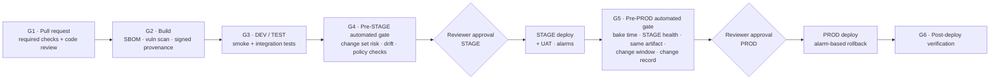

| Gate | When | Checks | Blocks on | Enforced by |
|---|---|---|---|---|
| **G1 · Pull request** | Before merge to `main` | cfn-lint; cfn-guard (all environment rule sets, so a PROD violation is caught early); IaC security scan (Checkov); unit tests + coverage threshold; SAST (bandit / SpotBugs+FindSecBugs / gosec / cargo-audit / eslint-plugin-security); dependency scan (OSV-Scanner); secret scanning (gitleaks); 1 code review from the product's team (CODEOWNERS) | Any failure | GitHub **ruleset** on `main` (required status checks + required review), set by the platform at repo creation and checked by the reconciler |
| **G2 · Build** | Once per commit on `main` | SBOM (Syft); vulnerability scan of the bundle (Trivy / OSV-Scanner); **signed provenance**: cosign signature with an AWS KMS key plus a SLSA provenance statement binding the artifact digest to the commit and workflow run | Critical/high vulnerabilities without an approved exception; missing attestation | Build job; digest + results recorded as evidence |
| **G3 · DEV / TEST** | After each deploy | DEV: smoke tests. TEST: integration/contract tests against the deployed stack; results published as check runs | Any failed suite | `needs:` in the workflow + evidence record |
| **G4 · Pre-STAGE** | In `plan-stage`, before approval | Evidence check: G1–G3 passed **for this SHA and digest**. Attestation verified. **Change set risk analysis** (below). **Drift detection** on the STAGE stack. **IAM Access Analyzer custom policy checks**: no new access compared with the currently deployed template (`CheckNoNewAccess`) and no forbidden actions (`CheckAccessNotGranted`) | Any failed check; high-risk change without an explicit override | Gate service (Mode A: before the release executor; Mode B: also as a deployment protection rule) |
| **Reviewer (STAGE)** | After G4 passes | Human approval with the evidence summary | Rejection / no approval | GitHub required reviewers (§8.3) |
| **G5 · Pre-PROD** | In `plan-prod`, before approval | Everything in G4 for the PROD stack, plus: **same artifact digest that ran in STAGE**; STAGE **bake time** met (e.g. ≥ 24 h, set per environment); STAGE CloudWatch alarms **green** during the bake; UAT sign-off recorded; **change window** open / no freeze; optional **change record** approved (built-in; external ITSM only via webhook if an organization wants it); for DR/HA projects, a **successful STAGE DR drill** within the last 30 days and a healthy secondary region (§10.7) | Any failed check | Gate service (Mode A: before the release executor; Mode B: also as a deployment protection rule) |
| **Reviewer (PROD)** | After G5 passes | Human approval with the evidence summary | Rejection / no approval | GitHub required reviewers (§8.3) |
| **G6 · Post-deploy** | During and after the PROD deploy | CloudFormation **rollback triggers** (`RollbackConfiguration` with CloudWatch alarms and a monitoring window) roll the stack back automatically if alarms fire; post-deploy health checks | Alarm during the monitoring window → automatic rollback | CloudFormation + pipeline |

#### 8.4.2 Change set risk analysis (G4/G5)

The plan job sends the change set to the gate service, which classifies every change:

| Risk | Examples | Default outcome |
|---|---|---|
| **High** | Replacement or deletion of a stateful resource (S3 bucket, DynamoDB table); deletion of a log group in PROD; removing `DeletionPolicy: Retain`; disabling encryption or versioning | **Blocked**, unless the change carries an explicit, separately approved override (e.g. a `allow-destructive-change` label approved by a platform admin). The override is recorded. |
| **Medium** | Any IAM policy or role change; new S3 notification or Lambda permission; runtime change | Allowed, but **highlighted** at the top of the reviewer summary |
| **Low** | Code-only update; memory/timeout change; tag change | Allowed |

#### 8.4.3 Where the evidence lives

- The gate service keeps a **release record** per commit SHA: artifact digest and attestation, test and scan results per environment, change set IDs and risk classification, drift result, approvals (who, when, comment), and deploy outcome.
- Workflows post results to the platform with the job's OIDC token, so the platform can verify which repo, environment and run sent them.
- The same record feeds the reviewer summary, the platform UI and audit (§14).

#### 8.4.4 How the gate plugs into GitHub

In **Mode A** (default) the gate is checked by the platform before the release executor runs, with no GitHub feature needed. In **Mode B** it is also connected to GitHub as follows:

- The platform's GitHub App is registered as a **custom deployment protection rule** on every `stage` and `prod` environment, set at repo creation and checked by the reconciler.
- When a `deploy-stage` / `deploy-prod` job is about to start, GitHub sends a `deployment_protection_rule` event. The gate service evaluates G4/G5 and answers approve or reject, with a link to the evidence.
- The job starts only when **both** the gate service and a human reviewer approve. If the gate rejects, reviewers are never asked.
- **Mode A (default, any plan):** the gate service is evaluated by the platform itself before the release executor runs (§8.3.1). The deployment protection rule integration above applies only in **Mode B** (GitHub Enterprise).

#### 8.4.5 Gate settings are configurable per environment

These thresholds are part of the environment's `guardrailProfile` (§5.5.1) and are edited by platform admins:
- coverage minimum;
- allowed vulnerability severity;
- bake time;
- change windows / freeze calendar;
- whether a change record is required;
- which risk levels need an override.

The **gates themselves cannot be disabled for STAGE or prod-tier environments**; only their thresholds can be tuned.

#### 8.4.6 Later improvement (not v1)
For PROD Lambda deployments, add **gradual traffic shifting** (Lambda alias + CodeDeploy canary, e.g. 10% for 10 minutes, then 100%) with alarm-based automatic rollback. This limits the impact of a bad release to a small share of traffic.

### 8.5 Release console: the approval workflow in the platform UI

**Recommendation:** the platform UI provides the whole promotion and approval workflow, and **GitHub remains the record of approvals**. When a reviewer clicks *Approve* in the platform, the platform calls GitHub's *review pending deployments* API **as that reviewer**, using their own GitHub identity. So:
- it is a real GitHub reviewer approval: the required-reviewer rule, prevent-self-review and GitHub's audit log all still apply;
- reviewers never need to leave the platform;
- approving directly in GitHub still works, and the platform reflects it within seconds via webhooks.

#### 8.5.1 Screens

| Screen | Who | What it shows / does |
|---|---|---|
| **Project pipeline view** | Everyone entitled to the product | One column per environment in configured order. Each column shows: state, commit SHA, artifact digest, who triggered, when, gate results (G1–G6) as green/red chips, and links to the GitHub run and the CloudFormation stack. |
| **My approvals (inbox)** | Reviewers | All pending STAGE/PROD approvals across the products where the user is a reviewer, oldest first, with waiting time. |
| **Approval detail** | Reviewers | The evidence summary from the release record (§8.4.3), on one page: <br/>• change set diff grouped by risk, with high-risk items on top<br/>• test and scan results<br/>• drift result<br/>• for PROD: STAGE bake time and alarm health, and confirmation that the artifact is the same one that ran in STAGE<br/>• change ticket link<br/>Plus a comment box and **Approve** / **Reject** buttons. *Approve* stays disabled until the automated gate (G4/G5) has passed. |
| **Override requests** | Requester → platform admin | Request an override for a high-risk change (§8.4.2) with a reason; a platform admin approves or rejects it in the UI. The override applies only to that change set. |
| **Release history** | Everyone entitled; auditors | Every promotion per environment: who requested, which gates passed, who approved/rejected and why, outcome, rollback events. Exportable. |

#### 8.5.2 Promotion state machine (per commit, per gated environment)

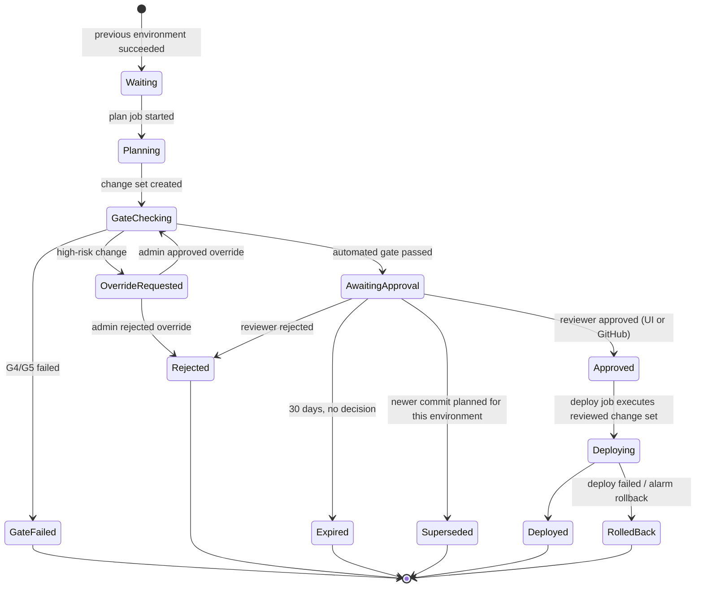

- **Superseded:** if a newer commit reaches the same gate, the older pending approval is closed automatically, so reviewers only see the latest candidate.
- The state is driven by GitHub webhooks (`workflow_run`, `deployment`, `deployment_status`, `deployment_review`, `deployment_protection_rule`) and the gate service, stored in the job/release tables (§3.4).

#### 8.5.3 How an approval in the UI reaches GitHub (Mode B only)

In **Mode A** (default), an approval in the console goes straight to the release executor (§8.3.1), and the platform writes a deployment status and commit status back to GitHub. The sequence below applies only when GitHub environment reviewers are also enabled (Mode B).

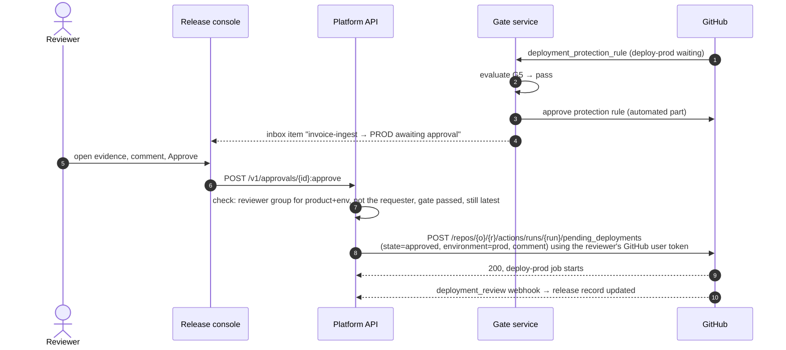

- **Reviewer identity:** each reviewer links their GitHub account once (GitHub App user authorization, OAuth). The platform stores the refresh token encrypted. It uses the token only to submit approvals, and only for runs in that reviewer's own products.
- **Double check on our side:** before calling GitHub, the platform checks that the user is in the product's reviewer group for that environment, is not the person who triggered the run, and that the automated gate passed. GitHub then enforces its own rules again.
- **Notifications:** new pending approvals, gate failures, rejections and rollbacks go to the **in-app inbox** and **email via Amazon SES**, with a deep link to the approval detail page. Generic **signed outgoing webhooks** let an organization forward events to any chat tool it uses, without the platform depending on that tool. Reminders go out after a configurable wait (e.g. 4 h).
- **Promotion mode** (configurable per environment, §5.5.1):
  - `auto`: STAGE plan starts automatically after TEST succeeds.
  - `on-request`: a user clicks **Promote to STAGE/PROD** in the UI, which starts the plan job via `workflow_dispatch`.

  Either way, the approval is still required.

#### 8.5.4 Separation of duties
- Requester ≠ approver (platform check + GitHub prevent self-review).
- PROD can require **two approvals from different groups** (e.g. product owner and change management). The platform collects both in the UI and submits the GitHub approval only when both are in. This requires that only the platform's approver identities be listed as GitHub reviewers; the alternative is GitHub's own single-approval model.
- Platform admins can approve overrides but cannot approve their own requests.

### 8.6 `deploy.yml` — design (not code yet)

| Aspect | Design |
|---|---|
| Triggers | `push` to `main`; `pull_request` (validate only); `workflow_dispatch` with an environment input (sandbox, or re-run any stage) |
| Permissions | `id-token: write`, `contents: read` |
| Structure | A reusable workflow `deploy-env.yml` (inputs: environment) holds all deploy steps and is identical in every repo. The caller `deploy.yml` is **generated from the environment configuration**: one job per enabled environment, chained in the configured order; gated environments (STAGE, PROD) get a `plan-{env}` job followed by a `deploy-{env}` job, with the quality gate (§8.4) and reviewer approval (§8.3) between them. If admins change the environment list later, the platform opens a "sync pipeline" PR in affected repos instead of changing them silently. |
| Concurrency | One group per environment (`deploy-{env}`), `cancel-in-progress: false` |
| Supply chain | Actions pinned to commit SHAs (only GitHub-owned `actions/*`, `aws-actions/*` and the platform's own actions are allowed); Dependabot |
| Per-environment job steps | 1. OIDC credentials (`role-to-assume: vars.AWS_ROLE_ARN`, `aws-region: vars.AWS_REGION`, scoped to that GitHub environment)<br/>2. **Guard:** caller account must equal `vars.AWS_ACCOUNT_ID` and `vars.ENVIRONMENT_NAME` must equal the job's environment<br/>3. **Pre-flight stack-state check** (table below)<br/>4. `aws cloudformation deploy` with `--role-arn $CFN_EXEC_ROLE_ARN`, `--parameter-overrides` from `config/{env}.json` + code prefix, `--tags` = the full `org:*` set built from GitHub variables (`vars.ORG_*`, `vars.PROJECT_NAME`, `vars.ENVIRONMENT_NAME`), `--no-fail-on-empty-changeset` (**DEV/TEST/sandbox only**; STAGE/PROD use the plan → approve → execute flow in §8.3)<br/>5. Post-deploy checks; outputs to job summary<br/>6. On failure: failed stack events (resource, type, reason) to job summary, exit non-zero |

Tags passed with `--tags` come from GitHub variables set by the platform (§5.5.5). **Even if someone changes them, IAM denies any value that doesn't match the deploy role's tags (§4.4).**

| Stack status before deploy | Action |
|---|---|
| does not exist | create via changeset |
| `CREATE_COMPLETE` / `UPDATE_COMPLETE` / `UPDATE_ROLLBACK_COMPLETE` | update via changeset |
| `ROLLBACK_COMPLETE` (first create failed) | delete the empty stack, then create again (safe: `RetainExceptOnCreate`) |
| `*_IN_PROGRESS` | wait with timeout |
| `UPDATE_ROLLBACK_FAILED` / `DELETE_FAILED` | stop with a runbook link. Never automated. |

### 8.7 Long-lived credentials mode (supported, not recommended)
Only where an account cannot have an OIDC provider:
- A per-project, per-environment IAM user with the same shared policy, **tagged identically**.
- Keys stored as **environment secrets** (the only secrets in the design; everything else stays a variable); ≤ 90-day rotation enforced by a platform job; warning shown in the UI.

---

## 9. Developer consumption: application repositories

### 9.1 The problem and the recommended model

The repos the platform generates (§7) are **infrastructure repos**: they define the AWS resources, the IAM roles and the event wiring for one project. Developers write their actual code (Python, Java, Go, Rust, Node.js, …) in **application repos**, and deploy it to ECS, Lambda, EKS or Step Functions *on top of* that infrastructure. Two things are needed:
1. a reliable way for application repos to **find** the infrastructure (names, ARNs, roles, endpoints) in every environment;
2. a safe way for them to **deploy onto** it, without being able to create IAM, change network or data resources, or touch other projects.

**Recommendation: "infrastructure contract + golden-path pipelines".**
- Each infrastructure repo **publishes a versioned, machine-readable contract** per environment: what it provides and how to reach it.
- Application repos **declare which project and which compute slots** they deploy to, in one small file.
- Application repos deploy through **reusable, platform-owned GitHub workflows** (one per language and compute type). These read the contract at deploy time, so no ARNs or account details are copied into application repos.
- Application deploy roles use the **same tag-based permission model** (§4), but can only update the runnable artifacts of their bound slots. They can never create IAM roles or change data, network or trigger resources.

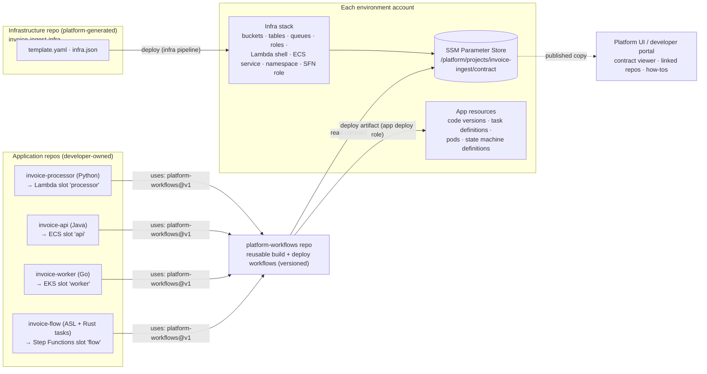

### 9.2 Who owns what: infrastructure vs application

The rule: **the infrastructure repo owns anything with identity, network, data or triggers. The application repo owns the runnable artifact and its runtime settings.**

| Compute type | Infrastructure repo owns (via the platform UI) | Application repo owns | How the app deploys |
|---|---|---|---|
| **Lambda** | Function "shell" (name, execution role, triggers such as S3 notifications, permissions, log group, concurrency, VPC config, binding env vars), a `live` alias, code-signing config in gated environments | Code, build, versions, which version `live` points to; app-level settings in AppConfig/SSM under the app path | Upload artifact → `UpdateFunctionCode` → `PublishVersion` → move `live` alias (later: CodeDeploy canary) |
| **ECS (Fargate)** | Cluster (per project, as clusters cost nothing), ECR repository, task role and task execution role, security groups, ALB target group/listener rule, log group, the ECS service (created with a platform placeholder image) | Dockerfile, image, task definition revisions (image digest, CPU/memory, env vars, health check) | Build image → push to ECR → register task definition (roles taken from the contract) → update service; ECS deployment circuit breaker with rollback |
| **EKS** | *Shared* cluster per portfolio per environment, run by the platform team (a cluster per project is too costly). Per project: namespace, ResourceQuota/LimitRange, NetworkPolicy, ServiceAccount + **EKS Pod Identity** association to a project role, ECR repository | Container image, Helm chart / Kustomize manifests **limited to its namespace** | Recommended: **GitOps with Argo CD**. The pipeline pushes the image and updates the image digest in the environment overlay; Argo CD syncs the namespace. Alternative: `helm upgrade --atomic` with a namespace-scoped role. |
| **Step Functions** | State machine execution role (allowed to call only the project's Lambdas/ECS tasks/resources), log group, X-Ray settings | The state machine definition (ASL) and any task code (which deploys to its own Lambda/ECS slots) | Small **app stack** (CloudFormation) containing the state machine, with `DefinitionSubstitutions` filled from the contract; the definition is validated before deploy |

**Why this split:**
- Developers can ship code many times a day without touching security-sensitive resources.
- Every new permission, trigger or data store still goes through the platform UI → infrastructure repo PR → quality gates (§8.4) → approvals.
- Drift checks on the infrastructure stack **ignore the fields owned by the application** (Lambda code and alias version, ECS service task definition) so these updates are not flagged as drift.

**Infrastructure repo changes (supersedes the single-repo starter code):** in the recommended model, the infrastructure repo no longer contains application code. Lambda functions are created with a small **platform bootstrap package** for their runtime, and the infrastructure pipeline does not build code. A **"single-repo starter" mode** (code in `src/` inside the infrastructure repo, as in §6) is kept for sandbox prototypes only.

### 9.3 Catalog additions for compute slots

A **compute slot** is a catalog resource that application code is deployed into. Each slot is bound to exactly one application repo; one application repo may serve several slots (a monorepo).

| Type | Key settings | Contract exposes |
|---|---|---|
| `lambda.function` | runtime family (`python`, `java`, `nodejs`, `go`, `rust`, `container`), arch, memory, timeout, triggers via connections | function name/ARN, `live` alias ARN, runtime, handler convention, artifact location, signing profile |
| `ecs.service` | CPU/memory limits, desired count range, port, public/internal, health check path | cluster, service, task role ARN, execution role ARN, ECR URI, container name, log group, subnets/SGs (from the landing zone network via SSM), target group |
| `eks.workload` | target shared cluster, quota, service account | cluster name, namespace, service account, ECR URI, Argo CD application name |
| `stepfunctions.workflow` | type (standard/express), logging level | role ARN, log group ARN, substitution values for the project's resources |
| `ecr.repository` | (created automatically for container slots) | repository URI; immutable tags + scan on push |

Existing connection kinds still apply (e.g. `s3.notify` → `lambda.function`, `iam.access` from any slot's runtime role to a bucket/table). The existing `lambda.python` becomes `lambda.function` with `runtime: python`.

### 9.4 The infrastructure contract

**Published three ways after every successful infrastructure deploy, per environment:**

| Where | For | Notes |
|---|---|---|
| **SSM Parameter Store** in the environment account: `/platform/projects/{project}/contract` (JSON, advanced tier) plus one parameter per value under `/platform/projects/{project}/...` | Deploy pipelines and running code | Written as `AWS::SSM::Parameter` resources by the infrastructure stack itself, so it is always in sync with what is deployed. Readable only by roles tagged with the same project (ABAC on the path). |
| **Platform API / developer portal**: `GET /v1/projects/{id}/contract?env=dev` | Humans, tooling, local development | Copy recorded in the release record with the infra commit SHA |
| **Infrastructure repo release** (GitHub Release asset `contract.{env}.json`, tagged with the infra version) | Review and diffing | Lets reviewers see contract changes between versions |

**Why SSM, not CloudFormation exports:** exports lock the exporting stack. A value that is imported elsewhere cannot be changed or removed, which would block infrastructure changes. SSM parameters keep stacks loosely coupled.

**Example contract (DEV):**

```json
{
  "contractVersion": "1",
  "project": "invoice-ingest",
  "environment": "dev",
  "accountId": "222222222222",
  "region": "us-east-1",
  "infraVersion": "1.4.0",
  "infraCommit": "4f78c64",
  "compute": {
    "processor": {
      "type": "lambda.function", "runtime": "python3.13", "architecture": "arm64",
      "functionName": "invoice-ingest--processor",
      "aliasArn": "arn:aws:lambda:us-east-1:222222222222:function:invoice-ingest--processor:live",
      "artifactBucket": "cloudinfra-artifacts-999999999999-us-east-1",
      "artifactPrefix": "apps/invoice-ingest/processor/",
      "boundRepo": "acme-platform/invoice-processor"
    },
    "api": {
      "type": "ecs.service",
      "cluster": "invoice-ingest--cluster", "service": "invoice-ingest--api",
      "containerName": "app",
      "ecrRepositoryUri": "222222222222.dkr.ecr.us-east-1.amazonaws.com/invoice-ingest/api",
      "taskRoleArn": "arn:aws:iam::222222222222:role/app/invoice-ingest/workload/…",
      "executionRoleArn": "arn:aws:iam::222222222222:role/app/invoice-ingest/workload/…",
      "logGroup": "/ecs/invoice-ingest--api",
      "boundRepo": "acme-platform/invoice-api"
    }
  },
  "resources": {
    "uploads": { "type": "s3.bucket", "name": "invoice-ingest--uploads-222222222222-us-east-1" }
  },
  "runtimeEnv": {
    "processor": { "UPLOADS_BUCKET_NAME": "invoice-ingest--uploads-222222222222-us-east-1" },
    "api":       { "UPLOADS_BUCKET_NAME": "invoice-ingest--uploads-222222222222-us-east-1" }
  }
}
```

**Contract versioning and compatibility:**
- `contractVersion` changes only for schema changes.
- Each infra change is classified by the gate service as **additive** (new slot/resource/value) or **breaking** (removed or renamed slot/resource, changed runtime family, changed container name).
- **Additive changes always flow freely.** Breaking changes follow the **expand → migrate → contract** rule (§9.9.4), so the platform team never has to wait for a product team to sign off, and nothing a deployed application uses disappears from under it.
- Application deploys check the contract in the target environment:
  - A **required** value that is missing stops that deploy with a clear message (*"DEV infrastructure does not yet provide `uploads`"*). Only the deploy stops; development carries on.
  - **Optional** values (§9.5) never block a deploy.
  - Infrastructure and applications are **promoted independently**.

### 9.5 Linking an application repo: `.platform/app.yaml`

Every application repo has one small, language-neutral file that says what it deploys and where:

```yaml
apiVersion: platform/v1
project: invoice-ingest            # the infrastructure project
components:
  - slot: processor                # compute slot in the infra contract
    type: lambda.function
    language: python               # python | java | go | rust | nodejs | container
    path: services/processor
    requires: [uploads]            # must exist in the target env, or this deploy waits
    optional: [archive]            # used if present; code handles absence (feature flag)
  - slot: api
    type: ecs.service
    language: java
    path: services/api
    build: { tool: gradle }
```

- **Binding is recorded in the platform, not trusted from this file.** The platform links slot → repo when the app repo is created (or linked) in the UI. The app deploy role's OIDC trust is limited to that repo, so a file in another repo claiming `project: invoice-ingest` gets AccessDenied.
- The file decides **how to build** and **which slots to deploy**. The contract decides **where**.

### 9.6 Golden-path pipelines (`platform-workflows` repo)

A central, versioned repo of **reusable GitHub workflows**. Application repos call them by tag; Dependabot pins and updates the commit SHAs. Builds are separate from deploys, so one artifact is built once and promoted through every environment, just like infrastructure (§8.2).

**Build workflows (per language):**

| Language | Lambda artifact | Container artifact (ECS/EKS) |
|---|---|---|
| Python | zip with dependencies (`pip install --target`, arm64 wheels) → `python3.x` runtime | Docker image |
| Java | jar/zip via Maven/Gradle → `java21` runtime (SnapStart optional) | Docker image (e.g. Jib or Dockerfile) |
| Go | `bootstrap` binary (`GOOS=linux GOARCH=arm64`) → `provided.al2023` | Distroless image |
| Rust | `bootstrap` via `cargo lambda build --arm64` → `provided.al2023` | Distroless image |
| Node.js | bundled zip (esbuild) → `nodejs22.x` | Docker image |

Every build: unit tests → SAST/dependency scan → SBOM → vulnerability scan → **signed provenance (cosign + AWS KMS)** → (Lambda) **AWS Signer code signing** → publish to the artifact bucket (zip) or ECR (image, by digest). This is the application version of gates G1–G2.

**Deploy workflows (per compute type):** `deploy-lambda.yml`, `deploy-ecs.yml`, `deploy-eks.yml` (GitOps update), `deploy-sfn.yml`. Each one:
1. Assumes the **app deploy role** for the environment via OIDC.
2. Reads the contract from SSM and checks `requires`.
3. Checks that the artifact's runtime family matches the slot (a Go binary cannot go to a Python slot).
4. Deploys and waits until healthy.
5. Rolls back on failure: Lambda alias back to the previous version, ECS circuit breaker, Argo CD rollback, SFN previous definition.
6. Reports to the release record.

Application repos get the **same environments, approvals and quality gates** as infrastructure repos:
- GitHub environments sandbox → PROD;
- required reviewers and the gate service for STAGE/PROD;
- the release console (§8.5) shows application promotions next to infrastructure promotions.

For application deploys, the "change set" the reviewer approves is a **deploy diff**: current vs new artifact digest, code/version hash, task definition diff and Kubernetes manifest diff.

### 9.7 Security for application deploys

**App deploy role** (per application repo, per environment, created by the platform):
- **Trust:** OIDC `sub = repo:{owner}/{app-repo}:environment:{env}`.
- **Tags:** same `org:*` tags as the project, so the same tag-based model applies (§4).
- **Shared policy:** `cloudinfra-appdeploy-abac`, which allows only:

| Allowed | Scope |
|---|---|
| `lambda:UpdateFunctionCode`, `PublishVersion`, `UpdateAlias`, `GetFunction` | Functions tagged with the same project **and** named after a slot bound to this repo |
| `ecs:RegisterTaskDefinition` (with own tags), `ecs:UpdateService`, `ecs:Describe*` | Services/task families of bound slots |
| `iam:PassRole` | Only roles under `/app/{project}/workload/`, only to `ecs-tasks.amazonaws.com` / `states.amazonaws.com`, as listed in the contract |
| `ecr:*Image*` push/pull actions | Repositories tagged with the same project |
| `ssm:GetParameter*` | `/platform/projects/${aws:PrincipalTag/org:project}/*` |
| `cloudformation:*ChangeSet*` on app stacks `{project}-app-*` | **With the `cloudformation:ResourceTypes` condition** limited to an allow-list (e.g. `AWS::StepFunctions::StateMachine`, `AWS::Lambda::Version`, `AWS::CloudWatch::Dashboard`) |
| `s3:PutObject` | `artifact-bucket/apps/{project}/*` |
| `eks:DescribeCluster` | Shared cluster (for GitOps, nothing else; Kubernetes access goes through Argo CD) |

**Gated environments (STAGE/PROD), Mode A:** the app deploy role only **prepares** a release: it uploads the artifact, publishes a Lambda version, registers a task definition revision, or proposes a GitOps commit. The **platform release executor** performs the traffic-affecting step after approval: moving the `live` alias, updating the ECS service, merging/syncing the GitOps change, or executing the app stack change set.

**Never allowed:** `iam:Create*`/`Put*`/`Attach*`, any change to buckets/tables/queues/VPC/security groups/triggers, any resource of another project.

**Extra safeguards:**
- A **CloudFormation Guard Hook** in every account rejects IAM, network and data resource types in stacks named `*-app-*`.
- **Artifact provenance in gated environments** (an AWS-side check in addition to GitHub approvals):
  - Lambda functions in STAGE/PROD have a **code signing config** that accepts only code signed by the platform build.
  - ECR repositories use immutable tags and deploys pin images by digest.
  - EKS admission policy (e.g. Kyverno) admits only images with a valid signature/attestation.
- **Runtime access:** running code uses the slot's runtime role (Lambda execution role, ECS task role, Pod Identity role, SFN role). Like every component, it can reach only resources with the same project and environment tags (§4.10). These are created by the infrastructure stack with exact-ARN policies and the shared boundary (§4.5), so application code has exactly the access drawn as connections in the platform UI.

### 9.8 How developers use it day to day

| Need | How |
|---|---|
| Start a new service | Platform UI → project → **"Create application repo"**: choose slot(s), language and compute type. The platform creates the repo with a language template, `.platform/app.yaml`, a workflow that calls the golden path, environments, protection rules and variables, using the same provisioning steps as §7. Or link an existing repo. |
| Find resource names/ARNs | Platform UI **contract viewer** per environment (copy buttons, diff between environments); `platform` CLI: `platform contract get invoice-ingest --env dev` |
| Use resources in code | Read the environment variables the deploy injects (`UPLOADS_BUCKET_NAME`, …). This works the same way in every language, with no platform SDK. The language templates include small examples (boto3, AWS SDK for Java v2, AWS SDK for Go v2, AWS SDK for Rust). |
| Get a new bucket/table/permission | Platform UI → **"Change infrastructure"** → the platform regenerates the template and opens a **PR on the infrastructure repo** → gates and approvals → infra promotes → the contract updates → the app can use it |
| Run or test locally | IAM Identity Center access to sandbox/DEV, with tag-based access to the product's resources (§4.8); `platform env export --env dev` writes the contract values as local env vars |
| Discover what exists | Platform UI project page (infra repo, bound app repos per slot, environments, versions). Each repo also gets a `catalog-info.yaml` so an open-source **Backstage** portal can show the same view, if you choose to run one (optional). |

**GitHub variables in application repos** (§5.5.5 rules apply). These are the only variables an application repo needs; everything else comes from the contract at deploy time:

| Variable | Level |
|---|---|
| `PROJECT_NAME` | Repository |
| `ENVIRONMENT_NAME` | Environment |
| `AWS_ACCOUNT_ID` | Environment |
| `AWS_REGION` | Environment |
| `AWS_ROLE_ARN` (the app deploy role) | Environment |
| `CONTRACT_PARAMETER` (`/platform/projects/{project}/contract`) | Repository |

**Repo visibility:** infrastructure repos are **internal** (readable by everyone in the GitHub org, writable only through the platform), so developers can read the template and the contract. Application repos follow the product's normal policy.

### 9.9 Working in parallel: how platform and product teams stay independent

Every solution has **two parts**:
1. **Infrastructure:** owned by the platform team. It is generated and changed through the platform and lives in the infrastructure repo.
2. **Solution code:** owned by the product team. It is written by developers in application repos and deployed onto the infrastructure.

The goal is that **neither team ever waits for the other**. The design achieves this with six mechanisms.

#### 9.9.1 Separate everything except the contract

| | Infrastructure | Solution code |
|---|---|---|
| Repo | `{project}-infra` (platform-generated) | one or more application repos |
| Owner | Platform team (product team can request changes via the UI) | Product team |
| Pipeline | Infra pipeline (§8) | Golden-path app pipelines (§9.6) |
| Version | `infraVersion` (semver, tagged in the infra repo) | each app's own version |
| Release schedule | Independent | Independent |
| Approvals/gates | Own GitHub environments + gates | Own GitHub environments + gates |
| AWS role | Infra deploy role + CFN execution role | App deploy role (only bound slots' artifacts) |
| **Shared** | **The contract only** (§9.4) | **The contract only** |

- **Neither pipeline ever triggers the other.** An infra deploy never redeploys code; an app deploy never changes infrastructure.
- **Each side owns its own fields, enforced by IAM, not by convention.** Infra deploys never touch app-owned fields (Lambda code/alias version, ECS task definition, Kubernetes manifests, ASL definitions). App deploy roles cannot touch infra-owned fields (§9.7). Drift checks ignore the other side's fields.

#### 9.9.2 Contract first: product teams can start before infrastructure exists

The contract exists in two forms:

| Form | When it exists | Used for |
|---|---|---|
| **Declared contract** | As soon as the project (or a change) is designed in the platform UI. It is generated from `infra.json` **before anything is deployed**. | Developers code against slot names, env var names and value types on day one |
| **Deployed contract** | Per environment, after each infra deploy (SSM, §9.4) | Actual values used by deploys and running code |

The platform UI shows both, side by side per environment ("declared, not yet deployed in TEST"). A product team can build, unit-test and even merge code that uses a resource the platform team has not deployed yet.

#### 9.9.3 Placeholders: infrastructure can ship before any solution code

Every compute slot is created with a **platform placeholder artifact**:
- a bootstrap Lambda package for each runtime that returns a clear "no application deployed" response;
- a placeholder container image with a health endpoint.

So the platform team can deploy, test and promote infrastructure to every environment with no application code present, and alarms and health checks still pass. When the product team's first deploy lands, it simply replaces the placeholder.

#### 9.9.4 Changing the contract without blocking anyone (expand → migrate → contract)

| Change | What happens | Who waits |
|---|---|---|
| **Additive** (new resource, slot, value, permission) | Deploys and appears in the contract; apps start using it when they're ready | Nobody |
| **Rename / replace** | **Expand:** the new value is added next to the old one; the old one is marked `deprecated` (with a removal-not-before date) in the contract. **Migrate:** product teams switch on their own schedule; the platform UI and PR comments remind them. **Contract:** the old value is removed automatically once no deployed app version in that environment still requires it. | Nobody. Removal waits for usage to reach zero, not for a person. |
| **Remove** | Same as above: deprecate → removal when unused | Nobody |
| **Emergency removal** (e.g. security issue) | Platform admin override, recorded; affected app owners notified | Explicit exception |

The platform knows exactly which value each **deployed** app version requires, because every app deploy records its `requires` list in the release record per environment. "Unused" is therefore a fact the platform can check, not a guess.

#### 9.9.5 Developing and testing solution code without the real infrastructure

| Need | Mechanism |
|---|---|
| Unit tests | Language templates include fakes/mocks for the AWS SDK calls they use; tests read the same env vars the deploy injects |
| Local integration | `platform dev up` starts **open-source emulators** (moto server; AWS SAM CLI for Lambda; LocalStack Community optional) configured from the **declared contract**: same bucket/table/queue names and env vars |
| Real AWS without waiting | **Ephemeral sandbox environments**: the platform deploys the declared infrastructure into the sandbox account with a TTL (`org:expires-on`) for a feature branch, without touching shared environments |
| Contract tests | The golden-path build checks the app's `requires`/`optional` against the declared contract (catches typos and stale names before any deploy) |

#### 9.9.6 Requests between teams are asynchronous

- **Product team needs new infrastructure:** "Change infrastructure" in the platform UI creates a **change request**. It immediately produces an updated **declared contract** (so developers can carry on) and a PR on the infra repo for the platform team. The app uses the new value as `optional` (behind a feature flag) until it is deployed, then switches it to `requires`.
- **Platform team improves infrastructure** (new runtime version, encryption change, shared cluster upgrade): it ships when ready. Additive changes need no coordination. Anything that affects apps goes through §9.9.4.
- **Visibility for both sides:** a per-project **compatibility view** in the platform UI shows, for each environment, the deployed infra version, the deployed app versions, and whether each app's needs are met, waiting or deprecated.

#### 9.9.7 Responsibilities

| Activity | Platform team | Product team |
|---|---|---|
| Catalog, building blocks, golden-path workflows, language templates | **Owns** | Consulted |
| Infra repo for a project (template, roles, wiring) | **Owns / approves** | Requests changes via UI |
| Contract schema and deprecation policy | **Owns** | Informed |
| Solution code, build, tests, app releases | Informed | **Owns** |
| App deploy approvals (STAGE/PROD) | — | **Owns** (product reviewers) |
| Infra deploy approvals (STAGE/PROD) | **Owns** (with product reviewers optional) | Consulted |
| Incident: app bug | Supports | **Owns** |
| Incident: infra/platform fault | **Owns** | Supports |

---

## 10. Multi-region resilience: DR and HA

### 10.1 Resilience modes

Every project chooses a **resilience mode** in the project wizard. Every template the platform generates is **multi-region capable from the start**, so a project can move from single-region to DR or HA later without redesign.

| Mode | Regions deployed | Regions active | Typical RTO / RPO | When to use |
|---|---|---|---|---|
| **Single region** | Primary only | Primary | Hours (redeploy from code + backups) / backup age | Sandbox, DEV, non-critical tools |
| **DR (active / standby)** | **Primary + secondary** | **Primary only.** Secondary is deployed, data replicates continuously, compute and event sources are inactive | Minutes to < 1 h / seconds to minutes (replication lag) | Business-critical workloads that can tolerate a short failover |
| **HA pair (active / active)** | **Primary + secondary** | **Both** | Near zero / near zero (depends on data store) | Customer-facing, always-on workloads |

**Regions are chosen in the UI.** **Any pair of two different regions is allowed.** The user picks the primary and secondary region from dropdowns in the project wizard; the selection becomes the project's DR/HA pair. The dropdowns are **pre-filled with us-east-1 (primary) / us-east-2 (secondary)**. Admins manage the list of enabled regions and the default pair in the UI (§10.9).

**DR strategy (DR mode only):**

| Strategy | Secondary compute while standby | RTO | Cost |
|---|---|---|---|
| **Pilot light** (default) | Scaled to zero / disabled | Longer (scale-up time) | Lowest |
| **Warm standby** | Minimal capacity running, no traffic | Shorter | Moderate |

### 10.2 What "deployed but inactive" means

The same template is deployed to both regions. Three parameters, set by the pipeline per region, decide the behavior:

| Parameter | Values | Set from |
|---|---|---|
| `ResilienceMode` | `single` \| `dr` \| `ha` | Project setting |
| `RegionRole` | `primary` \| `secondary` | Which region the stack is in |
| `ActivationState` | `active` \| `standby` | **DR:** primary `active`, secondary `standby`. **HA:** both `active`. Flipped only by a failover (§10.6). |

The engine wraps every activation-sensitive setting in CloudFormation **conditions** (`IsActive`, `IsPrimary`, `IsHA`), so **standby is a configuration of the same resources, not different resources**. Activating a region changes parameters, not the template.

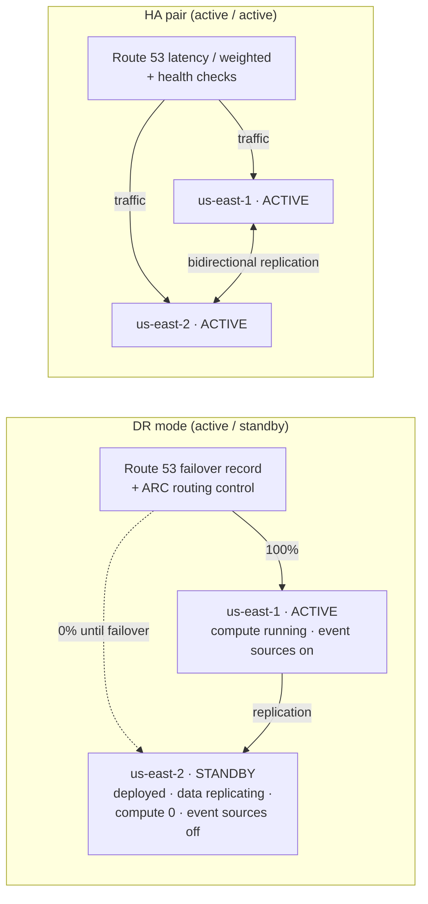

### 10.3 Per-service behavior

Every catalog entry (§6.8) declares a **multi-region capability**: `native-global`, `replicated`, `regional` or `not-supported`. The engine uses it to wire replication and standby behavior automatically, and the validation gate uses it to reject combinations that cannot meet the chosen mode.

| Service | DR: secondary in standby | HA: both active | Replication / global mechanism |
|---|---|---|---|
| **Lambda** | Deployed; reserved concurrency 0 (pilot light) or minimal (warm); event source mappings `Enabled: false`; S3/EventBridge triggers not attached | Deployed and triggered in both regions | Code uploaded to both regional artifact buckets |
| **ECS / Fargate** | Service deployed with desired count 0 (pilot light) or minimum (warm) | Desired count per region | ECR **replication** (push once, available in both regions) |
| **EKS workloads** | Argo CD app synced with replicas 0 (or minimum) | Replicas per region | Shared cluster must exist in both regions; ECR replication |
| **API Gateway / ALB** | Deployed; receives no traffic (Route 53 failover secondary) | Both in Route 53 latency/weighted set with health checks | Route 53 records + health checks in the global stack |
| **SQS / SNS** | Deployed, idle | Each region processes its own messages | Producers send to the active region(s) |
| **EventBridge** | Rules and schedules `DISABLED` | Enabled in both; optional **global endpoints** for event ingestion | Rules in both regions |
| **Step Functions** | Deployed; schedules/triggers disabled | Enabled in both | — |
| **S3** | Replica bucket receives **cross-region replication** | **Two-way replication** with replica-modification sync | Bucket names already include the region (§6.2) |
| **DynamoDB** | **Global table** replica in the secondary (data current, unused) | Global table, writes in both regions (last-writer-wins: app must be idempotent) | `AWS::DynamoDB::GlobalTable` |
| **Aurora (PostgreSQL / MySQL)** | **Aurora Global Database**; secondary cluster (headless in pilot light, one reader in warm standby) | Global Database; single writer in primary, **write forwarding** from the secondary; reads local | `AWS::RDS::GlobalCluster` + regional clusters |
| **RDS (non-Aurora)** | Cross-region read replica, promoted on failover | **Not supported** (single writer, no forwarding): validation offers Aurora or DynamoDB instead | Cross-region replica |
| **ElastiCache (Valkey / Redis OSS)** | Global Datastore secondary | Global Datastore (writes to primary) or independent regional caches | Global Datastore |
| **DocumentDB / Neptune** | Global cluster secondary | Single writer: reads local, writes to primary | Global clusters |
| **OpenSearch** | Cross-cluster replication follower | Two domains, app writes to both or replicates | Cross-cluster replication |
| **Secrets Manager** | Secret **replicated** to secondary | Replicated | Multi-region secrets |
| **KMS** | **Multi-Region keys** for anything replicated, so replicas decrypt locally | Multi-Region keys | `MultiRegion: true` |
| **SSM contract** (§9.4) | Written in both regions, with `regionRole` and `activationState` | Both | Each regional stack writes its own |
| **CloudFront / WAF / Route 53** | Global services: deployed once, in the global stack. CloudFront certificates (ACM) and CloudFront-scope WAF web ACLs **must live in us-east-1**, whatever the selected pair (§10.9) | Same | Origin groups for origin failover |
| **Cognito user pools** | **Limited**: no native replication; flagged in the preview with a documented pattern (or excluded from DR/HA projects) | Same | — |

**Validation examples:**
- *HA with RDS PostgreSQL* → rejected: "RDS PostgreSQL can be active in only one region. Use Aurora PostgreSQL Global Database (write forwarding) or DynamoDB global tables."
- *DR with a service marked `not-supported`* → warning with the expected RTO, and the service is redeployed from code during recovery.

### 10.4 Stack layout across regions

| Stack | Deployed in | Contains |
|---|---|---|
| `{project}-global` | **Primary region only** | Global or once-only resources: Route 53 records and health checks, ARC routing controls, CloudFront, WAF, `AWS::DynamoDB::GlobalTable`, `AWS::RDS::GlobalCluster`, Multi-Region KMS primary keys |
| `{project}-data`, `{project}-integration`, `{project}-compute`, `{project}-edge` (§6.8.5) | **Both regions** (same template, `RegionRole`/`ActivationState` parameters) | Regional resources and replicas |

- **IAM is global.** The project's deploy, plan and CFN execution roles (§4.5) are created once per account and used for both regions; the app execution roles created by regional stacks get CloudFormation-generated names, so the two regions never collide.
- Both regions of one environment use the **same AWS account** by default. A separate DR account per environment is an option (D31); the account bindings (§5.5.2) already carry a region per binding.
- **During a primary-region outage, the global stack cannot be changed** (its CloudFormation control plane is in the primary region). That is why failover never depends on it: data-plane controls (ARC, Global Database failover) are used instead, and the global stack is reconciled after recovery.

### 10.5 Pipeline: deploying to both regions

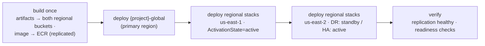

- **Order per environment:** global stack → primary region → secondary region → readiness checks (replication lag, Route 53 ARC readiness, health checks).
- **STAGE / PROD:** the plan job creates change sets for **every stack in both regions**. Reviewers approve **one release** covering all of them (§8.3), and the release executor applies them in the order above.
- **Failure handling:** if the secondary region fails to deploy, the primary keeps running the new version. The release is marked "secondary out of sync" and **blocks the next promotion** until fixed, because a DR region on an old version is not a valid DR target.
- **Application repos (§9)** follow the same pattern: artifacts are published to both regions, and code is deployed to both. In DR standby, the code is updated but stays inactive, so the standby always runs the same version as the primary.
- **Per-environment policy** (environment configuration §5.5.1), defaults:

| Environment | Default resilience |
|---|---|
| Sandbox, DEV | Single region always (cost) |
| TEST | Single region (DR/HA optional) |
| QA/STAGE | **Mirrors PROD's mode**, so failover can be tested before PROD |
| PROD | As selected by the project |

**New GitHub variables (§5.5.5 rules apply):**

| Variable | Level | Example |
|---|---|---|
| `RESILIENCE_MODE` | Environment | `dr` |
| `AWS_PRIMARY_REGION` | Environment | `us-east-1` (replaces `AWS_REGION`) |
| `AWS_SECONDARY_REGION` | Environment | `us-east-2` (empty for single-region) |
| `ARTIFACT_BUCKET_PRIMARY` / `ARTIFACT_BUCKET_SECONDARY` | Environment | regional Shared Services buckets |
| `ACTIVATION_STATE_SECONDARY` | Environment | `standby` (DR) / `active` (HA); changed only by failover |

### 10.6 Failover and failback (DR mode)

Failover is a **platform operation** started from the release console, not a code change.

| Step | Action | Depends on primary region? |
|---|---|---|
| 1. Declare | Incident lead clicks **Fail over to us-east-2** in the release console; **two approvers** (break-glass fast path, separate from release approvals) | No |
| 2. Data | **Aurora Global Database**: managed failover (planned) or detach-and-promote (unplanned). **RDS** replica promoted. DynamoDB global tables, S3, secrets: already current | No |
| 3. Compute | Release executor sets `ActivationState=active` on the **secondary regional stacks only** (scale up, enable event sources and rules) | No |
| 4. Traffic | Flip **Route 53 Application Recovery Controller** routing control to us-east-2 (data plane, highly available) | No |
| 5. Verify | Health checks, smoke tests, contract in us-east-2 shows `activationState=active` | No |
| 6. Record | Release record + GitHub variable `ACTIVATION_STATE_*` updated, so the next pipeline run keeps the new state | No |

**Failback** reverses the steps once the primary is healthy: re-establish replication toward us-east-1, sync, a planned switchover, flip traffic back, and set us-east-2 to standby. It is scheduled, approved like a PROD release, and never automatic.

**HA mode:** no failover action is needed. Route 53 health checks remove an unhealthy region automatically. Single-writer data stores (Aurora) follow their managed failover; the platform shows the writer location in the release console.

### 10.7 Continuous DR assurance

- **Readiness checks:** Route 53 ARC readiness checks confirm the secondary matches the primary (capacity settings, versions, replication). Drift is shown in the release console and blocks promotion.
- **DR drills:** a scheduled failover and failback in **QA/STAGE** (default monthly) for every DR/HA project, run by the platform with the steps above.
- **Gate G5 addition (§8.4):** a PROD release of a DR/HA project requires a **successful STAGE DR drill within the last N days** (default 30) and a healthy secondary in PROD.
- **Measured, not assumed:** each drill records the achieved RTO/RPO against the targets set in the wizard, shown per project.

### 10.9 Region selection: any pair, chosen in the UI

**User experience (project wizard):**
1. Choose **Resilience**: single region / DR / HA pair.
2. Choose **Primary region** (dropdown) and, for DR/HA, **Secondary region** (dropdown). Both list every region the platform has enabled. They are pre-filled with **us-east-1 / us-east-2**, and any combination of two different regions can be selected.
3. The preview immediately shows, for the chosen pair:
   - the target account per environment and region;
   - service availability in both regions;
   - replication support for each data store;
   - indicative cost including **cross-region data transfer**;
   - expected RTO/RPO.

**What the platform validates for the selected pair:**

| Check | Source | If it fails |
|---|---|---|
| Primary ≠ secondary | Payload | Rejected |
| Both regions are **enabled in the platform** and **onboarded** in each target account (opt-in regions enabled, account bootstrap present, artifact bucket present) | Environment config + onboarding checks (§5.5.3) | Region not selectable for that environment until onboarding completes |
| Every selected service, engine version and instance class **exists in both regions** | AWS public SSM parameters (`/aws/service/global-infrastructure/regions/{region}/services`) + CloudFormation `describe-type` per region + RDS/ElastiCache orderable options APIs | Field-level error naming the missing service in the region |
| The data store's **cross-region feature supports this pair** (e.g. Aurora Global Database, DynamoDB global tables, ElastiCache Global Datastore, multi-Region KMS) | Catalog multi-region capability (§10.3), checked per region | Rejected with alternatives |
| Optional **data-residency rules** (e.g. a classification limited to certain regions) | Admin-defined region groups; none by default | Rejected only if an admin has defined such a rule |

**Global-service placement, independent of the pair:**
- **CloudFront** certificates (ACM) and **CloudFront-scope WAF** web ACLs must be created in **us-east-1** by AWS rule. The global stack therefore deploys those specific resources to us-east-1 even when the pair is, say, eu-west-1 / eu-central-1.
- Route 53 is global.
- All other global-stack resources (DynamoDB global table definition, Aurora global cluster, multi-Region KMS primary keys, ARC controls) are created in the **selected primary region**.

**Admin screen: Regions** (part of the environment configuration, §5.5):

| Setting | Purpose |
|---|---|
| **Enabled regions** | The list shown in the wizard dropdowns. Enabling a region triggers onboarding: account-bootstrap StackSet instances in that region for all workload accounts, a Shared Services artifact bucket in that region, ECR replication rules, and an SCP region allow-list update (with approval, §4.7). |
| **Default pair** | Pre-fill for the wizard (default us-east-1 / us-east-2), per environment if needed |
| **Region groups (optional)** | Data-residency rules by classification; empty by default, so all pairs are allowed |
| **Per-environment policy** | Which resilience modes each environment allows (defaults in §10.5) |

**Account bindings per region:** an account binding (§5.5.2) is per environment **and region**. By default, the same account serves every region of an environment, so a newly enabled region needs no new binding, only onboarding. A separate DR account can be bound per region if D31 chooses that.

**Changing regions later** (also from the UI, as an infrastructure change request with approvals):

| Change | How |
|---|---|
| Single region → DR/HA | Add the secondary region: deploy the regional stacks there in standby (DR) or active (HA), start replication, run readiness checks |
| Change the **secondary** region | Build the new secondary and wait for replication to catch up; switch the pair; then retire the old secondary |
| Change the **primary** region | A **planned switchover** (§10.6) to the secondary, then the old primary is rebuilt or retired. It is treated as a PROD release with approvals and a DR drill beforehand |

**GitHub variables** (§10.5) carry the selection per environment: `AWS_PRIMARY_REGION`, `AWS_SECONDARY_REGION`, and the regional artifact buckets. The platform updates them when a pair changes. Workflows contain no region names.

### 10.8 Platform control plane is multi-region too

Failover must work when us-east-1 is down, so the platform itself runs active/standby across the same region pair:
- DynamoDB **global tables** for registry, jobs and release records;
- Step Functions, API and release executor deployed in both regions;
- the UI and API behind Route 53 failover;
- `CloudInfraProvisioner` / `PlatformReleaseExecutor` roles are global IAM, assumable from either region.

## 11. Security model

| Threat | Mitigation |
|---|---|
| Unapproved cross-account access | Only via approved sharing agreements (§4.11); both sides generated from the agreement; SCP data perimeter keeps access inside the organization; Access Analyzer alerts on anything not matching an active agreement |
| A project changes another project's resources | Tag conditions on every create/change action (`aws:RequestTag` / `aws:ResourceTag` = principal tag) + name patterns built from the principal's tag + per-project roles + SCP protecting ownership tags |
| A repo forges tags to impersonate another product | Role tags are platform-owned and SCP-protected; request tags must equal principal tags (§4.4) |
| Generated IAM grants too much | Exact-ARN policies; least-privilege linter; shared tag-scoped boundary; exec role can only create roles with the boundary attached |
| A DEV/sandbox pipeline reaches PROD | Separate accounts; OIDC `sub` per environment; environment-scoped variables (a DEV job cannot see PROD's account or role); caller-account guard in the pipeline; environment-lock SCP |
| Unapproved change reaches STAGE or PROD | GitHub required reviewers before the deploy job starts (no AWS access until approved); prevent self-review; gated deploy role can only execute the reviewed change set; reconciler restores removed protection rules |
| Sensitive data in sandbox | Classification gate SCP + sandbox data rules |
| Removing the boundary or tags after creation | SCP denies `DeleteRolePermissionsBoundary` and `org:*` tag changes except by platform roles |
| Confused deputy | `SourceAccount` on the Lambda permission, `aws:SourceAccount` on the CFN trust, `aws:PrincipalOrgID` + ExternalId on the provisioner role |
| Platform GitHub credential leak | App private key in Secrets Manager (KMS); installation tokens per job, never stored |
| S3 ↔ Lambda infinite loop | Validation rule + Lambda's built-in recursive-loop detection |

**Platform authN/authZ:**
- SSO via the org IdP.
- Entitlements come from IdP group → product mapping in the registry.
- Roles: `viewer` (preview), `creator` (provision for entitled products), `approver` (mirrored into GitHub environment reviewers), `platform-admin`.

---

## 12. Scalability and multi-tenancy

### 10.1 Where the load is
Synthesis is cheap. The real limits are **GitHub API quotas per installation**, **CloudFormation / IAM API throttling per account**, and wall-clock time (a five-environment promotion takes tens of minutes plus approval time). So the effort goes into async orchestration, throttling that respects quotas, and keeping policy count flat.

### 10.2 Scaling each layer

| Layer | Strategy |
|---|---|
| UI | Static on CloudFront (includes the release console); registry responses cached per user with a short TTL |
| API | Stateless containers, autoscaled |
| Registry | DynamoDB; read-heavy, cached; admin edits and imports are event-driven |
| Orchestration | Step Functions Standard (durable, holding many jobs open costs no compute); per-environment bootstrap runs as a `Map` state with a concurrency cap |
| Workers | Lambda with reserved concurrency per worker type |
| Status | Webhooks → DynamoDB Streams → SSE/WebSocket; reconciler for missed events |
| **IAM footprint** | **Shared tag-based policies.** Per project, only small tagged roles are added. No per-project policy documents, so the account-level limits on managed policies are never approached. |
| Account onboarding | Service-managed StackSets auto-bootstrap new accounts in the workload OUs |

### 10.3 Throttling that respects quotas
- **Per GitHub installation:** a token bucket (DynamoDB conditional writes) for write calls; a job waits in a Step Functions `Wait` state rather than failing.
- **Per AWS account:** a cap on concurrent bootstrap stack operations (IAM and CloudFormation are the bottlenecks).
- **Per product/tenant:** fair-share limits; an SQS queue in front of `StartExecution` absorbs bursts.
- **Account quotas:** under option A/B, many projects share Lambda concurrency and other account quotas. Track per-account usage and alert. A product that outgrows its share moves to option C by changing its account binding only.

### 10.4 Catalog and registry growth
- **New service** = block + binders + tag-support matrix entry + additions to the shared policies (rolled out via StackSets) + golden tests. No UI-protocol or orchestrator changes.
- **New portfolio/product** = registry entry (admin screen or import). Tag Policy allowed values update automatically. No IAM changes.
- **New account** = joins an OU, is bootstrapped automatically, then an admin binds it to an environment in the application.
- **New environment** (e.g. adding `perf` between TEST and STAGE) = admin creates it in the application, binds accounts, and approves. New projects pick it up at once; existing projects get a sync-pipeline PR.

---

## 13. Error handling, idempotency and rollback

### 11.1 Failure matrix

| Failure | Handling | User sees |
|---|---|---|
| Invalid payload / not entitled to product | 422 / 403 before any side effect | Inline error on the exact field |
| GitHub rate limit | Backoff honoring headers; job waits | "Waiting for GitHub capacity…" |
| Repo name taken (not ours) | Fail fast, nothing to clean up | Name conflict + suggestion |
| Bootstrap fails in one environment account | Stack auto-rolls back; job undoes all environments + repo | Which account/environment failed and why (CFN events) |
| Provisioner role missing in an account (not bootstrapped) | Fail before any GitHub writes (checked during preview) | "Account {env} not onboarded" + admin link |
| Commit ref rejected (non-fast-forward) | Rebuild on the new parent, retry once | Nothing |
| **Deploy fails in an environment** | **Repo kept**; CloudFormation rolls back that environment only; later environments don't run; first-create failures are cleaned up by the next run's pre-flight | `DEPLOY_FAILED(env)` + run link + failed resources |
| AccessDenied from tag conditions | Treated as a policy violation, not retried; message names the tag key that didn't match | "Tag org:project mismatch on …" |
| `UPDATE_ROLLBACK_FAILED` | Never automated; runbook | `FAILED_NEEDS_ATTENTION` |
| Approval not given in time | Job stays in `PROMOTING` (the GitHub environment times out after 30 days); no AWS change | "Awaiting approval for stage/prod" |
| Missed webhook | Reconciler every 5 min queries runs/deployments by `head_sha` | Status resolves late, not never |

### 11.2 Idempotency layers
1. **API:** `Idempotency-Key` → same job; same key with a different payload → 409.
2. **Orchestrator:** execution name = `jobId`.
3. **Each step:** ownership marker on the repo, CloudFormation `ClientRequestToken`, `PUT` semantics, commit trailer check.
4. **Infrastructure:** deterministic template + content-keyed artifacts → empty changesets on re-run.

### 11.3 Undo policy

```mermaid
stateDiagram-v2
  [*] --> RepoCreated
  RepoCreated --> AwsBootstrapped: all envs ok
  AwsBootstrapped --> ActionsConfigured
  ActionsConfigured --> Committed
  Committed --> Promoting
  Promoting --> Succeeded: prod deployed
  Promoting --> DeployFailed: env failed (repo kept)
  RepoCreated --> Undo: failure
  AwsBootstrapped --> Undo: failure
  ActionsConfigured --> Undo: failure
  Undo --> FailedRolledBack: bootstrap stacks deleted (all envs) → repo deleted
  Undo --> FailedNeedsAttention: undo itself fails
```

- **Before the commit:** undo steps run in reverse order across all environment accounts. The repo is deleted only if this job created it.
- **After the commit:** nothing is deleted automatically. The user fixes and pushes, or uses "retry deploy" (`workflow_dispatch`).

---

## 14. Observability

| Signal | What |
|---|---|
| Logs | Structured, with `jobId`, `projectId`, `portfolio`, `product`, `env`, `step`, `attempt`, `x-github-request-id`, `stackId` |
| Traces | OpenTelemetry/X-Ray: API → Step Functions → workers |
| Metrics | Jobs by state; time from click to DEV and to PROD; deploy failure rate by environment and catalog combination; GitHub rate-limit headroom per installation; AccessDenied from tag conditions (could indicate misuse) |
| Cost | CUR / Cost Explorer by `org:portfolio` → `org:product` → `org:project` → `org:environment` |
| Compliance | AWS Config tag compliance per account → audit account; dashboard of non-compliant resources per product |
| Alerts | Spike in `FAILED_NEEDS_ATTENTION`; any attempt to change `org:*` tags (CloudTrail → EventBridge); bootstrap drift; rate-limit headroom below 10% |

---

## 15. Where an LLM fits (and where it must not)

| Use | Allowed? | Guardrails |
|---|---|---|
| Natural language → **draft payload** (services + connections) | Yes | Same validation; ownership still chosen from dropdowns, never inferred |
| Handler business logic in starter code | Optional | Limited to `src/`; linted; shown in preview |
| CloudFormation resources, IAM policies, tags | **No** | Deterministic blocks only |
| Explaining a failed deploy from stack events | Yes | Read-only summary next to the raw events |

---

## 16. Proposed repository layout

For your review. Nothing is created until you approve.

```
CloudInfraAutomation/
├── docs/
│   ├── ARCHITECTURE.md
│   ├── TAGGING-STANDARD.md            ← tag keys, values, ownership rules (from §4)
│   └── runbooks/
├── backend/
│   ├── api/                           ← FastAPI, auth, entitlements, idempotency
│   ├── registry/                      ← org registry model, CSV/REST import, tag-policy sync
│   ├── synth/                         ← models, blocks, binders, linters, starters, env profiles
│   ├── provisioning/                  ← github/, aws/ (multi-account), saga/
│   ├── webhooks/                      ← workflow_run / deployment_status + reconciler
│   └── tests/                         ← unit, golden, ABAC policy tests (IAM policy simulator)
├── org/
│   ├── scp/                           ← tag protection, env lock, classification, regions
│   ├── tag-policies/                  ← generated from registry
│   └── stacksets/account-bootstrap.yaml ← OIDC, shared ABAC policies, provisioner role
├── bootstrap/
│   └── project-bootstrap.yaml         ← tagged deploy role + exec role (per env)
├── platform-workflows/               ← reusable build (per language) + deploy (per compute) workflows; published as its own repo
├── app-templates/                   ← language templates for application repos (python, java, go, rust, nodejs)
├── generated-repo-skeleton/
│   └── .github/workflows/{deploy.yml, deploy-env.yml}
├── infra/                             ← platform control plane IaC
└── frontend/                          ← React UI with cascading ownership dropdowns
```

**Proposed stack:**
- Python 3.12+ (FastAPI, pydantic v2, PyGithub 2.x, boto3, PyNaCl).
- Step Functions + Lambda + DynamoDB.
- React + TypeScript.
- ABAC policies are tested with the **IAM policy simulator** and with real allow/deny tests in a sandbox account in CI.

---

## 17. Decisions needed from you

| # | Decision | Recommendation |
|---|---|---|
| D1 | Backend language | **Python** |
| D2 | GitHub identity | **GitHub App** (organizations only in v1) |
| D3 | Tag key prefix | Your company prefix, e.g. `acme:`. Placeholder in this document: `org:` |
| D4 | Main isolation level | **Project** (default) with opt-in read sharing within a product |
| D5 | Hierarchy | **Decided:** three levels, Portfolio → Product/Platform → Project. No team level or team tag. |
| D6 | Account granularity | **B: per portfolio per environment**, with C available per product |
| D7 | Registry source of truth | **Decided:** the platform registry is the master (CSV/REST import available) |
| D8 | Sandbox model | Shared sandbox account per portfolio with 14-day TTL, or per-product sandbox accounts? |
| D9 | Approvers | **Decided:** STAGE and PROD require GitHub reviewer approval before deployment. Open: which groups review each (default QA for STAGE; product owner + change management for PROD), and is a built-in change record required for PROD? |
| D10 | Regions | **Decided:** multi-region from the start: single region, DR or HA per project, any region pair chosen in the UI (§10) |
| D11 | Onboarded today? | Do Control Tower / OUs per environment already exist, or does `org/` need to create the OU structure too? |
| D12 | LLM | Exclude from v1, or NL → draft payload only? |
| D13 | Who can configure environments and accounts | **Platform admins only, with a second-person approval** for changes to production-tier environments. Normal users see environments read-only. (If you meant every user should configure them, note that whoever binds an account decides where code deploys.) |
| D14 | Binding scope | Bind accounts per **portfolio** by default, with a per-product override (matches D6), or per product only? |
| D15 | GitHub plan | Not a blocker: Mode A works on any plan. If you have GitHub Enterprise, should Mode B (GitHub environment reviewers in addition) be turned on? |
| D16 | Quality-gate thresholds | Coverage minimum (e.g. 80%), vulnerability policy (block critical/high), STAGE bake time before PROD (e.g. 24 h), change windows / freeze calendar, built-in change record required for PROD? |
| D17 | PROD approvals | One GitHub approval (simplest), or two approvals from different groups collected in the release console (§8.5.4)? |
| D18 | Notifications | **Decided:** in-app inbox + email via Amazon SES + optional signed webhooks |
| D19 | Application repo granularity | One repo per compute slot (simplest permissions), or allow monorepos serving several slots? |
| D20 | EKS deploy model | **Argo CD GitOps** (recommended) or pipeline-driven `helm upgrade`? Does a shared EKS cluster per portfolio per environment already exist, and who runs it? |
| D21 | Languages in v1 | Python, Java, Go, Rust, Node.js all at once, or start with two (e.g. Python + Java)? |
| D22 | Developer portal | Platform UI only (default), or also open-source Backstage (`catalog-info.yaml` generated either way)? |
| D23 | Networking for ECS/EKS | Shared VPC from the landing zone (subnets/SGs published to SSM by the network team)? |
| D24 | Deprecation window | Minimum time a deprecated contract value stays after it becomes unused in an environment (e.g. 0 days in DEV/TEST, 14 days in STAGE/PROD)? |
| D25 | Infra approvals | Should product reviewers also approve infra deploys to STAGE/PROD, or the platform team only? |
| D26 | Open-source license policy | Allow Apache-2.0, MIT, BSD, MPL-2.0 and LGPL (as libraries); exclude AGPL and source-available licenses unless approved? |
| D27 | Tier 1 services at launch | Confirm the proposed curated list (§6.8.2), or start smaller (e.g. compute + integration + Aurora/RDS PostgreSQL + DynamoDB) and grow? |
| D28 | Commercial DB engines | Exclude RDS for Oracle / SQL Server (default, per open-source policy), or allow them? |
| D29 | Network ownership | Does the landing zone provide shared VPCs with database/private subnets per environment account, or must the platform create project VPCs? |
| D30 | Region pairs | **Decided:** any two different regions, chosen in the UI per project; default pre-fill us-east-1 / us-east-2; admins manage the enabled-region list |
| D31 | DR account model | Same account for both regions of an environment (default), or a separate DR account per environment? |
| D32 | DR defaults | Pilot light (default) or warm standby for DR projects? QA/STAGE mirrors PROD's mode (default)? DR drill frequency (default monthly) and G5 recency (default 30 days)? |
| D33 | Cognito and other non-replicating services | Exclude from DR/HA projects, or allow with a documented recovery pattern? |
| D34 | Cross-account outside the AWS Organization | Keep off by default with a security exception per partner account (recommended), or allow certain partner accounts by default? |
| D35 | Sharing agreement policy | Default expiry (12 months?) and recertification (quarterly?); does PROD sharing always need a security reviewer, or only for `confidential`+ data? |
| D36 | Cross-environment sharing | Allow same-tier only (recommended), or permit specific exceptions such as PROD → non-PROD read of anonymized data? |
| D37 | Share-tag limits | Maximum `org:share-scope` per data classification (default: public/internal any, confidential ≤ product, restricted none) and whether `organization` scope is allowed at all? |
| D38 | Sharing approval routing | Accept the default routing matrix (§4.11.6)? Allow providers to choose `org:share-approval=auto`, or require approval for every access request? Recertification frequency (default quarterly)? |

---

## 18. Implementation phases (after approval)

| Phase | Deliverable | Exit criteria |
|---|---|---|
| **P0 — Standards** | `TAGGING-STANDARD.md`, registry schema, tag-support matrix for S3/Lambda/DynamoDB/Logs/IAM | Signed off by security / cloud governance |
| **P1 — Org guardrails** | SCPs, Tag Policies, account-bootstrap StackSet with shared ABAC policies, same-tag resource policy patterns (§4.10) | In a sandbox: project A's runtime roles cannot reach project B's S3/SQS/DynamoDB/secrets/functions even with exact ARNs (§4.10.4); project A's roles are **denied** on project B's resources and on forged tags; allowed on their own (automated allow/deny test suite) |
| **P2 — Engine** | Payload schema, synthesis (S3, Lambda, DynamoDB, binders), linters, per-environment parameter files, golden tests | Lambda + S3 template passes lint/guard for all 5 environments; regeneration gives identical output |
| **P3 — Pipeline** | `project-bootstrap.yaml`, `deploy.yml` + `deploy-env.yml`, G1–G3 gates, plan → approve → execute for STAGE/PROD | Manual repo promotes sandbox → prod with reviewer approvals; STAGE/PROD cannot deploy without approval; second push = empty changesets; failure in TEST stops promotion and the next push recovers |
| **P4 — Provisioning** | GitHub App client, multi-account bootstrapper, saga, CLI | One command creates a repo that bootstraps 5 accounts and deploys DEV; failures injected at each step undo cleanly |
| **P5 — API + UI** | Registry API, **environment & account admin screens**, **release console (pipeline view, approval inbox, approval detail)**, cascading dropdowns, preview, status per environment | Click-to-DEV in the browser; entitlement filtering verified; an admin can add/reorder an environment and bind an account, and onboarding checks block an invalid account |
| **P5b — Quality gate service** | Release record, deployment protection rule app, change set risk analysis, Access Analyzer checks, G4/G5 | A high-risk change set is blocked; PROD is refused if the artifact differs from STAGE or bake time is not met |
| **P5c — Application golden paths** | Compute slot catalog types, contract publishing (SSM + API), `platform-workflows` (build per language, deploy per compute type), app deploy roles, "Create application repo" flow, contract viewer | A Python Lambda app and a Java ECS app deploy from their own repos to DEV and promote to PROD with approvals; an app repo cannot create IAM or touch another project; an app deploy stops cleanly when the contract lacks a required value |
| **P5d — Full service catalog** | Catalog sync job (CFN schemas + Service Authorization Reference), Tier 2 generator, generic connection kinds, database blocks (Aurora/RDS/DynamoDB first), layered stacks, pairwise CI, nightly deploy tests, reference patterns | Any enabled resource type can be composed and passes all gates; pairwise suite green; every database engine deploy-tested weekly |
| **P5e — Multi-region DR/HA** | Resilience modes in wizard and payload, conditions in generated templates, global stack, per-service replication wiring, two-region pipeline, failover/failback operations, ARC readiness, DR drills, multi-region control plane | A DR project deploys to us-east-1 (active) and us-east-2 (standby); a STAGE drill fails over and back within target RTO/RPO; an HA project serves traffic from both regions |
| **P5f — Cross-account sharing** | Sharing approval workflow (share offers, access requests, agreements, renewals, revocations), sharing agreements, shareable-resource catalog, generators for patterns A–F, consumer contract `external` bindings, readiness checks, expiry/revocation, Access Analyzer integration | A consumer in account A reads an approved S3 prefix and consumes an approved SQS queue in account B; any other project or environment in A is denied; revoking the agreement removes access on both sides |
| **P6 — Production control plane** | Step Functions, webhooks, reconciler, quotas, observability, Config compliance | 100 concurrent jobs on one installation complete without failing on rate limits; tag compliance dashboard live |

**Next step:** review this document, answer §17, and approve a phase to start. No code will be written until then.

---

## 19. Appendix A: Approval and workflow diagrams

This appendix collects every approval flow in the design in one place. Each diagram links back to the section that defines the rules. The same diagrams are available as PNG and SVG files in `docs/diagrams/approvals/`.

**Approval summary:**

| What needs approval | Approvers | Enforced by | Defined in |
|---|---|---|---|
| STAGE / PROD release (infrastructure or application) | Product reviewers (QA for STAGE; product owner + change management for PROD) | Gate service first; release executor applies only the reviewed change | §8.3, §8.4, §8.5 |
| High-risk change override | Platform admin (not the requester) | Gate service blocks until the override is recorded | §8.4.2 |
| Sharing: offer, access request, agreement, renewal, revocation | Provider owner; + security / platform admin by risk; auto-approval only if the provider allows it | Sharing workflow, generated PRs, normal gates | §4.11.6 |
| Infrastructure change request (from a product team) | Platform team (code review), then release approvals per environment | Infra repo PR + gates | §9.9.6 |
| Environment, account binding or region change | Platform admin; + second platform admin for prod tier or the SCP region list | Configuration service (versioned, audited) | §5.5.4, §10.9 |
| DR failover / failback | Incident lead + second approver (break-glass) | Release executor runbook | §10.6 |

### A.1 Approval landscape

```mermaid
flowchart LR
  H1["REQUEST"]:::hdr --> H2["APPROVERS"]:::hdr --> H3["ENFORCEMENT"]:::hdr
  R1["STAGE / PROD release<br/>infrastructure or application"] --> A1["Product reviewers<br/>QA for STAGE · owner + change mgmt for PROD"] --> E1["Gate service passes first<br/>release executor applies the exact reviewed change"]
  R2["High-risk change override"] --> A2["Platform admin<br/>not the requester"] --> E2["Gate blocks until override recorded<br/>for this change set only"]
  R3["Sharing request<br/>offer · access · agreement · renewal · revocation"] --> A3["Provider owner<br/>+ security / platform admin by risk"] --> E3["Generated infra PRs on both sides<br/>normal gates · recertified quarterly"]
  R4["Infrastructure change request<br/>from a product team"] --> A4["Platform team code review<br/>then release approvals per environment"] --> E4["Infra repo PR · gates ·<br/>declared contract updated at once"]
  R5["Environment / account / region change"] --> A5["Platform admin<br/>+ second admin for prod tier or SCP"] --> E5["Versioned config · onboarding checks ·<br/>sync PRs to existing projects"]
  R6["DR failover / failback"] --> A6["Incident lead + second approver<br/>break-glass"] --> E6["Release executor runbook ·<br/>ARC traffic switch · RTO/RPO recorded"]
  classDef hdr fill:#1F3864,color:#ffffff,stroke:#1F3864,font-weight:bold
```

### A.2 STAGE / PROD release: default mode (any GitHub plan)

```mermaid
sequenceDiagram
  autonumber
  participant GA as GitHub Actions
  participant AWS as STAGE or PROD account
  participant GS as Gate service
  participant RC as Release console
  actor R as Reviewer
  participant EX as Release executor
  GA->>AWS: plan job: OIDC plan role creates change set cs-sha-run
  GA->>GS: evidence: change set summary, tests, scans, signed provenance
  GS->>GS: evaluate G4 or G5 policies (OPA)
  alt gate failed
    GS-->>RC: GateFailed with reasons, reviewers not asked
  else high-risk change
    GS-->>RC: OverrideRequested, see A.4
  else gate passed
    GS-->>RC: AwaitingApproval, inbox item for reviewers
    R->>RC: review evidence, approve with comment
    RC->>RC: check reviewer group, not the requester, still the latest candidate
    RC->>EX: release the approved change set
    EX->>AWS: assume executor role with session tag org:project, ExecuteChangeSet
    AWS-->>EX: UPDATE_COMPLETE or automatic rollback
    EX-->>GA: result to the waiting release job, GitHub deployment and commit status
  end
```

### A.3 Release decision flow

```mermaid
flowchart TD
  S["Change reaches the STAGE / PROD gate"] --> P{"Change set created<br/>by the plan job?"}
  P -->|no| F1["Stop: plan failed"]
  P -->|yes| G{"Automated gate<br/>G4 / G5 passed?"}
  G -->|no| F2["Stop: gate failed<br/>reasons shown"]
  G -->|yes| HR{"High-risk change?<br/>replace or delete data · IAM widening"}
  HR -->|yes| O{"Override approved<br/>by a platform admin?"}
  O -->|no| F3["Stop: rejected"]
  O -->|yes| Q
  HR -->|no| Q{"Reviewer decision<br/>not the requester"}
  Q -->|reject| F4["Stop: rejected"]
  Q -->|30 days, no decision| F5["Expired"]
  Q -->|newer commit arrived| F6["Superseded"]
  Q -->|approve| X["Release executor applies<br/>the exact reviewed change set"]
  X --> D{"Healthy during<br/>monitoring window?"}
  D -->|no| RB["Automatic rollback<br/>CloudFormation alarms"]
  D -->|yes| OK["Deployed and recorded"]
  classDef stop fill:#FBE5E1,stroke:#C0504D,color:#7F1D1D
  classDef ok fill:#E2F0D9,stroke:#548235,color:#1E4620
  class F1,F2,F3,F4,F5,F6,RB stop
  class OK ok
```

### A.4 High-risk change override

```mermaid
sequenceDiagram
  autonumber
  actor REQ as Requester
  participant RC as Release console
  actor PA as Platform admin
  participant GS as Gate service
  GS-->>RC: high-risk change detected, for example a database replacement
  REQ->>RC: request override with reason, data protection and rollback plan
  RC->>RC: validate: approver is not the requester, change set still current
  RC->>PA: approval request with change set diff and risk details
  alt approved
    PA->>RC: approve, scope limited to this change set
    RC->>GS: record override and re-evaluate
    GS-->>RC: AwaitingApproval, the normal reviewer step is still required
  else rejected
    PA->>RC: reject with comment
    RC-->>REQ: promotion stopped, environment unchanged
  end
```

### A.5 Sharing approval routing

```mermaid
flowchart TD
  S["Sharing request"] --> T{"Request type"}
  T -->|share offer| O1{"Scope wider than product, or<br/>access beyond read, or data confidential?"}
  O1 -->|no| AO["Provider product owner"]
  O1 -->|yes| AOS["Provider owner + security"]
  T -->|access request| AR{"Within an approved offer and<br/>org:share-approval = auto?"}
  AR -->|yes| AUTO["Auto-approved<br/>provider notified"]
  AR -->|no| PC{"PROD and data<br/>confidential?"}
  PC -->|no| AP["Provider product owner"]
  PC -->|yes| APS["Provider owner + security"]
  T -->|agreement| AG{"Outside the organization<br/>or across environments?"}
  AG -->|yes| AGX["Provider owner + security<br/>+ platform admin"]
  AG -->|no| PC
  T -->|renewal| RN["Same approvers as the original request"]
  T -->|revocation| RV{"Emergency?"}
  RV -->|yes| RVS["Security reviewer alone<br/>takes effect at once"]
  RV -->|no| RVO["Provider or consumer owner"]
  classDef stop fill:#FBE5E1,stroke:#C0504D,color:#7F1D1D
  classDef ok fill:#E2F0D9,stroke:#548235,color:#1E4620
  class AUTO ok
  class RVS stop
```

### A.6 Access request to a shared resource

```mermaid
sequenceDiagram
  autonumber
  actor C as Consumer owner
  participant UI as Platform UI
  participant WF as Sharing workflow
  actor P as Provider owner
  participant GH as Infra repos
  participant AWS as AWS accounts
  C->>UI: draw a connection to a shared resource from the catalog
  UI->>WF: access request, tag rule pre-checked: environment, organization, product or portfolio
  alt resource allows auto-approval
    WF-->>P: notification only
  else approval required
    WF->>P: inbox item with evidence and generated policy diff
    P->>WF: approve
  end
  WF->>GH: PR on consumer infra repo: role statements and contract binding
  WF->>GH: PR on provider infra repo when a per-consumer grant is needed, for example KMS
  GH->>AWS: deploy through normal gates, STAGE and PROD need release approval
  AWS-->>WF: readiness check passed, a harmless test read
  WF-->>C: access active, contract exposes the resource
```

### A.7 Infrastructure change request from a product team

```mermaid
sequenceDiagram
  autonumber
  actor D as Product developer
  participant UI as Platform UI
  participant PL as Synthesis and contract
  participant GH as Infra repo
  actor PT as Platform team
  participant ENV as Environments
  D->>UI: Change infrastructure, for example add a table and grant access
  UI->>PL: synthesize and validate
  PL-->>D: declared contract updated at once, development continues
  PL->>GH: PR with regenerated template and risk classification
  GH->>PT: code review by CODEOWNERS
  PT->>GH: approve and merge
  GH->>ENV: Sandbox, DEV and TEST deploy automatically
  GH->>ENV: STAGE and PROD via plan, reviewer approval and release executor
  ENV-->>D: deployed contract updated per environment
```

### A.8 Environment, account or region configuration change

```mermaid
flowchart TD
  A["Platform admin edits an environment,<br/>account binding or enabled region"] --> V{"Validation and onboarding checks pass?<br/>account in org · OU tier · bootstrap · unique account"}
  V -->|no| X["Rejected with reasons"]
  V -->|yes| T{"Affects a prod-tier environment<br/>or the SCP region list?"}
  T -->|no| AP["Applied: versioned and audited"]
  T -->|yes| S{"Second platform admin approves?<br/>not the editor"}
  S -->|no| X
  S -->|yes| AP
  AP --> PR["Propagation: new projects use it at once,<br/>existing projects get sync PRs, never silent"]
  classDef stop fill:#FBE5E1,stroke:#C0504D,color:#7F1D1D
  classDef ok fill:#E2F0D9,stroke:#548235,color:#1E4620
  class X stop
  class AP ok
```

### A.9 DR failover (break-glass)

```mermaid
sequenceDiagram
  autonumber
  actor IL as Incident lead
  actor A2 as Second approver
  participant RC as Release console
  participant EX as Release executor
  participant SEC as Secondary region
  participant ARC as Route 53 ARC
  IL->>RC: fail over project to the secondary region, with reason
  RC->>A2: break-glass approval request, paged
  A2->>RC: approve
  RC->>EX: start the failover runbook
  EX->>SEC: promote databases, Aurora global failover or replica promotion
  EX->>SEC: set ActivationState active, scale up, enable event sources
  EX->>ARC: switch routing control to the secondary region
  EX->>SEC: health checks and smoke tests
  EX-->>RC: failover complete, RTO and RPO recorded, GitHub variables updated
  Note over RC,EX: Failback later is planned and approved like a PROD release
```

### A.10 Sharing recertification and expiry

```mermaid
sequenceDiagram
  autonumber
  participant WF as Sharing workflow
  actor P as Provider owner
  participant GH as Infra repos
  participant AWS as AWS accounts
  WF->>P: recertification due, or expiry in 30 and 7 days
  alt re-approved
    P->>WF: confirm the access is still needed
    WF->>WF: extend expiry and record the decision
  else not re-approved in time
    WF->>GH: PRs removing consumer statements and provider grants
    GH->>AWS: deploy through normal gates
    WF-->>P: access revoked, consumers notified
  end
```

### A.11 Application release to PROD (default mode)

```mermaid
sequenceDiagram
  autonumber
  participant AP as App pipeline
  participant AWS as PROD account
  participant GS as Gate service
  actor R as Reviewer
  participant EX as Release executor
  AP->>AWS: prepare only: upload artifact, publish Lambda version or register task definition
  AP->>GS: evidence: deploy diff, tests, scans, signed provenance
  GS->>GS: G5: same artifact as STAGE, bake time, STAGE health, DR drill
  R->>GS: approve in the release console
  GS->>EX: release
  EX->>AWS: move live alias, update ECS service or sync the GitOps commit
  AWS-->>EX: healthy, or automatic rollback
  EX-->>AP: status
```


---

## 20. Landing zone workflow: AWS Organizations OU structure with Control Tower controls

**Status: design for review (rev 3). No code until approved.** Mock: the *Landing zone* page in `mock-ui/index.html`.

**Inputs:**
- AWS Prescriptive Guidance *OU structure in regulated AWS landing zones* (the attached document).
- AWS Prescriptive Guidance *Designing a Control Tower landing zone: account structure*.
- The sample OU and network diagram you supplied ([docs/diagrams/landing-zone-sample-input.png](diagrams/landing-zone-sample-input.png)): a master payer account with AWS Organizations, a separate Network account, and per-account VPCs with public and private subnets, each attached to a central hub.

**Scope:**
- The workflow sets up a **new organization or a new AWS subscription** (greenfield). The customer answers a guided questionnaire, the platform proposes an OU structure, the customer adjusts it, and the platform generates and deploys the CloudFormation.
- It is a **separate admin-only workflow**, independent of the project wizard.
- Project templates still refuse Organizations, Control Tower and SSO types (§6, Tier 2).

### 20.1 Fixed rules (cannot be removed in the designer)

| # | Rule | Enforced by |
|---|---|---|
| R1 | **Every environment is always its own OU** and holds only its own environment's accounts. The customer picks 4, 5 (**recommended**: Sandbox, DEV, TEST, STAGE, PROD) or 6 environments in the questionnaire. | `OuTreeValidator` rejects any design that merges two environments into one OU or nests one environment OU inside another. |
| R2 | **No access between environment OUs**, except for networking flows that are declared, isolated and inspected (§20.4) | Resource control policies (RCPs) and SCPs per environment OU (§20.5), plus transit gateway route-table isolation (§20.4) |
| R3 | **Exactly one Security (Cyber) OU** with the Log Archive and Audit accounts, which hold GuardDuty, Security Hub and Config aggregation | Created by the Control Tower landing zone. The validator requires exactly one. |
| R4 | Policies attach to **OUs only**, never to single accounts ("OUs are policy targets, not folders", from the attached guide) | Validator |
| R5 | Every change goes to the **Policy Staging OU** first, then is promoted after approval | Workflow (§20.7) |

### 20.2 The guided questionnaire

The UI asks these questions in order. Each answer is turned into OUs, accounts, controls and network elements by an **answer handler**, one class per question (Open/Closed: a new question adds a class). The result is a proposed design, which the customer then edits in the OU tree editor.

| Step | Question | Choices (default **bold**) | Effect on the design |
|---|---|---|---|
| 1. Organization | Organization name, management (payer) account email, home region, governed regions, DR region pair | Regions from the region registry (§10.9); **us-east-1 / us-east-2** | Landing zone manifest; region-deny SCP; IPAM regions |
| 2. Environments | How many environments? | 4 (Sandbox, DEV, STAGE, PROD; testing runs in DEV) / **5 (Sandbox, DEV, TEST, STAGE, PROD), recommended** / 6 (adds UAT, renameable). Names are editable. | One isolated OU per environment (R1, R2). STAGE and PROD are production tier with reviewer approval. |
| 3. Account model | How many accounts per environment? | **One per portfolio per environment** / one per environment / one per product per environment (D6) | Accounts vended into each environment OU |
| 4. Grouping (asked on the Environments step) | Put the environment OUs under two parent OUs (Prod and NonProd)? | **No: keep every environment OU separate, directly under the root (recommended)** / two parents, Prod and NonProd | **Separate (recommended):** every environment OU gets its own copy of the baseline policies, so one policy change can't loosen production and non-production at once. That is an extra security layer. The baseline is packed into one combined SCP to stay within the 5-SCPs-per-OU quota. **Parents:** shared policies attach once and are inherited; fewer attachments, larger blast radius per change. |
| 5. Compliance | Any regulated workloads? | **None** / PCI DSS / HIPAA / GxP / other | Each selected scope adds its own OU (e.g. a **PCI OU** with PCI-STAGE and PCI-PROD child OUs, like the sample's PCI VPC) with stricter controls and Security Hub standards |
| 6. Security (Cyber) | Security tooling account in addition to Log Archive and Audit? Delegated administrators? Log retention? | **Yes: Security Tooling account; GuardDuty, Security Hub, Inspector and Macie delegated to Audit; logs kept 365 days (STAGE/PROD 7 years)** | Accounts in the Security OU; delegated-admin settings; Control Tower logging config |
| 7. Infrastructure | Which shared accounts? | **Network, Shared Services, Identity, Backup, Monitoring** · optional: CI/CD Automations | Infrastructure OU and its accounts |
| 8. Network | Hub and spoke through a central Network account? Central egress? Inspection? On-premises link? Top-level CIDR? | **Yes / central egress / AWS Network Firewall inspection / none / 10.0.0.0/8** · VPN or Direct Connect optional | Network design (§20.4) |
| 9. Cross-environment flows | Which flows between environments are allowed? | **None**, except every environment to Shared Services (DNS, artifacts, directory) and to the egress/inspection VPC | Inspected exception rules (§20.4) |
| 10. Sandbox | Sandbox account per developer or per team? Budget? Expiry? | **Per team; $500 a month; 30-day expiry with cleanup** | Sandbox OU accounts, budget and TTL policies; internet egress only, no route to other environments |
| 11. Other OUs | Policy Staging (always), Exceptions, Suspended, Individual Business Users? | **Policy Staging, Exceptions, Suspended** | Optional OUs. Transitional is off by default because a new organization has no accounts to move in. |
| 12. Controls profile | Starting set of Control Tower controls | **Strongly recommended** / Baseline / Regulated (adds the compliance scope's controls) | Controls per OU (§20.6) |

The answers are stored as a versioned `LandingZoneQuestionnaire`. Re-running it with different answers produces a new design version and a diff (§20.7), never an in-place overwrite.

### 20.3 Default proposed structure (all default answers: 5 environments, kept separate)

```mermaid
flowchart TD
  ROOT["Root: Management / payer account<br/>AWS Organizations · Control Tower · Account Factory · IAM Identity Center"]
  ROOT --> SEC["Security OU (Cyber) — fixed<br/>Log Archive · Audit · Security Tooling"]
  ROOT --> INF["Infrastructure OU<br/>Network (Transit Gateway, IPAM, egress, inspection) · Shared Services · Identity · Backup · Monitoring"]
  ROOT --> SBX["Sandbox OU — fixed<br/>Sandbox accounts 1..n"]
  ROOT --> DEV["DEV OU"]
  ROOT --> TST["TEST OU"]
  ROOT --> STG["STAGE OU"]
  ROOT --> PRD["PROD OU"]
  ROOT --> PST["Policy Staging OU"]
  ROOT --> EXC["Exceptions OU"]
  ROOT --> SUS["Suspended OU"]
```

**Compared with the sample diagram.** The sample keeps the Non-Production, Production and PCI VPCs in **one** Enterprise account. Under R1/R2 these tiers move to **separate accounts in separate OUs** (DEV, TEST, STAGE, PROD, and a PCI OU if selected). The VPC pattern (public and private subnets, attached to the hub) and the separate Network account are kept as drawn.

### 20.4 Isolated networking between environments

```mermaid
flowchart LR
  subgraph NET["Network account (Infrastructure OU)"]
    TGW["Transit Gateway<br/>(shared to the environment OUs with RAM)"]
    IPAM["VPC IPAM<br/>one pool per environment per region"]
    EGR["Egress + inspection VPC<br/>NAT · AWS Network Firewall"]
  end
  subgraph SS["Shared Services account"]
    SSV["Shared VPC<br/>DNS resolver · artifacts · directory"]
  end
  SBXV["Sandbox VPCs"] --> TGW
  DEVV["DEV VPC"] --> TGW
  TSTV["TEST VPC"] --> TGW
  STGV["STAGE VPC"] --> TGW
  PRDV["PROD VPC"] --> TGW
  TGW --> EGR
  TGW --> SSV
```

| Element | Design |
|---|---|
| Addressing | VPC IPAM in the Network account. The top-level CIDR is split into **non-overlapping pools per environment per region** (e.g. PROD us-east-1 10.40.0.0/14). The pools are shared with each environment OU through RAM, so VPCs can only take addresses from their own environment's pool. |
| VPCs | One VPC per workload account per region, with private subnets in at least 2 AZs (public subnets only when the egress model is local) and a transit gateway attachment. **Every VPC created is registered automatically in the platform's network registry (§10 networks)**, so the wizard's VPC and subnet dropdowns fill without manual entry. |
| Route isolation | **One transit gateway route table per environment**, plus `shared` and `egress` tables. An environment's attachments associate with its own table, which only has routes to its own environment, Shared Services and egress. **No DEV ↔ PROD route exists**, so traffic between environments can't be routed at all. |
| Sandbox | Sandbox route table: egress only. No route to any other environment or to Shared Services, except DNS. |
| Allowed exceptions (question 9) | Each exception is a declared rule: source environment, destination environment, CIDR, port and protocol, owner, expiry. It is applied as a route **through the inspection VPC** plus a Network Firewall stateful rule that allows only that port. It is never a direct route. Exceptions go through the approval workflow and show in the UI with their expiry. |
| Same-environment traffic | Within an environment, services talk across the environment's private range without opening ports one by one (§10 networks, org security group) |
| Hybrid (optional) | VPN or Direct Connect gateway on the transit gateway, with its own route table and propagation to the environments chosen in question 8 |

### 20.5 Access isolation between environment OUs (R2)

| Layer | Policy | Effect |
|---|---|---|
| **Resource control policy** (Organizations RCP) on each environment OU | Deny access to S3, STS, KMS, SQS and Secrets Manager resources unless `aws:PrincipalOrgPaths` is under the **same environment OU**, or the principal belongs to the Security, Network or platform accounts' break-glass and automation roles | A PROD bucket can't be read by a DEV role, even if someone writes a permissive bucket policy |
| **SCP** on each environment OU | Deny `sts:AssumeRole` into roles outside its own OU path (`aws:ResourceOrgPaths`); deny RAM shares to principals outside its own OU | Identities in DEV can't move into TEST, STAGE or PROD |
| Tag rules (§4.7, §4.10) | Unchanged: same-tag isolation inside an account | Project isolation inside an environment |
| Cross-account sharing (§4.x sharing workflow) | Allowed **only between accounts in the same environment OU**. Shares across environments are rejected when the request is made. | Keeps the existing sharing feature consistent with R2 |

### 20.6 Controls per OU (editable catalog)

Admins pick controls from a catalog showing each control's behaviour (preventive, detective or proactive) and severity. Mandatory Control Tower controls are always on. Control identifiers are checked against Control Tower `ListControls` when the plan is built.

| OU | Default controls (Strongly recommended profile) | Organizations policies |
|---|---|---|
| Root | AI services opt-out | Tag policy from the registry; region deny for governed regions |
| Security | Mandatory Control Tower controls; protect logging and audit resources | Deny disabling GuardDuty, Security Hub, Config and CloudTrail |
| Infrastructure | Disallow root user actions and access keys; restricted SSH and common ports | Only network admins can change transit gateway, IPAM and firewall resources |
| Every environment OU (baseline, attached to each OU directly when kept separate) | Disallow root user actions and access keys; MFA for root and console users; S3 public read/write prohibited; RDS public access and snapshots prohibited; encrypted EBS and RDS storage | §4.7 SCPs: tag immutability, same-tag isolation, data perimeter |
| Each environment OU | Inherited | §20.5 RCP and SCP |
| STAGE and PROD | Plus: detect CloudTrail and Config tampering; deny deleting stacks and data stores except through the release executor | Backup policy (daily, cross-region copy to the DR pair) |
| Sandbox | Root restrictions; S3 public prohibited | Expensive-service limits; expiry tag required; no transit gateway attachment except egress |
| Compliance OUs (e.g. PCI) | Regulated profile; the scope's Security Hub standard (e.g. PCI DSS) | Stricter data perimeter; deny non-compliant regions |
| Exceptions | Inherited **minus** an exempted control. Each exemption has an owner, a reason and an expiry. | n/a |
| Suspended | n/a | Deny all except break-glass |

### 20.7 Workflow and stacks

```mermaid
stateDiagram-v2
  [*] --> Questionnaire
  Questionnaire --> Proposed: answer handlers build a design
  Proposed --> Draft: admin edits OU tree / accounts / controls / network
  Draft --> Planned: Plan (validate fixed rules, render stacks, diff)
  Planned --> Approval: Submit
  Approval --> Applying: second admin approves (no self-approval)
  Approval --> Rejected
  Applying --> Verifying: stacks applied in order
  Verifying --> Completed: all checks pass
  Applying --> Failed
  Verifying --> Failed
  Failed --> Draft
```

For a new organization there are no accounts to move, so the Policy Staging step (R5) applies to **later changes**. The first build applies directly after approval and verification.

The design is applied as **ordered CloudFormation stacks**, kept separate because building the landing zone takes about an hour and each stack keeps its blast radius small:

| Order | Stack (deployed from the management account) | Main resource types |
|---|---|---|
| 1 | `lz-foundation` | `AWS::Organizations::Organization`, the four Control Tower prerequisite `AWS::IAM::Role`s, `AWS::Organizations::Account` (Log Archive, Audit), `AWS::ControlTower::LandingZone` |
| 2 | `lz-structure` | `AWS::Organizations::OrganizationalUnit` (nested), `AWS::Organizations::Policy` (SCP, RCP, TAG, BACKUP, AI opt-out), `AWS::ControlTower::EnabledBaseline` per OU, `AWS::ControlTower::EnabledControl` (in batches with `DependsOn`) |
| 3 | `lz-accounts` | `AWS::ServiceCatalog::CloudFormationProvisionedProduct` of the Control Tower **Account Factory** product, one per account, created enrolled in its OU (chained, because Account Factory provisions accounts one at a time) |
| 4 | `lz-network` | `AWS::CloudFormation::StackSet`s: the Network account (transit gateway, route tables, IPAM and pools, egress/inspection VPC, Network Firewall, `AWS::RAM::ResourceShare` to the environment OU ARNs), and workload accounts per environment OU (VPC from IPAM, subnets, transit gateway attachment, route table association) |
| 5 | `lz-bootstrap` | Service-managed `AWS::CloudFormation::StackSet` for the §5.4 account bootstrap, auto-deployed to the Workloads and Sandbox OUs |

**Approved structure diagram.** When a design is approved, the final stage of the workflow shows the selected OU structure as a diagram:
- The root, then a *Foundation* row (Security, Infrastructure, Policy Staging, Exceptions, Suspended and so on) and an *Environments (isolated)* row, with each OU's accounts.
- Parent OUs (if chosen) and compliance child OUs appear nested under them.
- An `OuDiagramRenderer` builds it from the approved design version as SVG plus a Mermaid source.
- It is committed to `landing-zone-infra` as `docs/ou-structure.svg` and `docs/ou-structure.mmd`, and can be downloaded from the UI.
- It is redrawn for every approved version, so the diagram always matches what was deployed.

After stack 4, the platform reads the StackSet outputs and **fills the environment, account and network registries** (§5.5, §10). The project wizard is then ready to use without manual setup.

**Approvals** reuse the release policy (§8): a platform admin submits, a different admin approves, and high-risk plans need two approvers. Stacks are applied through GitHub Actions from a `landing-zone-infra` repository, with a GitHub environment that requires reviewers, using the same pattern as §8.

### 20.8 Verification

| Check | Source |
|---|---|
| Fixed rules R1–R4 hold in the live organization | Organizations `ListOrganizationalUnitsForParent`, `ListTargetsForPolicy` |
| Stacks complete and drift-free; landing zone not drifted | CloudFormation drift detection, Control Tower `GetLandingZone` |
| Controls `Succeeded`, baselines enabled per OU | Control Tower `ListEnabledControls`, `GetEnabledBaseline` |
| Accounts enrolled in the correct OU | Service Catalog provisioned product status, Organizations `ListParents` |
| **No route between environment route tables** except the approved exceptions | EC2 `SearchTransitGatewayRoutes` per environment table |
| IPAM pools non-overlapping; every VPC registered in the network registry | IPAM `GetIpamPoolAllocations` vs the registry |

### 20.9 Backend design (object-oriented, open for extension)

| Component | Responsibility | Extension point |
|---|---|---|
| `LandingZoneQuestionnaire` + `AnswerHandler` (one per question) | Answers → contributions to the design | New handler per question |
| `LandingZoneDesign` | OU tree, accounts, environment links, controls, policies, network plan, version | n/a |
| `OuTreeValidator` rules | R1–R4, unique names, maximum depth 5, at most 5 SCPs per OU (an Organizations quota), compliance OUs complete | New rule classes |
| `IpamPlanner` | Splits the top-level CIDR into non-overlapping pools per environment per region | New allocation strategies |
| `StackRenderer` per stack + **element builders** | Foundation, Structure, Accounts, Network, Bootstrap; builders for OU, policy (one subclass per policy type), baseline, control (batched), account, transit gateway route domain, VPC | New builders registered in a registry, as with blocks (§6) |
| `ControlCatalog` port | Lists controls and baselines. Local fake for tests; AWS adapter later. | New sources |
| `OuDiagramRenderer` (SVG, Mermaid) | Approved design → structure diagram shown at the final stage and committed to the repo | New output formats |
| `LandingZoneRun` saga, `Verifier` rules | §20.7 order with compensation; §20.8 checks | New step and check classes |
| Adapters | `OrganizationsPort`, `ControlTowerPort`, `NetworkPort`. **Local mode** keeps an in-memory organization and network, so the whole workflow runs on Docker Desktop with no AWS account. | AWS adapters later |

API (admin role required): `GET/PUT /v1/admin/landing-zone/questionnaire`, `POST /v1/admin/landing-zone:propose`, `GET/PUT /v1/admin/landing-zone/design`, `POST /v1/admin/landing-zone:plan`, `POST …/plans/{id}:submit|approve|reject`, `GET /v1/admin/landing-zone/runs/{id}`, `GET /v1/admin/landing-zone/controls`.

### 20.10 Decisions

| # | Decision | Status / recommendation |
|---|---|---|
| L1 | New or existing organization | **Decided:** new organization / new subscription |
| L2 | Environment OUs | **Decided:** every environment always its own isolated OU; networking only, declared and inspected |
| L3 | Security OU | **Decided:** exactly one Security (Cyber) OU |
| L4 | Environment count and grouping | **Decided:** asked in the questionnaire (4, 5 or 6; 5 recommended). Recommendation shown in the UI: **keep every environment OU separate** (no Prod/NonProd parents) for an extra security layer |
| L5 | Vend accounts with Account Factory | Recommend **yes** (needed for a new organization) |
| L6 | IAM Identity Center managed by Control Tower | Recommend **yes**, with one permission set per role per environment OU |
| L7 | Inspection for allowed cross-environment flows | Recommend **AWS Network Firewall** in the egress/inspection VPC |
| L8 | Landing Zone Accelerator, AFT or CfCT add-ons | Recommend **none**; native CloudFormation types cover this |
