# CloudInfraAutomation — Architecture

**Status:** Draft v2 for review. No code is written until this design is approved.
**Date:** 2026-10-03
**Scope:** A web feature where a user selects their **Portfolio → Product/Platform** (the project is the repo they are creating) and the AWS services they need. The platform then generates a CloudFormation template, starter code and a GitHub Actions pipeline, creates a new GitHub repository, and deploys the stack through a series of **environments, each in its own AWS account**. The environments and their account numbers are **configurable in the application** (default set: Sandbox, DEV, TEST, QA/STAGE, PROD). What each project can touch in AWS is controlled by **tags**: a project can never change another project's resources.

**Changes in v2:** added the org registry and tagging strategy (§4); permissions based on tags (§4.5–4.8); multi-account, five-environment model (§5); promotion pipeline (§8). Payload, provisioning, security and scaling sections are updated to match.
**Changes in v2.3:** STAGE and PROD require GitHub reviewer approval before deployment, using a plan → approve → apply-reviewed-change-set flow that cannot be turned off (§8.3). Added a layered quality-gate strategy for STAGE and PROD (§8.4). Added the release console: promotion and approval workflow in the platform UI, with approvals submitted to GitHub as the reviewer (§8.5).
**Changes in v2.2:** the hierarchy is now three levels, Portfolio → Product/Platform → Project. The team level and the `org:team` tag are removed.
**Changes in v2.1:** environment names, their order and their AWS account numbers can now be configured by platform admins in the application (§5.5). Nothing about environments is hardcoded.

---

## Contents

1. [Goals, non-goals and design principles](#1-goals-non-goals-and-design-principles)
2. [System architecture](#2-system-architecture)
3. [Request payload and data model](#3-request-payload-and-data-model)
4. [Org registry, tagging strategy and tag-based permissions](#4-org-registry-tagging-strategy-and-tag-based-permissions)
5. [Multi-account environment strategy](#5-multi-account-environment-strategy)
6. [CloudFormation generation engine](#6-cloudformation-generation-engine)
7. [GitHub repository provisioning](#7-github-repository-provisioning)
8. [Deployment pipeline (GitHub Actions + OIDC, configurable environments)](#8-deployment-pipeline-github-actions--oidc-configurable-environments)
9. [Security model](#9-security-model)
10. [Scalability and multi-tenancy](#10-scalability-and-multi-tenancy)
11. [Error handling, idempotency and rollback](#11-error-handling-idempotency-and-rollback)
12. [Observability](#12-observability)
13. [Where an LLM fits (and where it must not)](#13-where-an-llm-fits-and-where-it-must-not)
14. [Proposed repository layout](#14-proposed-repository-layout)
15. [Decisions needed from you](#15-decisions-needed-from-you)
16. [Implementation phases](#16-implementation-phases)

---

## 1. Goals, non-goals and design principles

### Goals
- A user picks their Portfolio → Product/Platform from dropdowns, names the project, selects services (for example, a Python Lambda triggered by an S3 bucket), and gets a working repository deployed in one click.
- **Tags decide what a project may touch.** Every resource is tagged with its portfolio, product, project and environment. The IAM roles a project uses can only create resources with *their own* tags and can only change resources that already carry *their own* tags.
- **Configurable environments, one account each:** environments (default: Sandbox, DEV, TEST, QA/STAGE, PROD) and their unique AWS account numbers are managed in the application by platform admins. A project is promoted through them in the configured order by a gated pipeline, using the same built artifact each time.
- Generated infrastructure is **least-privilege by construction**: no `*` actions or `*` resources in any IAM role the app template creates.
- Each push safely updates the existing stack, nothing is replaced unless intended, and failures are cleaned up or clearly reported.
- Supports many portfolios, products and projects at once without hitting GitHub or AWS API limits.

### Non-goals (v1)
- A general-purpose infrastructure designer. v1 offers a fixed catalog of services that can be connected to each other.
- Creating new AWS accounts. The account landing zone (AWS Organizations / Control Tower) already exists; the platform only *uses* its accounts.
- Editing the Portfolio/Product lists in this UI. They come from the org registry (§4.2), whose source of truth is a CMDB or a platform admin screen.

### Design principles
| Principle | What it means here |
|---|---|
| **Tags are the permission boundary, names are the backstop** | Permissions are written once, using tag conditions, and reused by every project. Resource names are still prefixed by project, as a second line of defense for AWS actions that don't support tag conditions. |
| **The platform owns the tags, not the repo** | The tag values a project may use are fixed on its IAM roles by the platform. A user who edits the repo to claim another product's tags is denied by AWS. |
| **Account per environment** | PROD is separated from everything else by an account boundary, not just by tags. |
| **Build once, deploy many** | The same artifact (zip + template) moves DEV → TEST → STAGE → PROD. Only parameters change per environment. |
| **Deterministic over generative** | Templates and IAM come from a versioned, tested catalog of building blocks, never from free-form LLM output. |
| **Short-lived credentials everywhere** | OIDC for GitHub Actions → AWS, GitHub App installation tokens, STS AssumeRole between accounts. No long-lived keys by default. |
| **Async and safe to retry** | Long-running provisioning is orchestrated as a series of steps, each safe to repeat (keyed by the request ID), with undo steps for anything that fails partway. |

---

## 2. System architecture

### 2.1 Component diagram

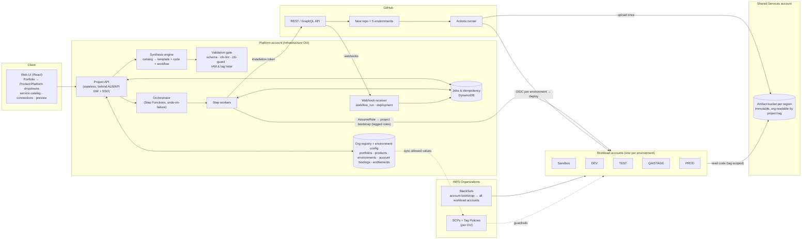

### 2.2 End-to-end sequence

```mermaid
sequenceDiagram
  autonumber
  actor U as User
  participant UI as Web UI
  participant API as Project API
  participant REG as Org registry
  participant SF as Orchestrator
  participant GH as GitHub
  participant ENV as Env accounts (SBX/DEV/TEST/STAGE/PROD)
  participant GA as GitHub Actions

  UI->>API: GET /v1/org-registry (filtered by user's entitlements)
  API->>REG: portfolios → products the user may use
  U->>UI: Pick Portfolio, Product/Platform; name project; select Lambda + S3; connect S3 → Lambda
  UI->>API: POST /v1/projects:preview
  API->>REG: check selection + resolve account per environment
  API-->>UI: files + resolved tags + target accounts per environment
  U->>UI: "Create Repository & Deploy"
  UI->>API: POST /v1/projects (Idempotency-Key)
  API-->>UI: 202 {jobId}
  API->>SF: StartExecution
  SF->>GH: 1. create repo (custom properties = ownership tags)
  par for each environment account
    SF->>ENV: 2. project bootstrap: tagged deploy role + exec role (trust: this repo + this env only)
  end
  SF->>GH: 3. create one GitHub environment per enabled env (protection rules) + repo/env variables
  SF->>GH: 4. one atomic commit
  GH->>GA: push to main
  GA->>ENV: build once → DEV → TEST → (approval) STAGE → (approval) PROD
  GH-->>SF: deployment / workflow_run webhooks → status per environment
  SF-->>UI: repo URL, run URL, status for each environment
```

### 2.3 Component responsibilities

| Component | Responsibility | Scaling |
|---|---|---|
| **Web UI** | Cascading ownership dropdowns, service catalog, connection editor, preview (files, tags, target accounts), job status per environment. | Static on CDN |
| **Project API** | Authentication, entitlement checks, validation, preview, job creation, idempotency. Keeps no state between requests. | Horizontal containers |
| **Org registry** | Source of the Portfolio → Product/Platform tree, projects, cost centers, entitlements, allowed tag values. | DynamoDB + cache; synced from CMDB |
| **Environment config** | Admin-managed list of environments (name, order, tier, protection and guardrail profiles) and **account bindings** (environment + portfolio/product + region → AWS account ID). Validates and onboards accounts before they can be used (§5.5). | DynamoDB, versioned, audited |
| **Synthesis engine** | Payload → template, starter code, workflow, per-environment parameter files. Pure function with no I/O. | Runs in-process |
| **Validation gate** | Schema, connection rules, cfn-lint, cfn-guard (rules differ per environment), IAM least-privilege + tag linter. | Runs in-process |
| **Orchestrator** | Provisioning steps across GitHub and up to five accounts, with retries and undo steps. | Step Functions Standard |
| **Org guardrails** | SCPs and Tag Policies attached to OUs, enforcing the tag rules no matter which tool makes the call. | AWS Organizations |
| **StackSets** | Deploy the *account bootstrap* (OIDC provider, shared tag-based policies, provisioner role) to every workload account automatically, including new ones. | Service-managed StackSets |
| **Artifact bucket** | One per region in Shared Services. Workload accounts can read only their project's prefix. | S3 |

### 2.4 API surface (contract only)

| Method & path | Purpose |
|---|---|
| `GET /v1/org-registry` | Portfolio → Product/Platform tree, **filtered to what the caller is entitled to**. Drives the dropdowns. |
| `GET /v1/catalog` | Services that can be selected, their settings and valid connections. |
| `GET /v1/environments` | Active environments in promotion order (read-only for normal users). |
| `GET/POST/PUT /v1/admin/environments` | **Admin:** create, rename (display name), reorder, set profiles, deactivate environments. |
| `GET/POST/PUT/DELETE /v1/admin/account-bindings` | **Admin:** map an AWS account ID to an environment for a portfolio/product/region. |
| `POST /v1/admin/account-bindings/{id}:validate` | **Admin:** run the onboarding checks (§5.5.3) and report the result. |
| `POST /v1/projects:preview` | Validate + synthesize, no side effects. Returns files, resolved tags and target accounts per environment. |
| `POST /v1/projects` | Start provisioning (`Idempotency-Key` required) → 202 `{jobId}`. |
| `GET /v1/jobs/{jobId}` / `…/events` | Job + per-environment status (JSON / SSE). |
| `GET /v1/projects/{id}/releases` | Release console: pipeline view and history per environment (§8.5). |
| `GET /v1/approvals?mine=true` | Reviewer's approval inbox. |
| `POST /v1/approvals/{id}:approve` / `:reject` | Approve/reject in the UI; the platform submits it to GitHub as the reviewer. |
| `POST /v1/projects/{id}/environments/{env}:promote` | Start promotion when the environment is in `on-request` mode. |
| `POST /v1/overrides` / `POST /v1/overrides/{id}:decide` | Request / decide a high-risk change override. |
| `POST /v1/github/webhooks` | GitHub App webhooks. |

---

## 3. Request payload and data model

### 3.1 Design choices
- **Ownership by ID, not by name:** the UI sends registry IDs (`pf-…`, `pr-…`). The server checks them against the registry *and* the user's entitlements. **The UI is never trusted for ownership.**
- **No account IDs in the payload.** The server works out the target account for each environment from the admin-configured account bindings (§5.5). Users cannot point a deploy at an account they don't own.
- **Graph-shaped:** `resources` (nodes) and `connections` (edges). Permissions and event wiring come from the edges, so the user never writes IAM.
- **Stable IDs supplied by the user** become logical IDs and part of physical names; stable IDs are what make updates safe.

### 3.2 Example — Python Lambda + S3, owned by Payments → Invoicing → AP Automation

```json
{
  "schemaVersion": "2.0",
  "requestId": "6f1c2a9e-4b7d-4a52-9d55-0d1f2b3c4e5f",
  "catalogVersion": "2026.10.0",
  "project": {
    "name": "invoice-ingest",
    "description": "Process invoices dropped into S3",
    "github": { "owner": "acme-platform", "visibility": "private" }
  },
  "ownership": {
    "portfolioId": "pf-payments",
    "productId": "pr-invoicing",
    "dataClassification": "confidential"
  },
  "environments": {
    "enabled": ["sandbox", "dev", "test", "stage", "prod"],
    "region": "us-east-1"
  },
  "resources": [
    { "id": "uploads", "type": "s3.bucket",
      "config": { "versioning": true, "expireNoncurrentDays": 30 } },
    { "id": "processor", "type": "lambda.python",
      "config": { "runtime": "python3.13", "architecture": "arm64", "starterCode": "s3-event-logger" } }
  ],
  "connections": [
    { "kind": "s3.notify", "source": "uploads", "target": "processor",
      "config": { "events": ["s3:ObjectCreated:*"], "prefix": "incoming/" } }
  ],
  "environmentOverrides": {
    "prod":    { "processor": { "memoryMb": 512, "reservedConcurrency": 50 } },
    "sandbox": { "*": { "retainOnDelete": false } }
  },
  "deploy": { "auth": "oidc" }
}
```

What the server adds before synthesis (shown in the preview, read-only):

```json
{
  "resolvedTags": {
    "org:portfolio": "pf-payments",
    "org:product": "pr-invoicing",
    "org:project": "invoice-ingest",
    "org:cost-center": "CC-4410",
    "org:data-classification": "confidential",
    "org:managed-by": "cloudinfra"
  },
  "targets": {
    "sandbox": { "accountId": "111111111111", "region": "us-east-1" },
    "dev":     { "accountId": "222222222222", "region": "us-east-1" },
    "test":    { "accountId": "333333333333", "region": "us-east-1" },
    "stage":   { "accountId": "444444444444", "region": "us-east-1" },
    "prod":    { "accountId": "555555555555", "region": "us-east-1" }
  }
}
```

`org:environment` is added per account at deploy time (§4.3).

### 3.3 Schema rules (enforced by the validation gate)

| Field | Rule | Reason |
|---|---|---|
| `ownership.*Id` | Must exist in the registry; product must belong to the portfolio; user must be entitled to the product | Stops users from claiming someone else's product. |
| `ownership.dataClassification` | ≤ the product's classification ceiling; `restricted` data not allowed in `sandbox` | Classification gates are enforced in SCPs too (§4.7). |
| `environments.enabled` | Subset of the **active configured** environments that have an onboarded account binding for this product; must include every environment the configuration marks as a required gate before a later one (e.g. `prod` requires `stage`); order comes from the configuration, not the payload | Promotion integrity. |
| `project.name` | `^[a-z][a-z0-9]*(-[a-z0-9]+)*$`, 3–30 chars, no `--`, **unique within the GitHub org and across the registry** | `org:project` must identify exactly one project. `--` is reserved as the name separator. |
| `resources[].id` | `^[a-z][a-z0-9-]{0,19}$`, unique | Logical ID + physical name. |
| `len(project.name) + len(id)` for S3 | ≤ 31 | Bucket name `{project}--{id}-{account}-{region}` must stay ≤ 63 chars. |
| `environmentOverrides` | Only settings the catalog marks as overridable, within per-environment ranges (e.g. prod log retention ≥ 90 days) | Environments differ in size, not in shape. |
| Connections | Source/target must exist; the pair of types must be allowed; no overlapping S3 notifications; no write access to a bucket that also triggers the same function on an overlapping prefix | Correctness + stops S3 ↔ Lambda infinite loops. |

**v1 catalog:**
- **Resource types:** `s3.bucket`, `lambda.python`, `dynamodb.table`.
- **Connection kinds:** `s3.notify` (bucket → function) and `iam.access` (function → bucket/table; `read` | `write` | `readwrite`).

### 3.4 Persistent model (DynamoDB, single table)

| Entity | PK | SK | Key attributes |
|---|---|---|---|
| Portfolio | `REG#PORTFOLIO` | `PF#{id}` | displayName, status, owner group |
| Product/Platform | `REG#PF#{portfolioId}` | `PR#{id}` | displayName, kind (`product`\|`platform`), costCenter, classification ceiling, allowed envs, entitled IdP groups, GitHub access team (repo maintain role), GitHub reviewer teams per env |
| Environment | `CFG#ENV` | `ENV#{envId}` | displayName, order, tier, OU, required-gate flag, protection profile, guardrail profile, status, version |
| Account binding | `CFG#BIND#{envId}` | `{scope}#{scopeId}#{region}` | accountId, status (`pending`/`onboarded`/`failed`/`retired`), last validation result, version |
| Account index (uniqueness) | `CFG#ACCT#{accountId}` | `META` | envId. Written in the same transaction as the binding, so **one account ID can belong to only one environment** |
| Project | `PROJECT#{name}` | `META` | ownership IDs, repo ID, enabled envs, bootstrap stack IDs per env, catalog version |
| Job | `JOB#{jobId}` | `META` / `STEP#{n}#{name}#{env}` | state, per-step / per-env status, errors, undo state |
| Idempotency | `IDEMP#{requestId}` | `META` | jobId, payloadHash |

Job states: `ACCEPTED → REPO_CREATED → AWS_BOOTSTRAPPED(per env) → ACTIONS_CONFIGURED → COMMITTED → PROMOTING → SUCCEEDED | DEPLOY_FAILED(env) | FAILED_ROLLED_BACK | FAILED_NEEDS_ATTENTION`.

---

## 4. Org registry, tagging strategy and tag-based permissions

### 4.1 Hierarchy and how each level is used

Three levels: **Portfolio → Product/Platform → Project**. Who may act for a product (repo access, approvers, human AWS access) comes from IdP/GitHub groups attached to the product in the registry; it is not a level in the hierarchy and not a tag.

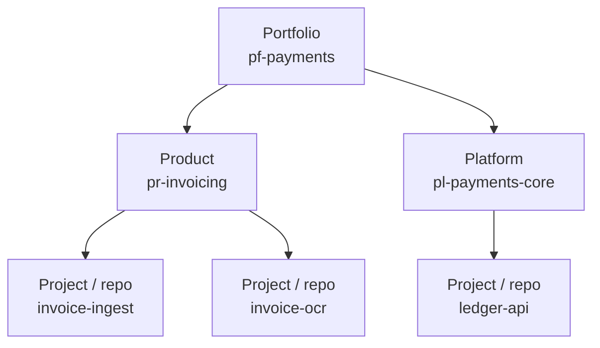

| Level | Used for | Used in IAM permissions? |
|---|---|---|
| **Portfolio** | Cost roll-up, portfolio-level guardrails, account routing (§5.2) | Guardrail SCPs only (e.g. "this account only accepts portfolio X") |
| **Product / Platform** | Cost, entitlements (who may create projects), optional sharing between projects in the same product | Yes, for opt-in sharing within a product (§4.6) |
| **Project** | **The main isolation boundary.** One repo = one project = one set of roles per environment | **Yes, always** |
| **Environment** | Which account / stage | Yes: must equal the account's environment |

**Default isolation:** a project can create, change and delete only resources tagged with its own `org:project`. Sharing within the same product is opt-in and read-only by default. Sharing across products is never automatic.

### 4.2 Org registry → UI dropdowns
- **Source of truth:** the CMDB (e.g. ServiceNow) or a platform admin screen, synced into the registry table. The UI never hardcodes the lists.
- **Cascading dropdowns:**
  - **Portfolio:** only portfolios where the user has at least one entitled product.
  - **Product/Platform:** filtered by the chosen portfolio *and* the user's IdP groups. Shows a badge for kind (Product or Platform).
  - **Project:** a new name typed by the user (validated for format and uniqueness, §3.3), not a dropdown.
- **Read-only fields shown after selection:** cost center, classification ceiling, and target account per environment (from the account bindings). The user sees exactly where the project will deploy.
- **Server-side re-check** on preview and on create (registry + entitlement). This guards against a stale UI and against crafted requests.
- **IDs are immutable; display names can change.** Tag values are IDs (`pr-invoicing`), so renaming "Invoicing" to "AP Invoicing" changes nothing in AWS.
- **Lifecycle:** retiring a product blocks new projects, flags existing ones and does not delete anything.

### 4.3 Tag schema

The key prefix `org:` is a placeholder; choose your company prefix (D3). All values are registry IDs or validated slugs.

| Key | Example | Set by | Required | Used for |
|---|---|---|---|---|
| `org:portfolio` | `pf-payments` | Platform (from registry) | Yes | Cost, guardrails |
| `org:product` | `pr-invoicing` | Platform | Yes | Cost, sharing within a product |
| `org:project` | `invoice-ingest` | Platform | Yes | **Primary permission key** |
| `org:environment` | `dev` | Platform (per account) | Yes | Must match the account's environment |
| `org:cost-center` | `CC-4410` | Platform (from product) | Yes | Billing (activated as a cost allocation tag) |
| `org:data-classification` | `confidential` | User (≤ product ceiling) | Yes | SCP gates (e.g. not in sandbox) |
| `org:managed-by` | `cloudinfra` | Platform | Yes | Marks resources only the platform pipeline may change |
| `org:share-scope` | `product` | Binder (opt-in) | No | Allows read by other projects in the same product (§4.6) |
| `org:expires-on` | `2026-11-01` | Platform (sandbox only) | Sandbox only | Automatic cleanup in sandbox |

**Where the tags are recorded:**

| Location | Tags | Purpose |
|---|---|---|
| IAM roles the platform creates per project per env (deploy role, CFN execution role) | All `org:*` keys | **These role tags are the source of truth.** Inside IAM policies they are read as `aws:PrincipalTag/...`. |
| CloudFormation stack tags | Same values, passed by the pipeline | Propagated by CloudFormation to every resource that supports tags. AWS only accepts them if they **match the role's own tags** (§4.5). |
| GitHub repo custom properties | portfolio, product, project | Discovery, rulesets, audit. Informational, not a security control. |
| `infra.json` in the repo | Ownership IDs | Regeneration. **Not trusted** for permissions. |

### 4.4 Why a repo cannot forge tags

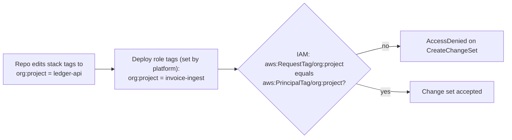

The role's tags can be changed only by the platform's provisioner role, and an SCP blocks changes to role tags by anyone else (§4.7). So a project can only ever act as itself.

### 4.5 Tag-based permissions (ABAC) design

**One shared policy per role type per account, instead of one policy per project.** The policies use `${aws:PrincipalTag/org:project}`, so the same policy behaves differently for each project's role. They are deployed once per account by StackSets. Project bootstrap only creates **tagged roles** that attach them. This is the main scalability gain: adding project number 500 adds no new policy documents.

| Role (per project, per env account) | Trusted by | Attached shared policy | Tag rules |
|---|---|---|---|
| `GitHubDeployRole` | GitHub OIDC, `sub = repo:{owner}/{repo}:environment:{env}` | `cloudinfra-deploy-abac` | CloudFormation create/update/change-set actions only when `aws:RequestTag/org:*` = `${aws:PrincipalTag/org:*}` for all required keys; describe/execute/delete only when `aws:ResourceTag/org:project` = own project. `iam:PassRole` only on roles where `aws:ResourceTag/org:project` = own project, passed to CloudFormation. Upload only to `artifact-bucket/${aws:PrincipalTag/org:project}/*`. |
| `CfnExecutionRole` | `cloudformation.amazonaws.com` (with `aws:SourceAccount`) | `cloudinfra-exec-abac` | **Create:** allowed only if request tags = own tags (and `aws:TagKeys` only from the allowed list). **Change/delete:** only if `aws:ResourceTag/org:project` = own project. **IAM:** `CreateRole`/`PutRolePolicy` only with the shared boundary attached and own tags. `PassRole` only on own-project roles, to Lambda. |
| App roles (e.g. the Lambda execution role, created by the stack) | `lambda.amazonaws.com` | Exact-ARN inline policy (from binders) **+ shared boundary** `cloudinfra-app-boundary` | The boundary allows data access only to resources tagged with the same `org:project` (or same `org:product` with `org:share-scope=product`, read-only). The inline policy narrows it to exact ARNs. |

**Illustrative pattern** (a design sketch, not final policy). The core rule of `cloudinfra-exec-abac` for Lambda:

```json
[
  {
    "Sid": "CreateOnlyWithOwnTags",
    "Effect": "Allow",
    "Action": ["lambda:CreateFunction", "lambda:TagResource"],
    "Resource": "arn:aws:lambda:*:${aws:PrincipalAccount}:function:${aws:PrincipalTag/org:project}--*",
    "Condition": {
      "StringEquals": {
        "aws:RequestTag/org:project":     "${aws:PrincipalTag/org:project}",
        "aws:RequestTag/org:product":     "${aws:PrincipalTag/org:product}",
        "aws:RequestTag/org:environment": "${aws:PrincipalTag/org:environment}"
      },
      "ForAllValues:StringEquals": { "aws:TagKeys": ["org:portfolio","org:product","org:project","org:environment","org:cost-center","org:data-classification","org:managed-by","org:share-scope"] }
    }
  },
  {
    "Sid": "ManageOnlyOwnProject",
    "Effect": "Allow",
    "Action": ["lambda:UpdateFunctionCode","lambda:UpdateFunctionConfiguration","lambda:DeleteFunction","lambda:AddPermission","lambda:RemovePermission","lambda:GetFunction"],
    "Resource": "arn:aws:lambda:*:${aws:PrincipalAccount}:function:${aws:PrincipalTag/org:project}--*",
    "Condition": { "StringEquals": { "aws:ResourceTag/org:project": "${aws:PrincipalTag/org:project}" } }
  }
]
```

Each rule checks **both** the tag condition and a name pattern built from the principal's own tag. Each one alone would be enough; together they are defense in depth.

### 4.6 Tags + names: covering what tag conditions can't

AWS support for `aws:ResourceTag` / `aws:RequestTag` **varies by service and by action**. The platform keeps a **support matrix** per catalog service, checked against the AWS Service Authorization Reference and tested in CI against a real sandbox account:

| Situation | Control used |
|---|---|
| Action supports `aws:RequestTag` (create) and `aws:ResourceTag` (change) | Tag condition **and** name pattern |
| Action lacks tag-condition support (some describe/list calls, some bucket-configuration actions) | Name pattern `${aws:PrincipalTag/org:project}--*` (still built from the role's tag, so still tag-driven) |
| Action supports no resource scoping at all (e.g. some `Describe*` calls) | Allowed read-only, at account+region scope, only in platform-owned roles, **never** in generated app roles |

**Sharing within a product (opt-in):** an `iam.access` connection to a resource in *another* project of the *same* product is allowed only if:
1. The target resource carries `org:share-scope=product`.
2. The access is read-only (unless an approved exception exists).
3. The boundary condition `aws:ResourceTag/org:product = ${aws:PrincipalTag/org:product}` holds.

Access across products is not offered by the platform; it goes through a separate exception process.

### 4.7 Organization guardrails (SCPs + Tag Policies)

SCPs apply to every principal in the account, including humans and other tools. So the tag rules hold even outside this platform.

| Guardrail | Attached to | Rule |
|---|---|---|
| **Protect ownership tags** | All workload OUs | Deny `TagResource`/`UntagResource` (and service-specific equivalents) that add, change or remove `org:*` keys on a resource, unless the caller's `org:project` matches the resource's, or the caller is the platform provisioner / break-glass role. |
| **Protect platform roles** | All workload OUs | Deny changes (policy, trust, tags, boundary) to roles tagged `org:managed-by=cloudinfra`, except by the provisioner role. Deny `iam:DeleteRolePermissionsBoundary` everywhere. |
| **Require tags on create** | All workload OUs | For callers tagged `org:managed-by=cloudinfra`: deny create actions on catalog services if `aws:RequestTag/org:project` or `org:environment` is missing. Scoped to platform principals so other tooling isn't broken. |
| **Environment lock** | Each environment OU | Deny create if `aws:RequestTag/org:environment` ≠ that OU's environment (e.g. only `prod` in the Prod OU). |
| **Classification gate** | Sandbox OU | Deny create if `aws:RequestTag/org:data-classification` is `confidential` or `restricted`. |
| **Region allow-list** | All workload OUs | Only approved regions. |
| **Tag Policies** | Root | Allowed keys + **allowed values** for `org:portfolio`/`org:product`, **generated from the registry and synced automatically**; enforce letter case; enforce on resource types that support it. |

Note: Tag Policies standardize values and report non-compliance; they enforce only for supported resource types. **SCP + IAM conditions are the actual enforcement**; Tag Policies are the consistency and reporting layer.

### 4.8 Human access uses the same tags
In IAM Identity Center, **attributes for access control** map an IdP attribute (product) to a session tag. Permission sets in shared environment accounts then use the same `aws:ResourceTag/org:product = ${aws:PrincipalTag/org:product}` pattern. Engineers can view and debug their product's resources in DEV/TEST and get read-only access in PROD, with no per-product policies.

### 4.9 Compliance and drift
- AWS Config rules (`required-tags` + a custom rule) flag `org:*` tag values that don't match the registry, per account, collected in the audit account.
- Resource Explorer / Tag Editor views per product.
- Cost Explorer + CUR grouped by `org:portfolio` / `org:product` / `org:cost-center` (activated as cost allocation tags in the management account).

---

## 5. Multi-account environment strategy

### 5.1 Organization structure

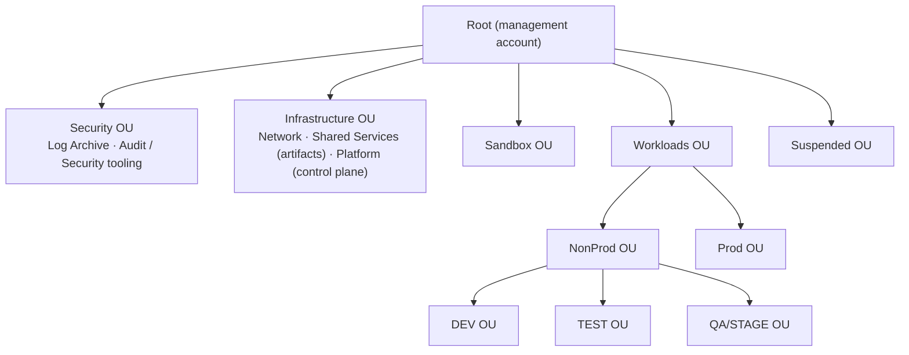

Separate OUs per environment let each environment have its own SCPs (environment lock, classification, sandbox budget/cleanup, prod deletion protection).

### 5.2 Account granularity: options

| Option | Accounts | Isolation between products | Main risk | When |
|---|---|---|---|---|
| **A. One account per environment** | 5 | Tags/ABAC only | Large blast radius; **shared service quotas** (e.g. Lambda's default 1,000 concurrent executions per account per region shared by everyone) | Small orgs |
| **B. One account per portfolio per environment** (recommended) | 5 × portfolios | Account boundary between portfolios; ABAC between products/projects inside | Moderate number of accounts | Default |
| **C. One account per product per environment** | 5 × products | Account boundary per product | Account sprawl | Regulated or very large products |

**Recommendation: B, with C available per product.** Account bindings (§5.5) decide per portfolio or product, so a product can move to dedicated accounts later without changing the generator, pipeline or policies. Only its binding changes. **Tag-based isolation is required in all three options**, because more than one project always shares an account.

### 5.3 Environment profiles

These are the **default profiles** for the five seeded environments. All of them can be changed per environment in the application (§5.5).

| | Sandbox | DEV | TEST | QA/STAGE | PROD |
|---|---|---|---|---|---|
| Purpose | Experiments, feature branches | Integration on `main` | Automated test suites | Production-like, UAT | Live |
| Deploy trigger | Manual dispatch from **any branch** | Auto on push to `main` | Auto after DEV succeeds | After TEST + **approval** | After STAGE + **approval** |
| GitHub env protection | None | Branch: `main` | Branch: `main` | `main`, **required GitHub reviewers** (QA), prevent self-review | `main`/release tags, **required GitHub reviewers** (product owner + change mgmt), prevent self-review, optional wait timer |
| Data classification allowed | ≤ internal | ≤ confidential (synthetic data) | ≤ confidential | as product ceiling | as product ceiling |
| `retainOnDelete` default | false | false | false | true | true (+ stack policy blocks replace/delete) |
| Log retention | 7 d | 14 d | 14 d | 90 d | ≥ 365 d |
| Cleanup | `org:expires-on` TTL (e.g. 14 days) + nightly cleanup job | — | — | — | Deletion denied by SCP except break-glass |
| Budget | Per-project budget alarm + hard SCP limits on expensive services | Budget alarm | Budget alarm | Budget alarm | Alarms + anomaly detection |
| Alarms | — | basic | basic | full | full + paging |

### 5.4 Bootstrap at scale

| Layer | What | Deployed by | When |
|---|---|---|---|
| **Account bootstrap** | GitHub OIDC provider; shared policies `cloudinfra-deploy-abac`, `cloudinfra-exec-abac`, `cloudinfra-app-boundary`; `CloudInfraProvisioner` role (trusted only by the Platform account, with `aws:PrincipalOrgID`) | **Service-managed StackSet** targeting the workload OUs, auto-deploying to new accounts | Once; updates roll out across the org |
| **Shared Services** | Artifact bucket per region; its bucket policy lets org accounts' execution roles read `${aws:PrincipalTag/org:project}/*` only (`aws:PrincipalOrgID` + principal-tag condition) | Platform IaC | Once per region |
| **Project bootstrap** | Per enabled environment: `GitHubDeployRole` + `CfnExecutionRole`, **tagged with the project's tags** and attaching the shared policies. Small, because the policies already exist. | Orchestrator via `CloudInfraProvisioner` in each target account (in parallel, throttled per account) | Once per project per environment |

Lambda requires the code bucket to be in the **same region** as the function; it can be in another account. Hence one artifact bucket per region in Shared Services.

### 5.5 Configurable environments and account numbers

Environments and their AWS account numbers are **data in the application, not code**. The five environments above are the default seed. Admins can rename, reorder, add (e.g. `perf`) or retire environments, and bind account numbers to them, without a code change or redeploy.

#### 5.5.1 Environment definition (admin screen)

| Field | Example | Notes |
|---|---|---|
| `envId` | `stage` | Immutable slug (`^[a-z][a-z0-9]{1,15}$`). Used as the GitHub environment name, the `org:environment` tag value and the OIDC `sub` suffix, so it **cannot be renamed** once a project uses it. |
| `displayName` | `QA/STAGE` | Free text, can change at any time. |
| `order` | `4` | Promotion order. Must be unique among active environments. |
| `tier` | `sandbox` \| `nonprod` \| `prod` | Selects default guardrails and which OU an account must be in. |
| `requiredGate` | `true` | If true, any later environment requires this one to be enabled (e.g. no prod without stage). |
| `deployTrigger` | `manual-any-branch` \| `auto-on-main` \| `after-previous` \| `after-previous-with-approval` | Becomes the job wiring in the generated `deploy.yml`. |
| `requiresApproval` | `true` | GitHub required-reviewer approval before deployment. **Locked to `true` for STAGE and all `prod`-tier environments** (§8.3). |
| `protectionProfile` | branch rules, reviewer source, prevent self-review, wait timer | Applied to the GitHub environment (§7.2). |
| `guardrailProfile` | classification ceiling, retention minimums, retain defaults, TTL, stack policy | Feeds validation, cfn-guard rules and `config/{env}.json` defaults (§5.3 table = the default profiles). |
| `status` | `active` \| `retired` | Retired environments are hidden for new projects; existing projects keep working until migrated. |

#### 5.5.2 Account bindings

An account binding says *"for this environment, this portfolio (or product), in this region, deploy to this AWS account"*.

| Field | Example | Rule |
|---|---|---|
| `envId` | `prod` | Must be an active environment |
| `scope` | `portfolio` / `product` | A product binding overrides its portfolio's binding (matches option B with C per product, §5.2) |
| `scopeId` | `pf-payments` | Must exist in the org registry |
| `region` | `us-east-1` | Must be in the region allow-list |
| `accountId` | `555555555555` | 12 digits. **Unique across environments:** an account can belong to only one environment (enforced by a transactional uniqueness record). It may serve several portfolios only if the admin explicitly allows sharing (option A). |
| `status` | `pending` → `onboarded` / `failed` → `retired` | Only `onboarded` bindings can be selected for deploys |

Resolution at preview time is: product binding → portfolio binding → error "no account configured for {env}". The preview shows the resolved account for every environment before the user clicks Create.

#### 5.5.3 Onboarding checks (run when a binding is saved or re-validated)

| Check | How |
|---|---|
| Account belongs to the organization and is active | `organizations:DescribeAccount` from the Platform account (delegated admin) |
| Account is in the OU that matches the environment's tier | `organizations:ListParents` |
| Account bootstrap is in place | StackSet instance status `CURRENT` for that account + region |
| Platform can reach it | Assume `CloudInfraProvisioner` and call `sts:GetCallerIdentity`; returned account must equal `accountId` |
| GitHub OIDC provider and shared tag-based policies exist | Read-only IAM checks through the provisioner role |
| Account not bound to a different environment | Uniqueness record |

A binding that fails any check stays `failed`, with the reason shown in the admin screen.

#### 5.5.4 Who can change it, and how changes propagate

- **Permissions:** only `platform-admin` can edit environments and bindings. Changes to `prod`-tier environments need a **second admin's approval** (four-eyes) before they take effect. Every change is versioned and audited (who, when, before/after).
- **New projects** always use the current configuration.
- **Existing projects are never silently re-pointed.** When an environment is added or a binding changes, the platform lists the affected projects and, per project:
  1. Bootstraps the new account (§5.4).
  2. Updates the repo's GitHub variables (§5.5.5).
  3. Opens a "sync pipeline" PR if the environment list or order changed.

  Moving an existing stack to a different account is a **migration** (deploy in the new account, move data, retire the old stack). It is done on purpose and per project, never automatically.
- A **reconciler** compares each repo's GitHub variables with the application configuration nightly. It reports drift and, if configured, repairs it.

#### 5.5.5 GitHub variables (all pipeline configuration lives here)

Every value the pipeline needs is a **GitHub Actions variable** (`vars.*`), written by the platform. The workflow files contain no account numbers, ARNs, names or tags; they only reference variables. There are **no GitHub secrets** in OIDC mode, because no credentials are stored. A role ARN is an identifier, not a credential, so it is a variable too.

| Variable | Level | Example | Source in the application |
|---|---|---|---|
| `PROJECT_NAME` | Repository | `invoice-ingest` | Project |
| `ORG_PORTFOLIO` | Repository | `pf-payments` | Ownership (registry ID) |
| `ORG_PRODUCT` | Repository | `pr-invoicing` | Ownership |
| `ORG_COST_CENTER` | Repository | `CC-4410` | Registry (product) |
| `ORG_DATA_CLASSIFICATION` | Repository | `confidential` | Ownership |
| `ENVIRONMENT_ORDER` | Repository | `sandbox,dev,test,stage,prod` | Environment config (informational; the generated `deploy.yml` holds the actual job chain) |
| `ENVIRONMENT_NAME` | **Environment** | `prod` | `envId` |
| `AWS_ACCOUNT_ID` | **Environment** | `555555555555` | Resolved account binding |
| `AWS_REGION` | **Environment** | `us-east-1` | Binding region |
| `AWS_ROLE_ARN` | **Environment** | `arn:aws:iam::555555555555:role/cloudinfra/invoice-ingest-deploy` | Project bootstrap output |
| `CFN_EXEC_ROLE_ARN` | **Environment** | `arn:aws:iam::555555555555:role/cloudinfra/invoice-ingest-cfn-exec` | Project bootstrap output |
| `ARTIFACT_BUCKET` | **Environment** | `cloudinfra-artifacts-999999999999-us-east-1` | Shared Services bucket for the binding's region |

- **Plan environments** (`stage-plan`, `prod-plan`) have their own copy of these environment variables, where `AWS_ROLE_ARN` points to the **plan role** (§8.3). The workflow uses the same variable name everywhere; GitHub supplies the right value per environment.
- **Environment-level variables** are visible only to jobs that run in that GitHub environment. So the DEV job never sees the PROD account number or role.
- GitHub's precedence is environment → repository → organization. The platform writes each variable at exactly one level, so precedence never decides a value by accident.
- **Who can edit them:** the product's GitHub access team (from the registry) gets the `maintain` role on the repo, not `admin`, so it cannot change variables or environment protection. Only the platform (GitHub App) and org admins can. This is a convenience control, not the security boundary.
- **The security boundary is still AWS.** If someone did change `AWS_ACCOUNT_ID` or a tag variable:
  - OIDC trust in each account only accepts this repo + this environment.
  - IAM only accepts stack tags equal to the deploy role's own tags (§4.4).
  - The pipeline also checks that `aws sts get-caller-identity` returns `vars.AWS_ACCOUNT_ID` and that `vars.ENVIRONMENT_NAME` equals the job's GitHub environment, and stops if not.

  A tampered variable can make a deploy fail; it cannot make it touch another project's or another environment's resources.
- **Long-lived credentials mode (§8.7)** is the only exception: access keys are credentials and are stored as GitHub **environment secrets**, never as variables.

---

## 6. CloudFormation generation engine

### 6.1 Approach: building blocks + connection binders

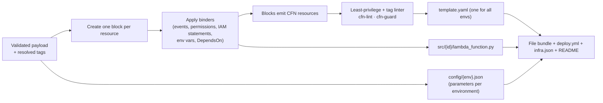

- **One template for all environments.** Differences between environments are only parameter values in `config/{env}.json` (memory, retention, concurrency, retain flags), checked against per-environment ranges.
- **Tags are not hardcoded per resource in the template.** They are applied as **stack tags** by the pipeline and propagated by CloudFormation. The template itself stays environment-neutral and ownership-neutral. (A resource type that doesn't receive propagated tags gets explicit `Tags` from parameters; the linter checks every taggable resource ends up tagged.)
- Output is **deterministic** (stable logical IDs, sorted keys, no timestamps), so regenerating gives an empty changeset.

### 6.2 Naming

| Item | Pattern | Example |
|---|---|---|
| Stack | `{project}` (one per environment account) | `invoice-ingest` |
| Logical IDs | `PascalCase(id)` + type suffix | `UploadsBucket`, `ProcessorFunction`, `ProcessorRole` |
| S3 bucket | `{project}--{id}-${AWS::AccountId}-${AWS::Region}` | `invoice-ingest--uploads-222222222222-us-east-1` |
| Lambda / DynamoDB | `{project}--{id}` | `invoice-ingest--processor` |
| Log group | `/aws/lambda/{project}--{id}` | — |
| IAM roles | CloudFormation-generated name, Path `/app/{project}/`, tagged | — |
| Boundary | Shared `cloudinfra-app-boundary` per account | — |

The account ID in bucket names keeps them unique across environments.

### 6.3 S3 → Lambda wiring (and the circular dependency trap)

The obvious template has a dependency loop:
- The bucket's notification needs the function ARN.
- The `Lambda::Permission` needs the bucket ARN.
- The bucket must wait for the permission, because S3 checks that it may invoke the function when the notification is saved.

**Fix:**
1. The bucket name is predictable (built with `Fn::Sub`).
2. `Lambda::Permission.SourceArn` and the function role's `s3:GetObject` resource use a **constructed ARN string**, not `Ref`/`GetAtt`.
3. The bucket gets `DependsOn` on the permission.
4. The permission sets `SourceAccount: ${AWS::AccountId}`, so another account that owns a bucket with that name cannot invoke the function.

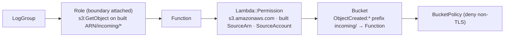

### 6.4 Defaults built into each block
- **S3:**
  - Public access blocked; ACLs off; encryption (SSE-S3, or SSE-KMS for `confidential`+).
  - TLS-only bucket policy.
  - Versioning + lifecycle.
  - `DeletionPolicy: RetainExceptOnCreate` / `UpdateReplacePolicy: Retain` when retained (stage/prod by default).
- **Lambda:**
  - One execution role per function, with the shared boundary attached; exact-ARN inline policy (logs to its own log group + binder statements).
  - An explicit log group with retention per environment; JSON logging.
  - `arm64`.
  - Code from the regional artifact bucket at `{project}/{tree-hash}/{id}.zip`.
  - DLQ / on-failure destination recommended for S3 triggers.
- **DynamoDB:** on-demand billing, point-in-time recovery, encryption, deletion protection in stage/prod.

### 6.5 Template parameters

| Parameter | Source |
|---|---|
| `ProjectName` | GitHub environment variable |
| `EnvironmentName` | GitHub environment variable (must equal the deploy role's `org:environment` tag) |
| `CodeS3Bucket`, `CodeS3Prefix` | Regional artifact bucket; `{project}/{tree-hash-of-src}` |
| Per-resource settings (memory, retention, concurrency, retain) | `config/{env}.json` |

### 6.6 Validation gate
1. Schema + graph + registry/entitlement checks (§3.3).
2. **Least-privilege linter:**
   - No `Allow` with `*` / `service:*` actions or `*` resources in generated roles.
   - No `iam:*`, `sts:AssumeRole` or `iam:PassRole` in app roles.
   - Every generated role has the boundary.
3. **Tag linter:** every taggable resource will carry the required `org:*` keys (via propagation or explicit tags).
4. cfn-lint; **cfn-guard rules per environment** (e.g. prod: retain + alarms + retention ≥ 365 days).
5. Golden-file tests for every catalog combination.

### 6.7 Idempotency of the template
- Stable logical IDs and predictable physical names.
- Retain policies on stateful resources; stack policy in prod.
- Code keys based on content (tree hash). A docs-only push gives an empty changeset (`--no-fail-on-empty-changeset`).
- No timestamps or request IDs in the template; deploys go through changesets.

---

## 7. GitHub repository provisioning

### 7.1 Identity: GitHub App (recommended)
1-hour installation tokens, per-installation rate limits, and an audit trail as a bot. Permissions:

| Permission | Level | Used for |
|---|---|---|
| Administration | write | Create/delete repos, custom properties |
| Contents | write | Commit |
| **Workflows** | write | Required to commit anything under `.github/workflows/` |
| Secrets | write | Only for long-lived credentials mode (§8.7); not needed with OIDC |
| Variables | write | Actions variables |
| Environments | write | Create one GitHub environment per configured environment |
| Actions | read | Run status |
| Deployments | write | Run status; **submit reviewer approvals from the release console** (as the reviewer, via user-to-server token, §8.5) |
| Members | read | Resolve reviewer teams |

Webhooks: `workflow_run`, `deployment`, `deployment_status`, `deployment_review`, `deployment_protection_rule`. GitHub Apps can create repos in **organizations**; personal-account repos are out of scope for v1.

### 7.2 Provisioning steps (each step is safe to retry)

| # | Step | How | Retry / idempotency approach | Undo (before the commit) |
|---|---|---|---|---|
| 1 | Create repo | `POST /orgs/{org}/repos` (`auto_init: true`). Set **custom properties** `portfolio`, `product`, `project`; grant the product's GitHub access team (from the registry) the `maintain` role. | Name exists → check the ownership marker (custom property `provision-request`); resume if ours, otherwise fail with a name conflict | Delete the repo (only if this job created it) |
| 2 | Bootstrap AWS **per enabled environment** (in parallel) | AssumeRole `CloudInfraProvisioner` in each target account → create/update `cloudinfra-bootstrap-{project}` (tagged roles, OIDC trust for `repo:{owner}/{repo}:environment:{env}`) | CloudFormation `ClientRequestToken`; create-or-update | Delete the bootstrap stack in each account where it was created |
| 3 | GitHub environments | `PUT /repos/{o}/{r}/environments/{env}` for each enabled environment, with protection rules from that environment's protection profile (§5.5) (branch policies; for STAGE and PROD: required reviewers from the registry, prevent self-review, plus a separate `{env}-plan` environment without reviewers, §8.3) | `PUT` can safely be repeated | Removed when the repo is deleted |
| 4 | GitHub variables | Repository variables (project + ownership tags) and **environment variables per enabled environment** (`ENVIRONMENT_NAME`, `AWS_ACCOUNT_ID`, `AWS_REGION`, `AWS_ROLE_ARN`, `CFN_EXEC_ROLE_ARN`, `ARTIFACT_BUCKET`). Full list in §5.5.5. No secrets in OIDC mode. | Create-or-update (`POST`, then `PATCH` on 409) | Removed when the repo is deleted |
| 5 | **Atomic commit** | Git Data API: create tree (all files) → create commit → fast-forward `refs/heads/main` (`force: false`) | Skip if `main` already has the job's commit trailer | **None.** The repo is kept from here on |
| 6 | Track promotion | `deployment_status` / `workflow_run` webhooks per environment; reconciler as a backup | Matched by `head_sha` + environment | — |

**Why variables are set before the commit:** pushing `deploy.yml` starts the workflow at once.

**Why the Git Data API:** one commit appears all at once. The per-file contents endpoint would create N commits and N workflow runs.

**Why environment-scoped values:** each environment's job sees only its own account's role. A DEV job cannot even read the PROD role ARN.

### 7.3 Rate limits and API etiquette
- Honor `x-ratelimit-remaining` / `reset` and `retry-after`. Otherwise use exponential backoff with full jitter (1 s base, 60 s cap, 6 attempts).
- Content-creating calls are serialized per installation, at least 1 s apart (token bucket, §10.3).
- Webhooks instead of polling; conditional requests (`304`s are not counted against the limit).
- A project with 5 environments needs roughly 25–30 write calls. At 1 write/s per installation, that is about 30 s of GitHub time per project, which is why provisioning is async and queued.

---

## 8. Deployment pipeline (GitHub Actions + OIDC, configurable environments)

### 8.1 Trust model per environment

```mermaid
flowchart LR
  subgraph GHJ["GitHub job: environment = prod"]
    J["deploy-prod"] -->|"JWT sub = repo:acme-platform/invoice-ingest:environment:prod"| X[" "]
  end
  X -->|"AssumeRoleWithWebIdentity"| STS["STS in PROD account"]
  STS -->|"trust: aud + sub exact match"| DR["GitHubDeployRole (PROD)<br/>tags: org:project=invoice-ingest,<br/>org:environment=prod, …"]
  DR -->|"CreateChangeSet with stack tags<br/>(must equal role tags)"| CFN["CloudFormation"]
  CFN -->|"assumes"| ER["CfnExecutionRole (PROD)<br/>same tags · cloudinfra-exec-abac"]
  ER -->|"create/update only own-tagged resources"| APP["invoice-ingest stack"]
```

- A token for `environment:dev` matches **only** the DEV account's role trust. Separate accounts + exact `sub` matching mean no environment can reach another environment's account.
- Hardening: customize the OIDC `sub` to include `repository_id`, so a deleted-and-recreated repo with the same name doesn't inherit trust.

### 8.2 Promotion flow

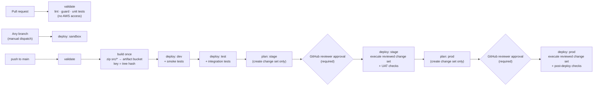

- **Build once:** one zip per function per commit, uploaded to the regional artifact bucket at a key based on content. Every environment deploys that exact key. No rebuilds between environments.
- **Change set before approval:** for STAGE and PROD, a plan job creates the change set and writes its summary (replacements and deletions highlighted) to the job summary. Reviewers approve with the exact change in front of them, and only that change set is executed (§8.3).
- **Sandbox** deploys can come from any branch via manual dispatch. Stacks get `org:expires-on` and are removed by the sandbox cleanup job.

### 8.3 Approval gates: STAGE and PROD require GitHub reviewer approval before deployment

**Rule:** nothing is deployed to STAGE or PROD until a GitHub reviewer approves. The approval happens **before** the deploy job starts. Until then the job has no OIDC token and no AWS access, so nothing in the account can change.

**How it works: plan, approve, then apply the reviewed change set**

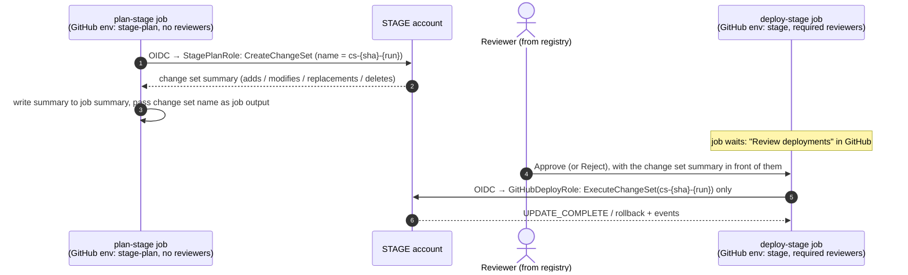

| Item | Design |
|---|---|
| GitHub environments | Two per gated stage: `stage-plan` / `stage` and `prod-plan` / `prod`. Only `stage` and `prod` have **required reviewers**. The plan environments have a branch rule (`main`) but no reviewers. |
| Plan role (`{project}-plan`, per gated account) | Trusted only for `sub = repo:{owner}/{repo}:environment:{env}-plan`. Can create, describe and delete change sets on its own stack (same tag rules as §4.5) and read the artifact. **Cannot execute change sets** or touch resources. |
| Deploy role in gated accounts | For STAGE and PROD it may **only execute an existing change set** (plus describe). It cannot create a new change set, so what runs is exactly what was reviewed. If the stack changed after the plan, execution fails and the pipeline re-plans; reviewers then approve the new plan. |
| Reviewers | Set on each environment from the registry: the product's reviewer GitHub team(s) per environment (default: QA reviewers for STAGE; product owner group + change management for PROD). Up to 6 users/teams per environment; one approval releases the job. |
| Prevent self-review | Enabled on `stage` and `prod`: the person who triggered the run cannot approve it. |
| Branch rule | `stage` and `prod` deploy only from `main` (PROD optionally also from release tags). |
| Wait timer | Optional on `prod` (e.g. 15 min after approval), for a final cancel window. |
| Timeouts | A pending approval expires after 30 days (GitHub limit). The job is marked "Awaiting approval" in the platform UI until then; no AWS change happens. Rejection stops the promotion and leaves the environment untouched. |
| Audit | GitHub records who approved/rejected, when, and the comment. The platform stores it with the job (via `deployment_status` / `deployment_review` webhooks) next to the change set ID and the CloudTrail `ExecuteChangeSet` event. |

**The gate cannot be turned off**
- In the environment configuration (§5.5.1), `requiresApproval` is **locked to `true` for STAGE and for every `prod`-tier environment**. Admins can change *who* reviews, but cannot remove the gate. Any new environment of tier `prod` gets the gate automatically.
- The product's GitHub team has the `maintain` role, not `admin`, so it cannot edit environment protection rules.
- The reconciler checks every repo's `stage` and `prod` environments nightly. Missing reviewers, disabled prevent-self-review or a changed branch rule is **restored automatically and alerted**.
- AWS backs it up: the gated deploy role can only execute change sets. Even a workflow edited to skip the plan job cannot deploy new changes to STAGE or PROD.

**GitHub plan requirement:** required reviewers on **private or internal** repositories need GitHub Enterprise Cloud (public repos have them on all plans). Please confirm your plan (D15).

### 8.4 Quality gates for STAGE and PROD (recommended strategy)

**Recommendation:** build the quality gate as **layered, evidence-based gates**, with the final decision made by a **central gate service in the platform** that is plugged into GitHub as a **custom deployment protection rule** on the `stage` and `prod` environments. Human reviewer approval (§8.3) is the last layer, not the only one.

Why this approach:
- **The gate's rules live in the platform, not in each repo's YAML.** A team cannot weaken them by editing the workflow, and changing a rule for all repos is one change in one place.
- **Decisions are based on evidence tied to the exact commit and artifact.** "TEST passed" means TEST passed for *this* SHA and *this* artifact digest, not just the latest run.
- **Reviewers get the full evidence in one summary**, so approval is an informed decision rather than a click.
- **AWS still has the final say.** The gated deploy role can only execute a reviewed change set (§8.3).

#### 8.4.1 The gate layers

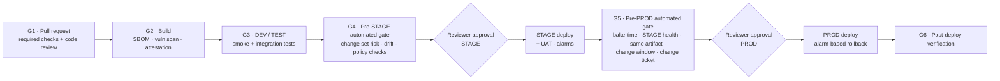

| Gate | When | Checks | Blocks on | Enforced by |
|---|---|---|---|---|
| **G1 · Pull request** | Before merge to `main` | cfn-lint; cfn-guard (all environment rule sets, so a PROD violation is caught early); IaC security scan (e.g. Checkov); unit tests + coverage threshold; SAST (CodeQL / bandit); dependency scan (Dependabot / pip-audit); secret scanning with push protection; 1 code review from the product's team (CODEOWNERS) | Any failure | GitHub **ruleset** on `main` (required status checks + required review), set by the platform at repo creation and checked by the reconciler |
| **G2 · Build** | Once per commit on `main` | SBOM (e.g. Syft); vulnerability scan of the bundle (e.g. Grype); **artifact attestation** (GitHub artifact attestations / Sigstore) binding the zip digest to the commit and workflow | Critical/high vulnerabilities without an approved exception; missing attestation | Build job; digest + results recorded as evidence |
| **G3 · DEV / TEST** | After each deploy | DEV: smoke tests. TEST: integration/contract tests against the deployed stack; results published as check runs | Any failed suite | `needs:` in the workflow + evidence record |
| **G4 · Pre-STAGE** | In `plan-stage`, before approval | Evidence check: G1–G3 passed **for this SHA and digest**. Attestation verified. **Change set risk analysis** (below). **Drift detection** on the STAGE stack. **IAM Access Analyzer custom policy checks**: no new access compared with the currently deployed template (`CheckNoNewAccess`) and no forbidden actions (`CheckAccessNotGranted`) | Any failed check; high-risk change without an explicit override | Gate service (deployment protection rule) |
| **Reviewer (STAGE)** | After G4 passes | Human approval with the evidence summary | Rejection / no approval | GitHub required reviewers (§8.3) |
| **G5 · Pre-PROD** | In `plan-prod`, before approval | Everything in G4 for the PROD stack, plus: **same artifact digest that ran in STAGE**; STAGE **bake time** met (e.g. ≥ 24 h, set per environment); STAGE CloudWatch alarms **green** during the bake; UAT sign-off recorded; **change window** open / no freeze; optional **ITSM change ticket** approved | Any failed check | Gate service (deployment protection rule) |
| **Reviewer (PROD)** | After G5 passes | Human approval with the evidence summary | Rejection / no approval | GitHub required reviewers (§8.3) |
| **G6 · Post-deploy** | During and after the PROD deploy | CloudFormation **rollback triggers** (`RollbackConfiguration` with CloudWatch alarms and a monitoring window) roll the stack back automatically if alarms fire; post-deploy health checks | Alarm during the monitoring window → automatic rollback | CloudFormation + pipeline |

#### 8.4.2 Change set risk analysis (G4/G5)

The plan job sends the change set to the gate service, which classifies every change:

| Risk | Examples | Default outcome |
|---|---|---|
| **High** | Replacement or deletion of a stateful resource (S3 bucket, DynamoDB table); deletion of a log group in PROD; removing `DeletionPolicy: Retain`; disabling encryption or versioning | **Blocked**, unless the change carries an explicit, separately approved override (e.g. a `allow-destructive-change` label approved by a platform admin). The override is recorded. |
| **Medium** | Any IAM policy or role change; new S3 notification or Lambda permission; runtime change | Allowed, but **highlighted** at the top of the reviewer summary |
| **Low** | Code-only update; memory/timeout change; tag change | Allowed |

#### 8.4.3 Where the evidence lives

- The gate service keeps a **release record** per commit SHA: artifact digest and attestation, test and scan results per environment, change set IDs and risk classification, drift result, approvals (who, when, comment), and deploy outcome.
- Workflows post results to the platform with the job's OIDC token, so the platform can verify which repo, environment and run sent them.
- The same record feeds the reviewer summary, the platform UI and audit (§12).

#### 8.4.4 How the gate plugs into GitHub

- The platform's GitHub App is registered as a **custom deployment protection rule** on every `stage` and `prod` environment, set at repo creation and checked by the reconciler.
- When a `deploy-stage` / `deploy-prod` job is about to start, GitHub sends a `deployment_protection_rule` event. The gate service evaluates G4/G5 and answers approve or reject, with a link to the evidence.
- The job starts only when **both** the gate service and a human reviewer approve. If the gate rejects, reviewers are never asked.
- **GitHub plan requirement:** custom deployment protection rules, like required reviewers, need GitHub Enterprise Cloud for private/internal repos (D15).

#### 8.4.5 Gate settings are configurable per environment

These thresholds are part of the environment's `guardrailProfile` (§5.5.1) and are edited by platform admins:
- coverage minimum;
- allowed vulnerability severity;
- bake time;
- change windows / freeze calendar;
- whether an ITSM ticket is required;
- which risk levels need an override.

The **gates themselves cannot be disabled for STAGE or prod-tier environments**; only their thresholds can be tuned.

#### 8.4.6 Later improvement (not v1)
For PROD Lambda deployments, add **gradual traffic shifting** (Lambda alias + CodeDeploy canary, e.g. 10% for 10 minutes, then 100%) with alarm-based automatic rollback. This limits the impact of a bad release to a small share of traffic.

### 8.5 Release console: the approval workflow in the platform UI

**Recommendation:** the platform UI provides the whole promotion and approval workflow, and **GitHub remains the record of approvals**. When a reviewer clicks *Approve* in the platform, the platform calls GitHub's *review pending deployments* API **as that reviewer**, using their own GitHub identity. So:
- it is a real GitHub reviewer approval: the required-reviewer rule, prevent-self-review and GitHub's audit log all still apply;
- reviewers never need to leave the platform;
- approving directly in GitHub still works, and the platform reflects it within seconds via webhooks.

#### 8.5.1 Screens

| Screen | Who | What it shows / does |
|---|---|---|
| **Project pipeline view** | Everyone entitled to the product | One column per environment in configured order. Each column shows: state, commit SHA, artifact digest, who triggered, when, gate results (G1–G6) as green/red chips, and links to the GitHub run and the CloudFormation stack. |
| **My approvals (inbox)** | Reviewers | All pending STAGE/PROD approvals across the products where the user is a reviewer, oldest first, with waiting time. |
| **Approval detail** | Reviewers | The evidence summary from the release record (§8.4.3), on one page: <br/>• change set diff grouped by risk, with high-risk items on top<br/>• test and scan results<br/>• drift result<br/>• for PROD: STAGE bake time and alarm health, and confirmation that the artifact is the same one that ran in STAGE<br/>• change ticket link<br/>Plus a comment box and **Approve** / **Reject** buttons. *Approve* stays disabled until the automated gate (G4/G5) has passed. |
| **Override requests** | Requester → platform admin | Request an override for a high-risk change (§8.4.2) with a reason; a platform admin approves or rejects it in the UI. The override applies only to that change set. |
| **Release history** | Everyone entitled; auditors | Every promotion per environment: who requested, which gates passed, who approved/rejected and why, outcome, rollback events. Exportable. |

#### 8.5.2 Promotion state machine (per commit, per gated environment)

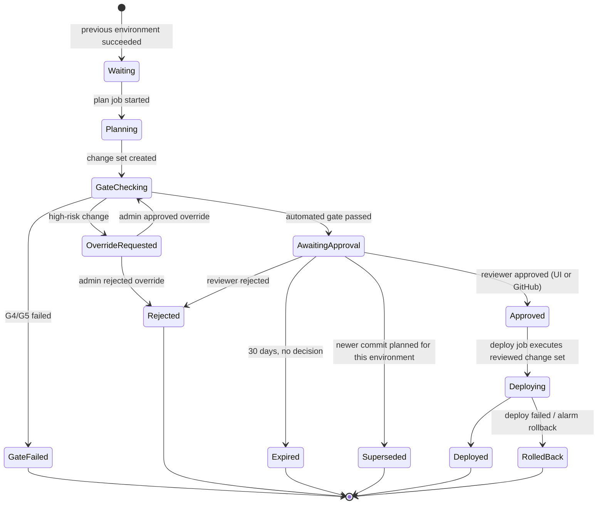

- **Superseded:** if a newer commit reaches the same gate, the older pending approval is closed automatically, so reviewers only see the latest candidate.
- The state is driven by GitHub webhooks (`workflow_run`, `deployment`, `deployment_status`, `deployment_review`, `deployment_protection_rule`) and the gate service, stored in the job/release tables (§3.4).

#### 8.5.3 How an approval in the UI reaches GitHub

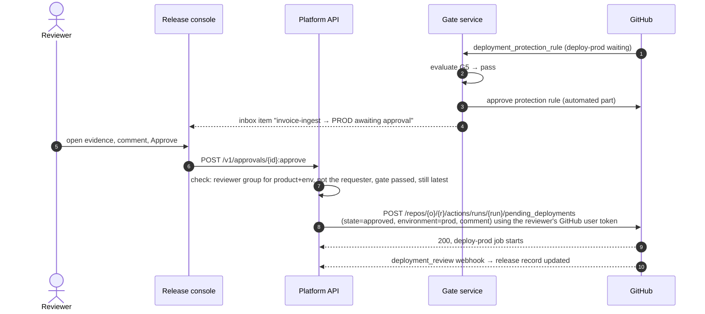

- **Reviewer identity:** each reviewer links their GitHub account once (GitHub App user authorization, OAuth). The platform stores the refresh token encrypted. It uses the token only to submit approvals, and only for runs in that reviewer's own products.
- **Double check on our side:** before calling GitHub, the platform checks that the user is in the product's reviewer group for that environment, is not the person who triggered the run, and that the automated gate passed. GitHub then enforces its own rules again.
- **Notifications:** new pending approvals, gate failures, rejections and rollbacks are sent to Slack/Teams/email with a deep link to the approval detail page. Reminders go out after a configurable wait (e.g. 4 h).
- **Promotion mode** (configurable per environment, §5.5.1):
  - `auto`: STAGE plan starts automatically after TEST succeeds.
  - `on-request`: a user clicks **Promote to STAGE/PROD** in the UI, which starts the plan job via `workflow_dispatch`.

  Either way, the approval is still required.

#### 8.5.4 Separation of duties
- Requester ≠ approver (platform check + GitHub prevent self-review).
- PROD can require **two approvals from different groups** (e.g. product owner and change management). The platform collects both in the UI and submits the GitHub approval only when both are in. This requires that only the platform's approver identities be listed as GitHub reviewers; the alternative is GitHub's own single-approval model.
- Platform admins can approve overrides but cannot approve their own requests.

### 8.6 `deploy.yml` — design (not code yet)

| Aspect | Design |
|---|---|
| Triggers | `push` to `main`; `pull_request` (validate only); `workflow_dispatch` with an environment input (sandbox, or re-run any stage) |
| Permissions | `id-token: write`, `contents: read` |
| Structure | A reusable workflow `deploy-env.yml` (inputs: environment) holds all deploy steps and is identical in every repo. The caller `deploy.yml` is **generated from the environment configuration**: one job per enabled environment, chained in the configured order; gated environments (STAGE, PROD) get a `plan-{env}` job followed by a `deploy-{env}` job, with the quality gate (§8.4) and reviewer approval (§8.3) between them. If admins change the environment list later, the platform opens a "sync pipeline" PR in affected repos instead of changing them silently. |
| Concurrency | One group per environment (`deploy-{env}`), `cancel-in-progress: false` |
| Supply chain | Actions pinned to commit SHAs; Dependabot |
| Per-environment job steps | 1. OIDC credentials (`role-to-assume: vars.AWS_ROLE_ARN`, `aws-region: vars.AWS_REGION`, scoped to that GitHub environment)<br/>2. **Guard:** caller account must equal `vars.AWS_ACCOUNT_ID` and `vars.ENVIRONMENT_NAME` must equal the job's environment<br/>3. **Pre-flight stack-state check** (table below)<br/>4. `aws cloudformation deploy` with `--role-arn $CFN_EXEC_ROLE_ARN`, `--parameter-overrides` from `config/{env}.json` + code prefix, `--tags` = the full `org:*` set built from GitHub variables (`vars.ORG_*`, `vars.PROJECT_NAME`, `vars.ENVIRONMENT_NAME`), `--no-fail-on-empty-changeset` (**DEV/TEST/sandbox only**; STAGE/PROD use the plan → approve → execute flow in §8.3)<br/>5. Post-deploy checks; outputs to job summary<br/>6. On failure: failed stack events (resource, type, reason) to job summary, exit non-zero |

Tags passed with `--tags` come from GitHub variables set by the platform (§5.5.5). **Even if someone changes them, IAM denies any value that doesn't match the deploy role's tags (§4.4).**

| Stack status before deploy | Action |
|---|---|
| does not exist | create via changeset |
| `CREATE_COMPLETE` / `UPDATE_COMPLETE` / `UPDATE_ROLLBACK_COMPLETE` | update via changeset |
| `ROLLBACK_COMPLETE` (first create failed) | delete the empty stack, then create again (safe: `RetainExceptOnCreate`) |
| `*_IN_PROGRESS` | wait with timeout |
| `UPDATE_ROLLBACK_FAILED` / `DELETE_FAILED` | stop with a runbook link. Never automated. |

### 8.7 Long-lived credentials mode (supported, not recommended)
Only where an account cannot have an OIDC provider:
- A per-project, per-environment IAM user with the same shared policy, **tagged identically**.
- Keys stored as **environment secrets** (the only secrets in the design; everything else stays a variable); ≤ 90-day rotation enforced by a platform job; warning shown in the UI.

---

## 9. Security model

| Threat | Mitigation |
|---|---|
| A project changes another project's resources | Tag conditions on every create/change action (`aws:RequestTag` / `aws:ResourceTag` = principal tag) + name patterns built from the principal's tag + per-project roles + SCP protecting ownership tags |
| A repo forges tags to impersonate another product | Role tags are platform-owned and SCP-protected; request tags must equal principal tags (§4.4) |
| Generated IAM grants too much | Exact-ARN policies; least-privilege linter; shared tag-scoped boundary; exec role can only create roles with the boundary attached |
| A DEV/sandbox pipeline reaches PROD | Separate accounts; OIDC `sub` per environment; environment-scoped variables (a DEV job cannot see PROD's account or role); caller-account guard in the pipeline; environment-lock SCP |
| Unapproved change reaches STAGE or PROD | GitHub required reviewers before the deploy job starts (no AWS access until approved); prevent self-review; gated deploy role can only execute the reviewed change set; reconciler restores removed protection rules |
| Sensitive data in sandbox | Classification gate SCP + sandbox data rules |
| Removing the boundary or tags after creation | SCP denies `DeleteRolePermissionsBoundary` and `org:*` tag changes except by platform roles |
| Confused deputy | `SourceAccount` on the Lambda permission, `aws:SourceAccount` on the CFN trust, `aws:PrincipalOrgID` + ExternalId on the provisioner role |
| Platform GitHub credential leak | App private key in Secrets Manager (KMS); installation tokens per job, never stored |
| S3 ↔ Lambda infinite loop | Validation rule + Lambda's built-in recursive-loop detection |

**Platform authN/authZ:**
- SSO via the org IdP.
- Entitlements come from IdP group → product mapping in the registry.
- Roles: `viewer` (preview), `creator` (provision for entitled products), `approver` (mirrored into GitHub environment reviewers), `platform-admin`.

---

## 10. Scalability and multi-tenancy

### 10.1 Where the load is
Synthesis is cheap. The real limits are **GitHub API quotas per installation**, **CloudFormation / IAM API throttling per account**, and wall-clock time (a five-environment promotion takes tens of minutes plus approval time). So the effort goes into async orchestration, throttling that respects quotas, and keeping policy count flat.

### 10.2 Scaling each layer

| Layer | Strategy |
|---|---|
| UI | Static on CloudFront (includes the release console); registry responses cached per user with a short TTL |
| API | Stateless containers, autoscaled |
| Registry | DynamoDB; read-heavy, cached; CMDB sync is event-driven |
| Orchestration | Step Functions Standard (durable, holding many jobs open costs no compute); per-environment bootstrap runs as a `Map` state with a concurrency cap |
| Workers | Lambda with reserved concurrency per worker type |
| Status | Webhooks → DynamoDB Streams → SSE/WebSocket; reconciler for missed events |
| **IAM footprint** | **Shared tag-based policies.** Per project, only small tagged roles are added. No per-project policy documents, so the account-level limits on managed policies are never approached. |
| Account onboarding | Service-managed StackSets auto-bootstrap new accounts in the workload OUs |

### 10.3 Throttling that respects quotas
- **Per GitHub installation:** a token bucket (DynamoDB conditional writes) for write calls; a job waits in a Step Functions `Wait` state rather than failing.
- **Per AWS account:** a cap on concurrent bootstrap stack operations (IAM and CloudFormation are the bottlenecks).
- **Per product/tenant:** fair-share limits; an SQS queue in front of `StartExecution` absorbs bursts.
- **Account quotas:** under option A/B, many projects share Lambda concurrency and other account quotas. Track per-account usage and alert. A product that outgrows its share moves to option C by changing its account binding only.

### 10.4 Catalog and registry growth
- **New service** = block + binders + tag-support matrix entry + additions to the shared policies (rolled out via StackSets) + golden tests. No UI-protocol or orchestrator changes.
- **New portfolio/product** = registry entry (CMDB sync). Tag Policy allowed values update automatically. No IAM changes.
- **New account** = joins an OU, is bootstrapped automatically, then an admin binds it to an environment in the application.
- **New environment** (e.g. adding `perf` between TEST and STAGE) = admin creates it in the application, binds accounts, and approves. New projects pick it up at once; existing projects get a sync-pipeline PR.

---

## 11. Error handling, idempotency and rollback

### 11.1 Failure matrix

| Failure | Handling | User sees |
|---|---|---|
| Invalid payload / not entitled to product | 422 / 403 before any side effect | Inline error on the exact field |
| GitHub rate limit | Backoff honoring headers; job waits | "Waiting for GitHub capacity…" |
| Repo name taken (not ours) | Fail fast, nothing to clean up | Name conflict + suggestion |
| Bootstrap fails in one environment account | Stack auto-rolls back; job undoes all environments + repo | Which account/environment failed and why (CFN events) |
| Provisioner role missing in an account (not bootstrapped) | Fail before any GitHub writes (checked during preview) | "Account {env} not onboarded" + admin link |
| Commit ref rejected (non-fast-forward) | Rebuild on the new parent, retry once | Nothing |
| **Deploy fails in an environment** | **Repo kept**; CloudFormation rolls back that environment only; later environments don't run; first-create failures are cleaned up by the next run's pre-flight | `DEPLOY_FAILED(env)` + run link + failed resources |
| AccessDenied from tag conditions | Treated as a policy violation, not retried; message names the tag key that didn't match | "Tag org:project mismatch on …" |
| `UPDATE_ROLLBACK_FAILED` | Never automated; runbook | `FAILED_NEEDS_ATTENTION` |
| Approval not given in time | Job stays in `PROMOTING` (the GitHub environment times out after 30 days); no AWS change | "Awaiting approval for stage/prod" |
| Missed webhook | Reconciler every 5 min queries runs/deployments by `head_sha` | Status resolves late, not never |

### 11.2 Idempotency layers
1. **API:** `Idempotency-Key` → same job; same key with a different payload → 409.
2. **Orchestrator:** execution name = `jobId`.
3. **Each step:** ownership marker on the repo, CloudFormation `ClientRequestToken`, `PUT` semantics, commit trailer check.
4. **Infrastructure:** deterministic template + content-keyed artifacts → empty changesets on re-run.

### 11.3 Undo policy

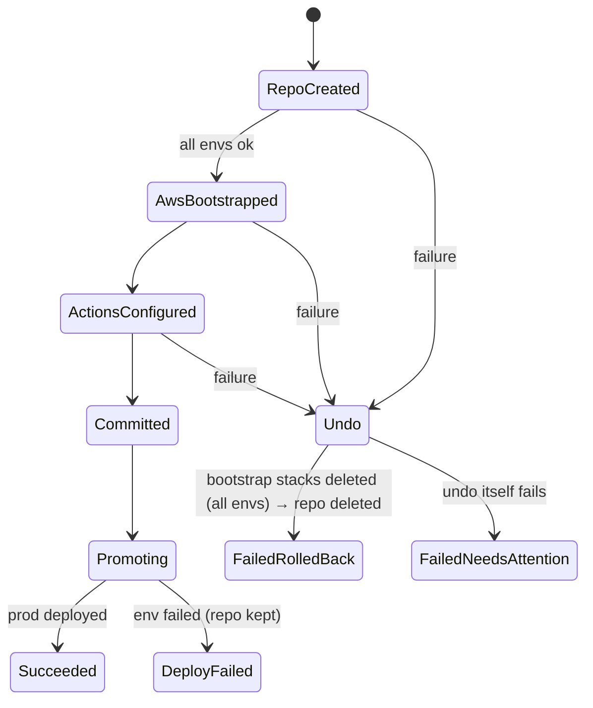

- **Before the commit:** undo steps run in reverse order across all environment accounts. The repo is deleted only if this job created it.
- **After the commit:** nothing is deleted automatically. The user fixes and pushes, or uses "retry deploy" (`workflow_dispatch`).

---

## 12. Observability

| Signal | What |
|---|---|
| Logs | Structured, with `jobId`, `projectId`, `portfolio`, `product`, `env`, `step`, `attempt`, `x-github-request-id`, `stackId` |
| Traces | OpenTelemetry/X-Ray: API → Step Functions → workers |
| Metrics | Jobs by state; time from click to DEV and to PROD; deploy failure rate by environment and catalog combination; GitHub rate-limit headroom per installation; AccessDenied from tag conditions (could indicate misuse) |
| Cost | CUR / Cost Explorer by `org:portfolio` → `org:product` → `org:project` → `org:environment` |
| Compliance | AWS Config tag compliance per account → audit account; dashboard of non-compliant resources per product |
| Alerts | Spike in `FAILED_NEEDS_ATTENTION`; any attempt to change `org:*` tags (CloudTrail → EventBridge); bootstrap drift; rate-limit headroom below 10% |

---

## 13. Where an LLM fits (and where it must not)

| Use | Allowed? | Guardrails |
|---|---|---|
| Natural language → **draft payload** (services + connections) | Yes | Same validation; ownership still chosen from dropdowns, never inferred |
| Handler business logic in starter code | Optional | Limited to `src/`; linted; shown in preview |
| CloudFormation resources, IAM policies, tags | **No** | Deterministic blocks only |
| Explaining a failed deploy from stack events | Yes | Read-only summary next to the raw events |

---

## 14. Proposed repository layout

For your review. Nothing is created until you approve.

```
CloudInfraAutomation/
├── docs/
│   ├── ARCHITECTURE.md
│   ├── TAGGING-STANDARD.md            ← tag keys, values, ownership rules (from §4)
│   └── runbooks/
├── backend/
│   ├── api/                           ← FastAPI, auth, entitlements, idempotency
│   ├── registry/                      ← org registry model, CMDB sync, tag-policy sync
│   ├── synth/                         ← models, blocks, binders, linters, starters, env profiles
│   ├── provisioning/                  ← github/, aws/ (multi-account), saga/
│   ├── webhooks/                      ← workflow_run / deployment_status + reconciler
│   └── tests/                         ← unit, golden, ABAC policy tests (IAM policy simulator)
├── org/
│   ├── scp/                           ← tag protection, env lock, classification, regions
│   ├── tag-policies/                  ← generated from registry
│   └── stacksets/account-bootstrap.yaml ← OIDC, shared ABAC policies, provisioner role
├── bootstrap/
│   └── project-bootstrap.yaml         ← tagged deploy role + exec role (per env)
├── generated-repo-skeleton/
│   └── .github/workflows/{deploy.yml, deploy-env.yml}
├── infra/                             ← platform control plane IaC
└── frontend/                          ← React UI with cascading ownership dropdowns
```

**Proposed stack:**
- Python 3.12+ (FastAPI, pydantic v2, PyGithub 2.x, boto3, PyNaCl).
- Step Functions + Lambda + DynamoDB.
- React + TypeScript.
- ABAC policies are tested with the **IAM policy simulator** and with real allow/deny tests in a sandbox account in CI.

---

## 15. Decisions needed from you

| # | Decision | Recommendation |
|---|---|---|
| D1 | Backend language | **Python** |
| D2 | GitHub identity | **GitHub App** (organizations only in v1) |
| D3 | Tag key prefix | Your company prefix, e.g. `acme:`. Placeholder in this document: `org:` |
| D4 | Main isolation level | **Project** (default) with opt-in read sharing within a product |
| D5 | Hierarchy | **Decided:** three levels, Portfolio → Product/Platform → Project. No team level or team tag. |
| D6 | Account granularity | **B: per portfolio per environment**, with C available per product |
| D7 | Registry source of truth | CMDB (which one?) synced into the platform registry, or the platform registry as the master |
| D8 | Sandbox model | Shared sandbox account per portfolio with 14-day TTL, or per-product sandbox accounts? |
| D9 | Approvers | **Decided:** STAGE and PROD require GitHub reviewer approval before deployment. Open: which groups review each (default QA for STAGE; product owner + change management for PROD), and is an ITSM (e.g. ServiceNow change) link required? |
| D10 | Regions | Single region in v1, or multi-region from the start? |
| D11 | Onboarded today? | Do Control Tower / OUs per environment already exist, or does `org/` need to create the OU structure too? |
| D12 | LLM | Exclude from v1, or NL → draft payload only? |
| D13 | Who can configure environments and accounts | **Platform admins only, with a second-person approval** for changes to production-tier environments. Normal users see environments read-only. (If you meant every user should configure them, note that whoever binds an account decides where code deploys.) |
| D14 | Binding scope | Bind accounts per **portfolio** by default, with a per-product override (matches D6), or per product only? |
| D15 | GitHub plan | Required reviewers on private/internal repos need **GitHub Enterprise Cloud**. Which plan do you have? |
| D16 | Quality-gate thresholds | Coverage minimum (e.g. 80%), vulnerability policy (block critical/high), STAGE bake time before PROD (e.g. 24 h), change windows / freeze calendar, ITSM ticket required for PROD? |
| D17 | PROD approvals | One GitHub approval (simplest), or two approvals from different groups collected in the release console (§8.5.4)? |
| D18 | Notifications | Slack, Microsoft Teams, email, or several? |

---

## 16. Implementation phases (after approval)

| Phase | Deliverable | Exit criteria |
|---|---|---|
| **P0 — Standards** | `TAGGING-STANDARD.md`, registry schema, tag-support matrix for S3/Lambda/DynamoDB/Logs/IAM | Signed off by security / cloud governance |
| **P1 — Org guardrails** | SCPs, Tag Policies, account-bootstrap StackSet with shared ABAC policies | In a sandbox: project A's roles are **denied** on project B's resources and on forged tags; allowed on their own (automated allow/deny test suite) |
| **P2 — Engine** | Payload schema, synthesis (S3, Lambda, DynamoDB, binders), linters, per-environment parameter files, golden tests | Lambda + S3 template passes lint/guard for all 5 environments; regeneration gives identical output |
| **P3 — Pipeline** | `project-bootstrap.yaml`, `deploy.yml` + `deploy-env.yml`, G1–G3 gates, plan → approve → execute for STAGE/PROD | Manual repo promotes sandbox → prod with reviewer approvals; STAGE/PROD cannot deploy without approval; second push = empty changesets; failure in TEST stops promotion and the next push recovers |
| **P4 — Provisioning** | GitHub App client, multi-account bootstrapper, saga, CLI | One command creates a repo that bootstraps 5 accounts and deploys DEV; failures injected at each step undo cleanly |
| **P5 — API + UI** | Registry API, **environment & account admin screens**, **release console (pipeline view, approval inbox, approval detail)**, cascading dropdowns, preview, status per environment | Click-to-DEV in the browser; entitlement filtering verified; an admin can add/reorder an environment and bind an account, and onboarding checks block an invalid account |
| **P5b — Quality gate service** | Release record, deployment protection rule app, change set risk analysis, Access Analyzer checks, G4/G5 | A high-risk change set is blocked; PROD is refused if the artifact differs from STAGE or bake time is not met |
| **P6 — Production control plane** | Step Functions, webhooks, reconciler, quotas, observability, Config compliance | 100 concurrent jobs on one installation complete without failing on rate limits; tag compliance dashboard live |

**Next step:** review this document, answer §15, and approve a phase to start. No code will be written until then.
